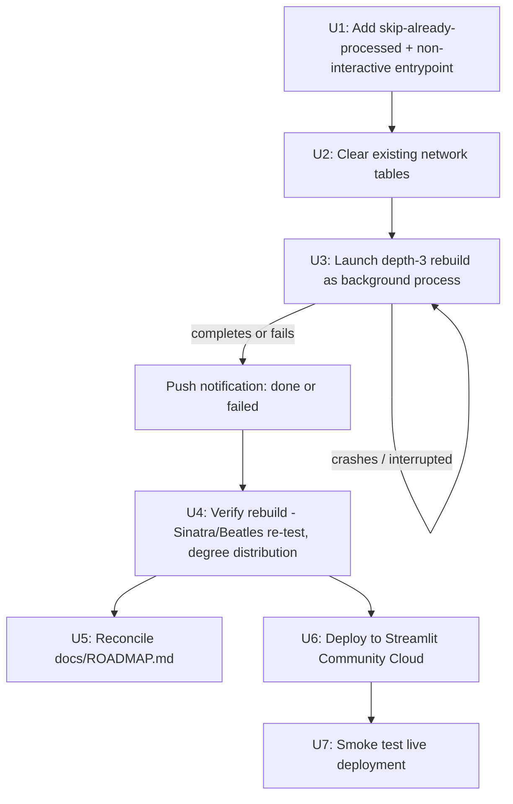

# Depth-3 network rebuild and public demo deployment - Plan

## Summary

Track 1 of `STRATEGY.md` (Rabbit Hole) needs two remaining things: a deeper, verified collaboration network, and a public, shareable demo. Due diligence this session found the currently-shipped database is not a clean depth-2 build as its code default implies — it's a partially-completed depth-3 build made with pre-fix code, committed hours before a pagination bug was fixed. Given the choice between reusing that data (faster, ~30-35% time savings, but carries unverifiable completeness gaps) and a clean rebuild (slower, fully trustworthy), the clean rebuild was chosen for accuracy. This plan covers that rebuild — made resumable and rate-limit-safe, run as an unattended background process with push notification on completion or failure — followed by deploying the resulting app publicly.

## Problem Frame

The network currently in `data/collaboration_network.db` was built by code that predates a pagination fix (commit `303bba5`), and BFS analysis this session found only ~33% of its degree-2 artists show evidence of being fully crawled — the rest are leaf nodes discovered but never processed themselves, consistent with the original depth-3 attempt being cut off by the rate-limit problem that prompted the revert to depth-2. This plan replaces that data with a network built entirely by the current, fixed crawler code, then deploys the app so the STRATEGY.md milestone (public demo, ~2026-07-07 soft target) can actually be hit.

This plan does not build the STRATEGY.md metrics instrumentation (explicitly deferred by the user), any UI/UX redesign (Track 2), the open-source generalization template (Track 3), or Rabbit Hole's thematic analysis feature (Track 4).

## Requirements

**Rebuild**
- **R1.** The network is rebuilt at `depth=3` from Kendrick Lamar using only the current (post-`303bba5`) crawler code, so every artist and edge in the resulting database reflects the fixed pagination behavior.
- **R2.** The rebuild is resumable: if interrupted partway (crash, network loss, manual stop), restarting does not re-crawl already-processed artists or create duplicate `songs` rows.
- **R3.** The rebuild runs unattended as a background process and does not require the user's own machine to stay awake.
- **R4.** On completion (success or failure), the user is notified via a push notification, not by the agent polling or narrating progress in chat.

**Verification**
- **R5.** After the rebuild, the previously-failing lookups from this session (Frank Sinatra, The Beatles) are re-tested, along with an overall degree-distribution sanity check, to confirm the rebuild produced a materially different (deeper, more complete) network than before.

**Deployment**
- **R6.** The app is deployed publicly (Streamlit Community Cloud, per the existing `docs/ROADMAP.md` candidate) with Spotify credentials handled via Streamlit's `secrets.toml` mechanism, not committed to the repo.
- **R7.** The deployed instance is smoke-tested with a real search before being considered done.

**Housekeeping**
- **R8.** `docs/ROADMAP.md` is updated to reflect what this plan actually delivers — items it implements are checked off/removed, items still deferred stay.

## Key Technical Decisions

**KTD1 — Clean rebuild, not incremental reuse.** Confirmed with the user directly: given the existing data's completeness can't be verified (pre-fix code, uneven crawl depth across artists), a full rebuild from scratch is worth the extra ~2-3 hours over reusing what's there, in exchange for a fully trustworthy dataset. (see origin: this session's due diligence and user confirmation)

**KTD2 — Resumability needs an explicit crawl-source marker, not an inferred one.** A multi-hour unattended run has a real chance of interruption (network blip, process killed, machine sleep), and resuming should skip artists already crawled to avoid re-spending API calls and time (not to prevent duplicate rows — `src/database.py`'s `add_collaboration` already does a `SELECT` existence check before inserting into `songs`, so re-running it is already idempotent at the row level). The real obstacle: `collaborations` stores undirected edges (`add_collaboration` sorts `artist1_id`/`artist2_id` before writing), so there is no way to distinguish "this artist was itself crawled" from "this artist was merely discovered as someone else's collaborator" by querying for the presence of edges — both look identical. A leaf artist and a fully-crawled artist would be indistinguishable, and a skip-check based on "has any edge" would silently skip real leaf artists, reproducing the exact uneven-coverage problem this rebuild exists to fix. The fix is an explicit marker: a new `crawled` column on `artists` (default 0), set to 1 only after an artist's own albums have been successfully processed. This also naturally makes "clean rebuild" and "resume an interrupted clean rebuild" the same code path, rather than two separate modes.

**KTD3 — Run via `run_in_background`, notify via push, no polling.** The agent will start the rebuild as a background process and rely on the harness's completion notification plus a single `PushNotification` call on finish (success or failure) — not periodic chat updates. This directly reflects the user's explicit ask: real-time progress narration burns attention for no benefit on a multi-hour job.

**KTD4 — One long-range fallback check, not a monitoring loop.** A background process that hangs indefinitely without exiting (rather than crashing loudly) wouldn't otherwise trigger a completion notification. A single scheduled check several hours out (sized to the expected runtime) catches this rare case without turning into periodic polling.

**KTD5 — Non-interactive rebuild entrypoint.** `src/build_network_sqlite.py`'s `main()` currently calls `input("Rebuild from scratch? (y/n): ")`, which blocks forever in an unattended background process. The rebuild needs a non-interactive path (a flag or a separate entrypoint) that skips this prompt, since the "rebuild from scratch" decision is already made at plan time, not runtime.

**KTD6 — Streamlit Community Cloud remains the deployment target.** No research surfaced a clearly better alternative for a small personal demo, and `secrets.toml` gives a first-class mechanism for the Spotify credentials. The post-depth-3 database size is unknown until the rebuild completes; whether it still ships as a git-committed file or needs a different distribution approach is deferred to U6 rather than decided speculatively now.

## High-Level Technical Design

---

## Implementation Units

### U1. Make the rebuild resumable and non-interactive

**Goal:** Add a skip-already-processed check so an interrupted rebuild can resume safely, and remove the blocking interactive prompt so the crawl can run unattended.

**Requirements:** R2 (KTD2, KTD5)

**Dependencies:** None

**Files:**
- `src/build_network_sqlite.py` — modify (`build_network()`'s per-artist processing loop; `main()`'s interactive prompt)
- `src/database.py` — modify (add a `crawled INTEGER DEFAULT 0` column to the `artists` table schema; add a method to mark an artist crawled and a method to check the flag)

**Approach:** Add a `crawled` column to the `artists` table (via `_init_schema`'s `CREATE TABLE IF NOT EXISTS` plus an `ALTER TABLE ... ADD COLUMN` guard for existing databases, since `CREATE TABLE IF NOT EXISTS` alone won't add a column to an already-created table). In `build_network()`'s level-processing loop, before submitting an artist to the thread pool, check its `crawled` flag — if set, skip re-crawling it and add its existing neighbors (from the `collaborations` table) to the next level instead. After `process_single_artist` successfully completes for an artist, mark that artist's `crawled` flag as 1. This is the only reliable signal, since the `collaborations` table's undirected edges cannot distinguish a crawled artist from one merely discovered as somebody else's collaborator. Add a `--fresh` / non-interactive flag (or a separate callable entrypoint) to `main()` that skips the `input()` prompt entirely, since the "start clean" decision is made in U2, not asked again at runtime.

**Patterns to follow:** The existing `INSERT OR IGNORE` idempotency pattern already used in `src/database.py`'s `add_artist`/`add_collaboration`, and the existing `SELECT`-before-`INSERT` dedup pattern already used for `songs` — the new `crawled`-flag update should follow the same "safe to call repeatedly" discipline.

**Test scenarios:**
- Happy path: running the rebuild against an artist already marked `crawled=1` skips re-crawling it (verified via a call counter or log line, not a live API call).
- Edge case: an artist present in the DB with `crawled=0` (a genuine leaf, discovered only as someone else's collaborator, matching the "not yet processed" pattern found this session) is still crawled, not skipped — this is the scenario the corrected design specifically fixes over an edge-presence check.
- Edge case: running `main()` non-interactively does not block waiting for stdin.
- Test expectation: no dedicated test file — this repo has no existing test suite; verify manually against a small local run before the full rebuild (e.g., interrupt and resume a short partial crawl, confirming via `crawled` flags which artists were actually skipped).

**Verification:** A short, deliberately-interrupted test run (a handful of artists, not the full network) can be resumed without re-crawling already-`crawled` artists, and a leaf artist with `crawled=0` is confirmed to still get crawled on resume.

---

### U2. Clear existing network data for a clean rebuild

**Goal:** Start the depth-3 rebuild from an empty network, per KTD1.

**Requirements:** R1

**Dependencies:** U1 (so the non-interactive clear-and-rebuild path exists)

**Files:**
- `src/build_network_sqlite.py` — modify (reuse existing table-clearing logic from `main()`, now reachable non-interactively)

**Approach:** Use the existing `DELETE FROM songs/collaborations/artists` logic already present in `main()`'s rebuild-confirmation branch, now triggered by the non-interactive path from U1 rather than the `y/n` prompt. Also clear the `data/*.json` API response cache directory (currently ~38,000 files from the prior build) before starting — its 7-day expiry means today's stale entries would be bypassed anyway, but clearing it removes any doubt that a quick U1 test-resume run and the full U3 rebuild could otherwise share cached responses across runs happening within the same 7-day window, which would undercut R1's guarantee that every artist reflects the current, fixed crawler code.

**Test scenarios:**
- Test expectation: none -- this is invoking existing, already-correct table-clearing SQL through a new non-interactive trigger path; covered by U1's non-interactive-entrypoint test.

**Verification:** After this step, `db.get_stats()` reports zero artists/collaborations/songs immediately before the rebuild begins, and the `data/` JSON cache directory is empty.

---

### U3. Run the depth-3 rebuild as a monitored background process

**Goal:** Execute the clean depth-3 rebuild unattended, with clear success/failure signaling and a push notification on completion.

**Requirements:** R1, R3, R4 (KTD3, KTD4)

**Dependencies:** U1, U2

**Files:**
- `src/build_network_sqlite.py` — modify (`main()`'s call to `build_network()`: change `depth=2` to `depth=3`; ensure exceptions propagate as a non-zero exit code rather than being silently swallowed)

**Approach:** Launch the rebuild as a background process. On launch, the agent schedules one long-range fallback check sized to the expected runtime (KTD4) in case the process hangs without exiting. When the background process completes (the harness notifies automatically), the agent reads the tail of its log/output to determine success or failure, then sends a single `PushNotification` summarizing the outcome (e.g., "Rebuild complete: N artists, M collaborations" or "Rebuild failed: <error>") rather than narrating progress along the way.

**Execution note:** This unit is the actual multi-hour data crawl — expect ~5-7 hours based on this session's sizing (~14,580 artists at depth 1-2, ~2-3 API calls each, rate-limited to 50 requests/30s).

**Test scenarios:**
- Happy path: rebuild completes successfully; push notification reports final artist/collaboration/song counts.
- Failure path: rebuild raises an unhandled exception (e.g., a sustained API outage); the process exits non-zero, and the push notification reports failure rather than silently going nowhere.
- Test expectation: no dedicated test file — this is an operational run, not new testable code beyond U1's resumability logic (already covered there).

**Verification:** The rebuild completes (or fails loudly) and the user receives exactly one push notification reporting the outcome, with no chat-based progress narration in between.

---

### U4. Verify the rebuild actually improved coverage

**Goal:** Confirm the rebuilt network is materially deeper/more complete than the network it replaced, using the same checks performed during this session's due diligence.

**Requirements:** R5

**Dependencies:** U3

**Files:** None (verification-only; no repo files change).

**Approach:** Re-run this session's exact checks against the new database: (a) BFS degree distribution from Kendrick Lamar — expect meaningfully more depth-3 coverage than the old ~12,444, since this rebuild actually completes the crawl the old one didn't; (b) re-test the previously-failing lookups (Frank Sinatra, The Beatles) — note whether they're now found (they may still be genuinely too far even at depth 3, which is an acceptable, informative outcome, not a failure); (c) spot-check a few more well-known artists across genres for qualitative "no connection found" rate, since the formal metric isn't being built yet per STRATEGY.md's deferred-metrics decision.

**Test scenarios:**
- Test expectation: none -- this is a verification pass over live data, not new code; the specific checks above are the test scenarios themselves.

**Verification:** The rebuild's BFS distribution and the Sinatra/Beatles re-test results are recorded (e.g., in the push notification or a follow-up note), and the network is confirmed to be a genuine improvement over the pre-rebuild state, not a lateral move.

---

### U5. Reconcile docs/ROADMAP.md

**Goal:** Keep the roadmap honest about what's been delivered versus what's still deferred.

**Requirements:** R8

**Dependencies:** U4, U7

**Files:**
- `docs/ROADMAP.md` — modify

**Approach:** Update the existing candidate list: mark "deploy publicly" and "expand network depth" as done (with a brief note on the outcome), leave "live-lookup fallback," "mobile-responsive layout," "tests," and "cache rotation" as still-deferred candidates, since none of those are in this plan's scope.

**Test scenarios:**
- Test expectation: none -- documentation update, not code.

**Verification:** `docs/ROADMAP.md` accurately reflects this plan's actual outcome, with no stale "TBD" items that this plan in fact resolved.

---

### U6. Deploy the app publicly on Streamlit Community Cloud

**Goal:** Get the app live at a public URL with the pitch from STRATEGY.md, with Spotify credentials handled securely.

**Requirements:** R6 (KTD6)

**Dependencies:** U4 (deploy the verified, rebuilt database, not the old one)

**Files:**
- `.streamlit/secrets.toml` — new, **not committed** (already covered by `.gitignore`'s `.env` pattern — confirm `secrets.toml` is also excluded; add if not)
- `.gitignore` — modify only if `secrets.toml` isn't already excluded

**Approach:** Connect the repo to Streamlit Community Cloud, set `SPOTIFY_CLIENT_ID`/`SPOTIFY_CLIENT_SECRET` via the platform's secrets UI (backed by `secrets.toml`) rather than `.env` (which isn't available in the deployed environment). Check the post-rebuild `data/collaboration_network.db` file size before deciding whether it still ships as a git-committed file (as it does today) — if it's grown large enough to strain Community Cloud's undisclosed but real repo-size practicalities, that's a deferred decision to make with the actual number in hand, not before.

**Test scenarios:**
- Test expectation: none -- deployment configuration, not application code; covered by U7's smoke test.

**Verification:** The app is reachable at a public Streamlit Community Cloud URL, and `secrets.toml` (or equivalent local credential file) is confirmed absent from `git ls-files`.

---

### U7. Smoke-test the live deployment

**Goal:** Confirm the publicly deployed instance actually works before calling this done.

**Requirements:** R7

**Dependencies:** U6

**Files:** None.

**Approach:** From the live public URL, run a real search (e.g., an artist confirmed present in the rebuilt network per U4) and confirm a connection resolves with song data and audio preview, matching local behavior.

**Test scenarios:**
- Happy path: searching a known in-network artist on the live deployment returns the same result shape verified locally in U4.
- Test expectation: manual smoke test, no automated test file, consistent with the rest of this plan's verification approach.

**Verification:** At least one real search against the public URL succeeds end-to-end (search → path found → songs shown → preview playable where available).

---

## Scope Boundaries

**In scope:** Clean depth-3 rebuild (resumable, unattended, push-notified), post-rebuild verification, ROADMAP reconciliation, public deployment, and a smoke test.

**Out of scope (non-goals for this plan):**
- STRATEGY.md's 3 metrics (no-connection-found rate, repeat-search rate, shares/link-outs) — explicitly deferred by the user until after the demo is live.
- Any UI/UX redesign (Track 2), the open-source generalization template (Track 3), or Rabbit Hole's thematic analysis feature (Track 4).
- Requesting a Spotify rate-limit/quota extension — confirmed this session as the wrong tool for a one-time backend crawl (extended quota is for apps with concurrent live users, not bulk ingestion).
- Alternative data sources (MusicBrainz, Discogs, etc.) to supplement or replace Spotify — would require an ID-mapping layer across systems; real scope creep against the ~1-week soft target.

### Deferred to Follow-Up Work
- If the rebuilt database grows large enough to make git-committed distribution impractical, choosing an alternative distribution approach (Git LFS, external object storage, rebuild-on-deploy) is a follow-up decision, not pre-solved here (see KTD6).

## Risks & Dependencies

- **Risk: multi-hour unattended run fails partway.** Mitigated by U1's resumability (KTD2) and U3's push-notification-on-failure (KTD3) — a failure is caught and reported, not silently lost.
- **Risk: rate-limit throttling during the rebuild.** The existing `RateLimiter(max_requests=50, window_seconds=30)` and `max_total=100` album-pagination cap (already in place from `303bba5`) are the existing safeguards; this plan does not loosen them in pursuit of speed, consistent with the user's explicit safety priority.
- **Risk: post-rebuild database size strains deployment.** Deferred to U6 with an actual number, not guessed at now (see KTD6, Deferred to Follow-Up Work).
- **Dependency:** Both Spotify API access (already configured via `.env` locally) and, for U6, Streamlit Community Cloud account access are required.

## Verification Contract

- The rebuild completes (or fails with a clear, non-zero-exit signal) and the user receives exactly one push notification with the outcome.
- A resumed (deliberately interrupted, then restarted) short test crawl does not re-process already-done artists or duplicate `songs` rows.
- Post-rebuild BFS analysis shows measurably improved depth-3 coverage over the pre-rebuild ~12,444 count, and the Frank Sinatra / The Beatles re-test result is recorded.
- `docs/ROADMAP.md` reflects the actual outcome of this plan.
- The app is live at a public Streamlit Community Cloud URL, with no secrets committed to git, and at least one real search succeeds end-to-end on the live instance.

## Definition of Done

- [ ] Resumability + non-interactive entrypoint added (U1)
- [ ] Existing network data cleared for a clean rebuild (U2)
- [ ] Depth-3 rebuild run as a background process; push notification sent on completion/failure (U3)
- [ ] Rebuild verified: BFS distribution improved, Sinatra/Beatles re-tested (U4)
- [ ] `docs/ROADMAP.md` reconciled (U5)
- [ ] App deployed publicly on Streamlit Community Cloud with secrets handled correctly (U6)
- [ ] Live deployment smoke-tested successfully (U7)
