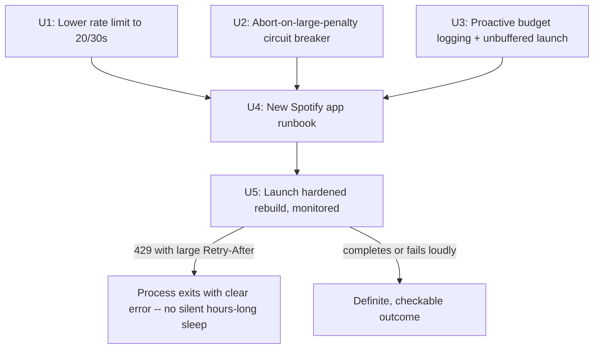

# Rate-limit observability and safety hardening before rebuild retry - Plan

## Summary

Today's rebuild attempts burned many hours chasing what looked like hangs (network, threading, SQLite) but was actually Spotify's real rate-limit system being silently absorbed by a blind `time.sleep(retry_after)` — confirmed directly: a fresh request just now returned HTTP 429 with `Retry-After: 35268` (~9.8 hours). This plan makes the rebuild pipeline honest about its own rate-limit state at all times, stops it from ever silently absorbing a large penalty again, and lays out an exact runbook for registering a new Spotify app (fresh rate-limit bucket) and re-attempting the rebuild with full confidence.

## Problem Frame

Spotify does not publish an exact numeric rate limit (confirmed via official docs: "calculated based on... a rolling 30 second window," with no disclosed threshold). The app's own `RateLimiter(max_requests=50, window_seconds=30)` was always a guess, and today's ~9.8 hour penalty is direct evidence it wasn't conservative enough for sustained, repeated crawl attempts. Compounding this, the pipeline had no way to show its own rate-limit state proactively — the only signal was a reactive 429, which the code then absorbed silently rather than surfacing. This plan fixes both: a materially more conservative default, and a pipeline that reports its own state continuously so "is it stuck or working" is never again a multi-hour mystery.

This is a hardening pass on already-diagnosed, already-partially-fixed code (this session already added: request timeouts, a bounded thread-pool wait loop, an IPv4-only DNS patch, and a 60-second cap on inline rate-limit retries). It does not touch the broader Track 1 deployment work (docs/plans/2026-06-30-004-feat-depth3-rebuild-public-demo-plan.md's U4-U7).

## Requirements

- **R1.** Drop the rate limiter's default from `max_requests=50` to `max_requests=20` per 30-second window, as a real safety margin given Spotify's threshold is undisclosed and today's settings triggered a multi-hour penalty.
- **R2.** Any 429 response with a `Retry-After` exceeding a small threshold aborts the entire rebuild run immediately (not just that one artist) — continuing to hit the API under an active penalty risks extending it.
- **R3.** The rate limiter proactively reports its own budget usage (requests used / window) at a regular cadence during a real run, not just reactively after a 429.
- **R4.** All console output uses unbuffered/flushed writes, so real-time log-watching (`tail -f`) reflects true state instantly — no more needing `lsof`/`ps` forensics to distinguish "working" from "stuck."
- **R5.** A concrete, step-by-step runbook exists for: registering a new Spotify app, safely updating `.env`, verifying the new credentials are a genuinely fresh rate-limit bucket, and launching the real rebuild with the hardened code.
- **R6.** Every step in the runbook has a concrete, checkable verification — not "looks fine."

## Key Technical Decisions

**KTD1 — Conservative default over precise tuning.** Since Spotify's actual threshold is undisclosed, there's no way to compute a provably safe number. Dropping to 20 req/30s (60% below the old default) is a deliberate safety-first choice, accepting slower crawl speed in exchange for a much larger margin before hitting the same penalty again. (see origin: this session's confirmed Spotify docs research — no disclosed limit exists to tune against precisely)

**KTD2 — Abort-on-large-penalty, not retry-through-it.** `_make_request`'s existing 60-second cap (added earlier this session) already stops it from sleeping for hours, but currently just raises `SpotifyAPIError` for that one call, which `process_single_artist` catches and treats as a failed artist — the crawl keeps going and keeps hitting the API. Given today's evidence that repeated attempts compounded the penalty, the crawl should treat a large `Retry-After` as a signal to stop entirely, not push through.

**KTD3 — Proactive budget logging, not just reactive 429 handling.** `RateLimiter.get_stats()` already exists and is already called every 10 completed artists in `build_network()` — but only on the happy path. This needs to run on a wall-clock interval (e.g., every 30s) regardless of completion events, so budget state is visible even during a slow patch, and needs to be visible in the log at all (not buffered away).

**KTD4 — Fix output buffering at the launch boundary, not per-print-statement.** Rather than auditing and editing dozens of existing `print()` calls across `src/data_fetcher.py` and `src/build_network_sqlite.py`, launch the process with `PYTHONUNBUFFERED=1` (or `python3 -u`). This is simpler, harder to regress (no need to remember `flush=True` on every future print), and fixes the exact problem that caused today's confusion.

## High-Level Technical Design

---

## Implementation Units

### U1. Lower the default rate limit

**Goal:** Reduce `RateLimiter`'s default request budget as a real safety margin.

**Requirements:** R1 (KTD1)

**Dependencies:** None

**Files:**
- `src/data_fetcher.py` — modify (`RateLimiter.__init__` default and/or the module-level `_rate_limiter = RateLimiter(max_requests=50, window_seconds=30)` instantiation)

**Approach:** Change the default/instantiated `max_requests` from 50 to 20, keeping `window_seconds=30`. No other logic changes — this is a pure parameter tune.

**Test scenarios:**
- Test expectation: none -- pure configuration change; no test infrastructure exists in this repo and a constant tune doesn't warrant introducing one.

**Verification:** `RateLimiter().max_requests == 20` (or the module-level `_rate_limiter` instance reflects the new value) confirmed by inspection.

---

### U2. Abort-on-large-penalty circuit breaker

**Goal:** Stop the entire rebuild run the moment Spotify signals a large penalty, rather than letting the crawl continue hitting the API and potentially extending it.

**Requirements:** R2 (KTD2)

**Dependencies:** None

**Files:**
- `src/data_fetcher.py` — modify (define a new `RateLimitPenaltyError` exception; the existing 60s-cap raise in `_make_request` uses it instead of plain `SpotifyAPIError`)
- `src/build_network_sqlite.py` — modify (three specific sites, precise per the feasibility review's P0/P1 findings against the current code: `process_single_artist`'s catch-all at its `except Exception as e:` block, `build_network`'s inner `for future in done:` loop's `except Exception as e:` block, and confirming the propagation path through the `while pending`/`for level in range(depth)` loops and back to `main()`)

**Approach:** Define `RateLimitPenaltyError` in `src/data_fetcher.py` (a distinct exception, not just a plain `SpotifyAPIError`, so it can be selectively re-raised rather than swallowed). `_make_request` raises this specific type when `Retry-After` exceeds the existing 60-second cap, carrying the actual `retry_after` value in its message.

Two existing broad `except Exception` blocks currently swallow *everything*, including this new exception, and both must be narrowed to let it through before the general catch:
- `process_single_artist`'s catch-all (the one wrapping the whole function body) needs an `except RateLimitPenaltyError: raise` immediately before its existing `except Exception as e: print(...); return ("", [], 0)` — without this, the exception becomes an ordinary-looking failed-artist return tuple and the future resolves "successfully," silently defeating the whole point of this unit (this is exactly the P0 gap the feasibility review caught: as originally drafted, this unit would have shipped a change that does nothing).
- `build_network`'s inner `for future in done:` loop has the same shape (`except Exception as e: print(...)`) around `future.result()` — it needs the same `except RateLimitPenaltyError: raise` before its broad catch, so the exception propagates out of that loop.

Once re-raised there, let it propagate naturally all the way up: out of the `while pending` loop (the `try/finally` around the executor already guarantees `executor.shutdown(wait=False, cancel_futures=True)` still runs via `finally` before the exception continues upward), out of the `for level in range(depth)` loop, out of `build_network()` itself, and out of `main()` uncaught — where the existing top-level `try: main() except Exception as e: print(f"FATAL: ...", ...); raise` wrapper (added earlier this session) already prints a clear message and causes a non-zero exit with no further changes needed there. This resolves the scope question explicitly: the abort stops the *entire* multi-level crawl (all remaining levels), not just the current level, since continuing to any further level means making more API calls under an active penalty — exactly what this unit exists to prevent.

**Test scenarios:**
- Happy path: a normal 429 with `Retry-After` under the cap (e.g., 5s) is retried inline as today, no abort.
- Edge case: `Retry-After` at or above the cap raises `RateLimitPenaltyError`, which is confirmed (by code inspection, tracing the exact call chain: `_make_request` → `get_artist_collaborators` → `process_single_artist` → `future.result()` → `build_network`'s loop → `main()`) to reach the top-level wrapper rather than being caught by either of the two narrowed `except Exception` blocks.
- Integration scenario: other futures already in flight when the penalty is detected are allowed to finish naturally (not force-cancelled mid-request), but no new level is started and no new artists are submitted afterward — verified by confirming the propagation happens after the current `for future in done:` batch, not mid-batch.

**Verification:** Tracing the exact call chain by inspection (real-network testing isn't safe here, since deliberately triggering a large penalty just to verify the fix would risk another actual multi-hour penalty) confirms `RateLimitPenaltyError` reaches `main()`'s top-level wrapper rather than being caught by either narrowed `except Exception` site, and the process exits non-zero with a message stating the exact wait time.

---

### U3. Proactive budget logging and unbuffered output

**Goal:** Make the rebuild's rate-limit state and liveness visible in real time, without needing process forensics to interpret.

**Requirements:** R3, R4 (KTD3, KTD4)

**Dependencies:** None

**Files:**
- `src/build_network_sqlite.py` — modify (`build_network()`'s level loop: add a wall-clock-interval budget log, independent of the existing every-10-completions log)

**Approach:** In `build_network()`'s per-level processing loop, track the last time budget stats were logged; if 30 seconds have elapsed regardless of how many artists completed, log `RateLimiter.get_stats()` output (requests used / window) as a heartbeat — this makes a genuinely slow-but-healthy period distinguishable from a stall by watching the log, not by external tooling. Separately, document (in the runbook, U4) that the real run must always be launched with `PYTHONUNBUFFERED=1` set, per KTD4 — this is a launch-time convention, not a code change, since it's simpler and less regression-prone than auditing every print call.

**Test scenarios:**
- Happy path: during a run with periods of no artist completions (e.g., waiting on the rate limiter), a budget heartbeat line still appears in the log at least every ~30s.
- Test expectation for the unbuffered-launch requirement: none -- this is a launch convention (documented in U4's runbook), not testable code.

**Verification:** Watching `tail -f` on a real run's log shows periodic budget updates even when no artist has completed recently, and all log lines appear in real time (no multi-second-or-longer buffering delay) when launched with `PYTHONUNBUFFERED=1`.

---

### U4. New Spotify app + rebuild runbook

**Goal:** Give the user (or a future agent session) an exact, checkable sequence for registering a new Spotify app and safely retrying the rebuild — no ambiguity about what to do at each step.

**Requirements:** R5, R6

**Dependencies:** U1, U2, U3 (the runbook should launch the hardened code, not the code as it was during today's incidents)

**Files:**
- None new — this runbook is captured in this plan's Definition of Done and Verification Contract below, since this repo has no separate runbooks/ directory convention to introduce for a single one-time procedure.

**Approach:** The runbook, in order:
1. Register a new app at `developer.spotify.com/dashboard` (Create App; any name/description; redirect URI can be `http://localhost` as the existing `.env.example` implies).
2. Copy the new Client ID and Client Secret.
3. Update `.env` (not committed — already gitignored) with the new credentials, replacing the old ones. Do not touch `.env.example`'s placeholder format.
4. Verify the new credentials work and are a fresh bucket: run a single, direct request (not through the full crawler) against `https://api.spotify.com/v1/artists/{KENDRICK_ID}` using the new token, and confirm a 200 response — this proves both that the new credentials authenticate correctly and that they are not currently rate-limited (unlike the old ones, which return 429 right now).
5. Only after step 4 succeeds, launch the real rebuild: `PYTHONUNBUFFERED=1 python3 src/build_network_sqlite.py --resume --depth 3`, backgrounded and disowned in the user's own terminal (consistent with this session's earlier decision to decouple long-running work from any AI session's fate).
6. Monitor via `tail -f` on the redirected log file — the U3 heartbeat and existing per-artist logs should show continuous, real-time progress; the U2 circuit breaker means a large-penalty 429 will now stop the process with a clear message instead of an ambiguous freeze.

**Test scenarios:**
- Test expectation: none -- this is an operational runbook, not new application code; each step has its own concrete verification below rather than a test file.

**Verification:** Step 4's direct request returns 200 (not 429) before proceeding; the real rebuild run either completes with a materially larger `crawled` count than the pre-rebuild baseline, or exits with a clear, specific error (rate-limit penalty with exact wait time, or another concrete failure) — never an unexplained multi-hour silence again.

---

## Scope Boundaries

**In scope:** Rate-limit safety hardening (lower default, circuit breaker), observability (proactive logging, unbuffered output), and the exact runbook for the next rebuild attempt.

**Out of scope (non-goals for this plan):**
- The broader Track 1 public-demo-deployment work (docs/plans/2026-06-30-004-feat-depth3-rebuild-public-demo-plan.md's U4-U7) — resumes once the rebuild itself actually succeeds under this plan.
- Building a formal test suite for this repo — none exists today, and introducing one is a separate, larger decision beyond this hardening pass.
- Determining Spotify's exact undisclosed rate limit — not knowable from outside; KTD1's conservative default is the practical response, not an attempt to reverse-engineer the true number.

## Risks & Dependencies

- **Risk: 20 req/30s still isn't conservative enough.** Since Spotify's real threshold is undisclosed, no setting can be proven safe in advance. Mitigation: U2's circuit breaker means even if this happens again, it will be caught and reported immediately rather than silently absorbed for hours.
- **Risk: a new Spotify app doesn't actually get a fresh rate-limit bucket** (e.g., if Spotify tracks penalties by developer account or IP rather than purely by Client ID). Mitigation: U4 step 4 explicitly verifies this empirically (a direct request must return 200) before committing to the full rebuild attempt — if it still 429s, that's discovered in seconds, not hours.
- **Dependency:** A Spotify Developer account (already established, since the user already has one) to register the new app.

## Verification Contract

- `RateLimiter`'s default is 20 requests per 30-second window.
- A 429 with `Retry-After` at or above the existing 60-second cap stops the entire run with a clear message, rather than being silently retried or absorbed.
- A real run's log shows a budget heartbeat at least every ~30s and all output appears in real time under `PYTHONUNBUFFERED=1`.
- The new Spotify app's credentials are verified (direct 200 response) before the real rebuild is launched.
- The rebuild either completes with measurably more crawled artists than today's ~846 baseline, or fails with a specific, understood cause.

## Definition of Done

- [ ] Rate limit default lowered to 20 req/30s (U1)
- [ ] Large-penalty circuit breaker stops the run instead of sleeping through it (U2)
- [ ] Proactive budget heartbeat logging added; unbuffered launch convention documented (U3)
- [ ] New Spotify app registered, `.env` updated, fresh-bucket verified with a direct 200 response (U4)
- [ ] Real depth-3 `--resume` rebuild launched under the hardened code and monitored to a definite outcome (U4)
