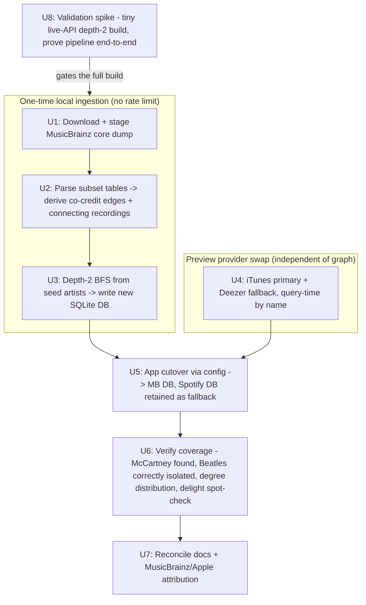

# MusicBrainz graph migration + provider-independent previews - Plan

## Summary

Three sessions of trying to build Rabbit Hole's collaboration graph by bulk-crawling the Spotify API have hit a hard wall: Spotify penalizes sustained bulk ingestion with escalating multi-hour lockouts (9.8h, then 21.7h) even at conservative rates, and lowering the request rate only delays the wall. We're ~12% crawled after multiple runs. This plan pivots the **graph data source** from a live Spotify crawl to the **MusicBrainz database dump** — CC0-licensed, downloadable, and free of any rate limit — which builds the whole graph locally in a one-time pass and eliminates the crawl problem entirely (and with it the depth-3/depth-4/"is Sinatra reachable" question, since a local graph is free to traverse to any depth).

Because MusicBrainz has no audio, and the click-to-preview interaction is a **Need-to-Have**, the plan also swaps the app's preview backend from Spotify's now-deprecated `preview_url` to a free, no-auth 30-second preview source (iTunes Search API primary, Deezer fallback) fetched at query time — fully independent of Spotify.

The existing Spotify-built database and crawler are **retained as legacy/fallback** (nothing discarded), and the app cuts over to the new MusicBrainz-built database via a reversible config switch. Scope is Track 1 only: the current SQLite schema and Streamlit app stay; no UI redesign.

---

## Problem Frame

Rabbit Hole's Track 1 needs a collaboration graph rich enough to reliably produce a "no way, really?" moment (per `STRATEGY.md`), plus a public demo. The current approach — crawl Spotify artist-by-artist via BFS — cannot get there: `src/data_fetcher.py` + `src/build_network_sqlite.py` make tens of thousands of API calls to cover ~14,580 artists, and Spotify's undocumented cumulative rate ceiling responds with escalating penalties (`Retry-After` up to ~78,000s) that make a complete crawl take weeks of babysitting, if it finishes at all. Separately, Spotify deprecated `preview_url` for development-mode apps on 2024-11-27, so the app's live-preview feature ([app.py:51](app.py)) is likely already returning null and failing silently.

MusicBrainz solves the bulk problem structurally: the core database is published as CC0 dumps you process locally, with no rate limit, and its "artist credit" model (who is credited on a recording) is a direct analog of the Spotify "track artists" edge we already use — and each edge carries the connecting recording, which is exactly the song the preview should play.

This plan does **not** build the `STRATEGY.md` metrics instrumentation (deferred by the user), the Track 2 UI/UX redesign, the Track 3 open-source template, or Track 4 thematic analysis. It does not discard the existing Spotify data or crawler.

---

## Requirements

**Graph source**
- **R1.** The collaboration graph is built from the **MusicBrainz core data dump** (CC0), locally, with no dependence on any rate-limited live crawl.
- **R2.** Every collaboration edge is a **shared recording** — two or more artists credited on the same recording — and **carries that recording as the connecting song**. This is the *only* edge source: MusicBrainz artist-artist relationships (including band membership) do **not** create edges. Band/group entities (The Beatles, Black Hippy) are ordinary artist nodes, reachable only via recordings actually credited to them — a searched entity is never satisfied by substituting a member for the band or vice versa.
- **R3.** The first iteration produces a **depth-2 subgraph** from Kendrick (his collaborators and their collaborators) — deliberately bounded so we learn the MusicBrainz data infrastructure before expanding. Paul McCartney resolves at this depth. "The Beatles" (the band entity) returns **no connection** to Kendrick. Frank Sinatra's status is recorded and may require a later, deeper iteration (expansion deferred, not committed now). **AMENDED 2026-07-04 (see KTD9/KTD10):** the U8 spike showed The Beatles is NOT naturally co-credit-isolated (52 co-credited recordings; connects to Kendrick via mashup bootlegs at degree 2). Its "no connection" result depends on the **Official-release filter (KTD10)** excluding those bootlegs — not on the earlier "~0 co-credits" assumption, which was a 100-recording sampling artifact.

**Previews (Need-to-Have)**
- **R4.** The click-to-preview interaction is preserved via a **free, no-auth 30-second preview source fetched at query time** (iTunes Search API primary, Deezer fallback), independent of Spotify; it degrades gracefully (no crash, no broken player) when no preview is found, and honors the chosen provider's terms (iTunes: stream-only, store badge/link proximate to the preview).

**Safety / reversibility**
- **R5.** The existing Spotify-built `data/collaboration_network.db` and the Spotify crawler code are **retained** (moved to a legacy path if needed, not deleted). The app selects its database via config, so cutover to the MusicBrainz DB is reversible with a one-line change.

**Licensing / housekeeping**
- **R6.** The public-facing deployment honors MusicBrainz licensing: only CC0 core data is used; a MusicBrainz attribution/credit is shown; a descriptive `User-Agent` is set if the live MusicBrainz API is ever used.
- **R7.** `docs/ROADMAP.md`, `README.md`, and a note in `STRATEGY.md` are reconciled to reflect MusicBrainz as the graph source and iTunes/Deezer as the preview source.

---

## Key Technical Decisions

**KTD1 — MusicBrainz core dump as the graph source.** The core data (artists, recordings, artist credits, artist-artist relationships) is CC0 — public domain, no attribution legally required, commercial/public use explicitly permitted ([MB Data License](https://musicbrainz.org/doc/About/Data_License)). Processed from a downloadable dump, it has **no rate limit**, which is the entire reason for this pivot. Discogs was considered and rejected (see Alternatives): richer credits but release-centric with messier artist entities and no clean streaming cross-link.

**KTD2 — Edges come only from shared recording credits; every edge is a playable song.** MusicBrainz `artist_credit` / `artist_credit_name` express "who is credited on this recording" with join phrases (`feat.`, `&`, `with`) — the direct analog of the current "track artists" edge. An edge exists **only** when 2+ artists are credited on the same recording, and it carries that recording as the connecting song (needed for R4's preview). Artist-artist relationships (`l_artist_artist`, including band membership) are **not** used as edges — see KTD9 — which keeps every edge song-backed and honest. This maps cleanly onto the existing `artists / collaborations / songs` schema. **Validated 2026-07-04** against live MusicBrainz data: 55 of 100 of Kendrick's recordings had 2+ credited artists (real edges), correct top collaborators (SZA, Ye/Kanye, Dr. Dre), and **Paul McCartney resolved as a degree-1 collaborator** via Kanye's "All Day" — a connection the Spotify crawl never reached.

**KTD3 — Preview via iTunes (primary) + Deezer (fallback), query-time, by name.** Both are free, no-auth, return 30-second previews, and comfortably handle the low volume of a per-search lookup (iTunes ~20/min; Deezer ~50/5s). Spotify's `preview_url` is deprecated for dev apps ([Spotify blog, 2024-11-27](https://developer.spotify.com/blog/2024-11-27-changes-to-the-web-api)). Dual-source maximizes the chance every connecting song has a playable preview — coverage matters because previews are Need-to-Have. iTunes' terms (stream-only; store badge/link proximate to the preview) are honored and align with `STRATEGY.md`'s existing "link out to verify" behavior. ([iTunes Search API](https://performance-partners.apple.com/search-api), [Deezer developer guidelines](https://developers.deezer.com/guidelines))

**KTD4 — Build into a new database; retain the Spotify DB and crawler as legacy.** Per user direction, no Spotify data is discarded. The MusicBrainz build writes to a **separate** SQLite file (e.g. `data/collaboration_network_mb.db`); the app chooses its DB by config so cutover is a reversible one-liner and the old graph remains as a fallback and comparison baseline. The Spotify crawler stays in the tree (optionally under a `legacy/` note), not deleted.

**KTD5 — First iteration is depth 2; expansion is a deliberate later step.** Per user direction (2026-07-04), the first build commits to **depth 2 only** — Kendrick's collaborators and their collaborators — to get familiar with the MusicBrainz data infrastructure before scaling. Local BFS costs nothing, so going deeper later is trivial, but we intentionally do **not** commit to more than depth 2 now: build small, verify it constructs a correct, delightful graph, then expand as a follow-up. This aligns with `STRATEGY.md`'s delight-over-completeness stance and de-risks the unfamiliar data model. Deeper iterations (which would reach farther artists like Frank Sinatra / The Beatles) are deferred.

**KTD6 — Ingest a targeted table subset, not a full PostgreSQL mirror.** `l_artist_artist` is **not** loaded, since relationships are no longer an edge source (KTD9). **AMENDED 2026-07-04 (KTD10):** the Official-release filter requires the release chain, so the subset is now **~8 tables**: the original 4 (`artist`, `artist_credit`, `artist_credit_name`, `recording`) plus `track`, `medium`, `release` (with its `status`/`release_status`), and `release_group` (for the Interview/Spokenword secondary-type exclusion). This is still far short of a full mirror. Loading just these (via a lightweight local Postgres load or a streaming parse of the dump files) keeps the one-time ingestion to roughly a half-day of mostly-unattended machine time. The exact mechanism (Postgres subset vs. stream-parse) is an implementation choice bounded by this table set.

**KTD7 — Node identity is the MBID.** MusicBrainz shows one artist under multiple credited names (validated: "Ye" and "Kanye West" are the same MBID). Nodes are keyed on **MBID, not display name**, or a single artist splits into multiple nodes and paths break; a display name is stored for the UI but is never the identity. Groups (Black Hippy, The Beatles) are ordinary artist nodes keyed the same way. Note: a separate **production/credits graph** (producers, writers, engineers — the session/production credits this performance-graph doesn't use) is pinned as a future work tree (see Deferred to Follow-Up Work), not a dismissal of that data.

**KTD8 — Dedup recording versions to one edge per artist pair, with a canonical connecting song.** The same collaboration recurs across many recordings (validated: "A1 Everything" x3; "All Day" and remixes; a "radio mix" vs a "Nu-Dub" of the same track). Edges are deduped to one undirected artist pair carrying a small set of representative songs, and the representative is chosen to be a **clean canonical title** (prefer the original recording over remix/live/instrumental/edit variants) so the graph isn't inflated and the iTunes/Deezer preview lookup (R4) matches the right track.

**KTD9 — A connection requires a shared recording; band membership is never an edge.** (This supersedes an earlier member-to-member-expansion idea, which was withdrawn 2026-07-04 after checking the data.) The core rule: to connect artist X to a searched entity E there must be a chain of real shared-recording edges ending at **E itself**; a band and its members are distinct nodes and one never substitutes for the other. **Black Hippy** songs are credited in a mix — some to the group entity alone (no edge), many co-crediting individual members and features ("Kendrick Lamar feat. Black Hippy & Mac Miller", "Black Hippy feat. ScHoolboy Q") — so members connect through the **Black Hippy node via real songs**, or directly when they share an individual credit. Result: every edge is a playable recording, no song-less membership shortcuts, and the "band vs. member" distinction is preserved exactly as the product requires.

> **AMENDED 2026-07-04 (U8 spike finding — supersedes the "~0 co-credits" claim below).** The earlier premise that **The Beatles** has "~0 co-credited recordings (1 spoken-word fluke in 100)" was a sampling artifact of looking at only 100 recordings. The full-data U8 spike found The Beatles has **52 co-credited recordings** and **connects to Kendrick at degree 2** — via **Kanye × Beatles mashup bootleg** recordings (release "What's a Black Beatle?", MusicBrainz status = *Bootleg*). The band-vs-member rule is preserved not by natural isolation but by **KTD10's Official-release filter**: the mashup bootlegs are the only bridge from The Beatles into Kendrick's hip-hop component, and they are excluded as non-Official. The Beatles' surviving Official co-credits are interviews/1960s recordings (Geoffrey Giuliano, Tony Sheridan) that do not reach Kendrick. So "The Beatles returns no connection to Kendrick" still holds — because of the filter, not because the band is co-credit-free.

**KTD10 — Edges are restricted to recordings released on an Official release (added 2026-07-04 after the U8 spike; user-approved scope change).** MusicBrainz includes bootleg/mashup/unofficial recordings that co-credit artists who never actually collaborated (Kanye × Beatles mashups; a joke track "Friday Part 3" crediting Kendrick, McCartney, Cher and "Hanging Dong"). Under the pure co-credit rule these manufacture false connections — the opposite of a delightful "no way, really?". An edge therefore counts **only if its connecting recording appears on at least one release with status = Official**, and **not on a release-group whose secondary type is Interview, Spokenword, Audiobook, or DJ-mix**. This requires the release chain (`recording → track → medium → release`, plus `release` status and `release_group`), so it **expands KTD6's table subset** (see U1). *DJ-mix added 2026-07-04 (user-approved): continuous-mix releases store blended segments as a single recording co-crediting both artists (e.g. "Sweet Love / wacced out murals" credited "Anita Baker / Kendrick Lamar"), a mixing artifact rather than a real collaboration — and, unlike the novelty-track case, DJ-mix is a clean structural signal (a release-group secondary type) so filtering it is principled, not hand-curation.* The filter removes the Beatles-into-hip-hop mashup bootlegs; two residual noise sources remain: (a) interview/spoken-word Official recordings — mitigated by excluding `release_group` secondary-type Interview/Spokenword/Audiobook; (b) **novelty/troll recordings marked Official** (e.g. "Friday Part 3" by "Hanging Dong") — these the status filter cannot catch, and one of them re-connects The Beatles to Kendrick via McCartney. **User decision (2026-07-04): accept and report these honestly rather than hand-blocklisting artists** — no data curation, consistent with `STRATEGY.md`'s delight-over-completeness stance. U6 records the outcome (McCartney/Sinatra resolve; Beatles reachable via a novelty track; ~0% no-connection rate across famous cross-genre artists).

**KTD11 — Depth-3 build (added 2026-07-05; supersedes the KTD5 depth-2 cap for the current iteration).** KTD5 intentionally capped the first build at depth 2 to learn the data model. That is done and validated, so the graph is rebuilt at **depth 3**. Rationale: depth 2 lost legitimate long-range cross-genre reach (e.g. Frank Sinatra, David Bowie) once the DJ-mix mix-artifact edges were correctly filtered — those artists had only been reachable through mixing artifacts, so their *real* shortest chains to Kendrick are 3 hops. Depth 3 restores them via honest co-credit chains. The edge rules are unchanged (co-credit only, Official-release filter, secondary-type exclusions); only the traversal depth changes. `--depth` now defaults to 3. Three sub-decisions gate this:

- **Memory — estimated, NOT yet validated at scale.** The streaming set-based build holds the whole edge set in memory, and the depth-3 BFS ball is materially larger than depth 2's. The depth-3 build **has not been run**: the depth-3 *logic* is validated by a synthetic-dump test, and memory is *estimated* (comfortable on the 32 GB dev machine by extrapolation from the depth-2 footprint) — but it is **unproven at real scale**. Run it in a terminal with RAM watched. If it OOMs, the fallback is a SQLite-backed join instead of in-memory sets.
- **Delight guardrail — the risk depth-3 introduces.** More depth means more reach, but if the graph explodes so that nearly every artist is exactly 3 hops from Kendrick, the *"no way, really?"* surprise (`STRATEGY.md`) collapses and the product gets **worse**, not better. Depth 3 is therefore gated on a **measured** guardrail, not just "Sinatra resolves": (a) node/edge counts stay in a sane range — a jump to a very large fraction of the reachable MusicBrainz component is a red flag, not a win; (b) the degree-from-Kendrick distribution and cross-genre no-connection rate are recorded; (c) the **spurious/novelty-Official edge surface is re-measured at depth 3** — the KTD10 "accept + report" caveat was measured at depth 2, and depth 3 reaches more Official-but-fake edges, so it must be re-counted, not assumed constant; (d) Sinatra/Bowie resolve via **real** co-credit chains (inspect the actual path hops, not just presence).
- **Build-to-separate-then-promote (rollback).** The depth-3 build writes to a **new** file (e.g. `data/collaboration_network_mb_d3.db`), is verified against the guardrail above, and only then promoted to `data/collaboration_network_mb.db`. This keeps the working depth-2 graph as a comparison baseline and a one-step revert. If the guardrail fails, depth 3 is reconsidered (capped reach, or held at depth 2) rather than shipped.

**KTD12 — Artist-alias search via the MusicBrainz `artist_alias` table (added 2026-07-05).** A node is keyed on MBID with a single canonical display name (KTD7), so a search by any *other* real name of that artist missed — most visibly "Kanye West", whose canonical MB node is "Ye". The `artist_alias` table maps alternate names to the canonical artist. The build stages `artist_alias`, and after the BFS it loads aliases **only for the artists actually in the graph** (streamed, memory-bounded) and writes them to a new `artist_aliases(artist_id, alias)` table. Search resolves a query against canonical names first, then aliases, always returning the **canonical node** (deduped — one row per artist, never a separate alias row). Only alias **types 1 (Artist name) and 2 (Legal name)** are surfaced; **type 3 (Search hint)** — misspellings/alternate spellings — is excluded, since resolving a search to the *wrong* node is worse than a clean miss (delight-over-coverage). The legacy Spotify DB has no aliases; its `artist_aliases` table is created empty (CREATE IF NOT EXISTS), so both DBs load under one schema and alias lookups simply no-op there.

---

## High-Level Technical Design



**Edge-derivation model (directional guidance, not implementation spec):**

```
recording R has artist_credit AC
AC lists artists [X, Y, Z] via artist_credit_name (with join phrases)
=> for every pair in {X,Y,Z}: emit undirected edge (a,b) carrying recording R.name as a connecting song
(single-artist credits emit no edge; artist-artist relationships emit no edge — KTD9)
band/group entities (e.g. "Black Hippy") are just artists X/Y/Z here — a member reaches
the group only via a recording that co-credits them, never via a membership fact
```

This lands in the existing schema: `artists` (one row per MBID artist), `collaborations` (undirected edge, already sorted by id), `songs` (`collaboration_id -> song_name`). Every edge has at least one connecting song.

---

## Output Structure

New files land alongside the existing `src/` and a new `scripts/` staging area; the app and schema are reused.

```
six-degrees-kdot/
  scripts/
    fetch_musicbrainz_dump.*        # U1: download + stage the core dump subset
  src/
    musicbrainz_ingest.py           # U2+U3: parse subset, derive edges, bounded BFS build
    preview_fetcher.py              # U4: iTunes primary + Deezer fallback, query-time
    database.py                     # reused; minor: artist id = MBID, optional new DB path
    build_network_musicbrainz.py    # optional thin CLI entrypoint wrapping ingest+build
  data/
    collaboration_network.db        # RETAINED (Spotify build) - untouched fallback
    collaboration_network_mb.db     # NEW (MusicBrainz build) - cutover target
  app.py                            # U5: DB path via config; U4: preview swap; U7: attribution
  tests/                            # new unit tests for U2/U3/U4 (repo has none today)
```

The per-unit `**Files:**` lists are authoritative; the tree is a scope sketch.

---

## Implementation Units

> **Sequencing note:** U8 was added 2026-07-04 after a live-data spike and is **sequenced first** — it de-risks the whole approach on real data before the full ingestion (U1–U3) is built. Its U-ID is 8 (never-renumber rule); read it first.

### U8. Validation spike — prove the pipeline on real data before full ingestion

**Goal:** Before building the full ingestion, prove end-to-end on a tiny real slice that MusicBrainz data constructs a correct, usable graph in the app — so the half-day ingestion is committed only after the approach is validated.

**Requirements:** R1, R2, R3, R4 (KTD2, KTD7, KTD8)

**Dependencies:** None (runs first; gates U1–U3)

**Files:**
- `scripts/mb_spike.py` — new: using the live MusicBrainz API (1 req/sec, descriptive `User-Agent`), build a small depth-2 graph from Kendrick — resolve MBID, pull recordings with `inc=artist-credits`, derive MBID-keyed deduped edges (co-credits only) with canonical connecting songs, and write a throwaway SQLite DB in the app's schema (e.g. `data/mb_spike.db`).
- `tests/test_mb_spike.py` — new: unit-test the edge-derivation and dedup logic against captured sample credit JSON (no live calls in tests).

**Approach:** This is a deliberately small proof-of-concept, not the real builder — it reuses the exact live-API path already validated 2026-07-04, at the same depth 2 as the first real iteration (KTD5), so it doubles as a preview of what depth 2 shows. The core policy is already decided: edges only from shared-recording co-credits (KTD2, KTD9 — no relationship/membership edges), MBID-keyed nodes (KTD7), versions deduped to a canonical song (KTD8). The spike confirms these hold on real output. Findings feed U1–U3; the spike DB is disposable.

**Execution note:** Start by asserting the edge-derivation/dedup unit tests pass on captured sample JSON, then run the live spike.

**Test scenarios:**
- Happy path: known collaborators (SZA, Kanye/Ye, Dr. Dre, and Black Hippy members) appear as Kendrick edges with connecting songs.
- Node identity: "Ye" and "Kanye West" collapse to a **single** node (keyed by MBID), not two — the KTD7 failure mode is explicitly guarded.
- Dedup: multiple recording versions of one collaboration ("A1 Everything", "All Day" + remixes) produce **one** edge carrying a clean canonical title, not many.
- Rule — no membership edges: a `member of band` relationship (e.g. Black Hippy) does **not** by itself create an edge; Black Hippy members connect only through actual co-credited songs (individually, or via the "Black Hippy" node reached by real songs).
- Rule — band ≠ member: "The Beatles" (the band node) returns **no connection** to Kendrick even though Paul McCartney does resolve — confirming a member is never substituted for the band.
- Integration: a shortest-path query between two seeded artists returns a path whose hops **each carry a connecting song** (no song-less hops exist).
- Integration: the iTunes/Deezer preview lookup (U4) returns a playable preview for at least one connecting song from the spike.
- Known lookup: Paul McCartney resolves at degree 1 (via Kanye's "All Day"), matching the 2026-07-04 spike.

**Verification:** All acceptance checks pass against a real spike DB loaded in the app — especially the band-vs-member rule (Beatles isolated, McCartney found) and every path hop carrying a real song. Only then is the full ingestion built.

---

### U1. Acquire and stage the MusicBrainz core dump subset

**Goal:** Get the MusicBrainz core data onto disk locally, isolated to the tables the graph build needs, with documented row counts so later units have a known baseline.

**Requirements:** R1 (KTD6)

**Dependencies:** None

**Files:**
- `scripts/fetch_musicbrainz_dump.sh` (or `.py`) — new: download the latest `mbdump` core archive from a MetaBrainz mirror, decompress, and extract the needed table files. Per KTD6-as-amended (KTD10): `artist`, `artist_credit`, `artist_credit_name`, `recording`, `track`, `medium`, `release`, `release_group` (+ the `release_status` lookup). No `l_artist_artist`, per KTD9. The release chain is what lets U2 keep only Official-release recordings.
- `docs/musicbrainz-ingest-notes.md` — new: record the dump date/version, mirror URL, file sizes, and per-table row counts for reproducibility.

**Approach:** Pull the core dump (not the edit-history dump). Stage only the subset tables per KTD6 to avoid a full-DB footprint. Do not load into the app DB yet — this unit only lands raw table data in a working directory (outside `data/`, which is gitignored, and large enough that it should not be committed). Capture row counts as the sanity baseline for U2.

**Patterns to follow:** The repo's existing `data/` cache discipline (large artifacts stay out of git; `.gitignore` already ignores `data/*`). Add a working directory (e.g. `data/mb_raw/`) that stays gitignored.

**Test scenarios:**
- Test expectation: none -- this is data acquisition, not application logic. Verification is manual: the expected subset files exist and their row counts are non-zero and in the documented order of magnitude (millions of recordings, millions of artists).

**Verification:** The four subset tables are present locally, decompressed, with recorded row counts; the archive itself is not committed to git.

---

### U2. Derive the collaboration edge set from artist credits

**Goal:** Turn the raw MusicBrainz subset into an in-memory (or intermediate-table) collaboration edge set, where each edge carries the recording(s) that connect the two artists.

**Requirements:** R1, R2 (KTD2)

**Dependencies:** U1

**Files:**
- `src/musicbrainz_ingest.py` — new: parse `artist_credit_name` + `recording` to group artists co-credited on each recording; emit undirected artist-pair edges carrying the recording name; normalize/key artists by MBID. No relationship parsing (KTD9).
- `tests/test_musicbrainz_ingest.py` — new.

**Approach:** For each `artist_credit` with 2+ credited artists, emit every unordered pair as an edge tagged with that recording's name (the connecting song). **Apply the KTD10 Official-release filter:** keep a recording only if it appears (via `track → medium → release`) on ≥1 release with status = Official, and drop recordings whose `release_group` secondary-type is Interview/Spokenword/Audiobook/DJ-mix. Deduplicate edges while preserving up to a small set of representative connecting songs per pair (mirrors the current app, which lists songs per collaboration). Join phrases (`feat.`, `&`, `with`, `vs.`) are informational, not filters — co-credit is the edge signal. This is the **only** edge source — no membership/relationship edges (KTD9), so band/group entities participate only when co-credited on a recording. Keep MBID as the artist key (KTD7). The pure edge-derivation/dedup logic was validated in U8 (`scripts/mb_spike.py`); U2 lifts it and adds the release filter.

**Patterns to follow:** The existing dedup discipline in `src/database.py` (`add_collaboration` sorts artist ids before writing; `songs` uses SELECT-before-INSERT) — the derived edge set should be equally safe to re-emit.

**Test scenarios:**
- Happy path: a synthetic `artist_credit` with artists [A, B, C] on recording "Song X" yields edges A-B, A-C, B-C, each carrying "Song X".
- Edge case: a single-artist credit (solo recording) yields no edges.
- Edge case: the same artist pair co-credited on two recordings yields one deduped edge carrying both song names (up to the representative cap).
- Edge case: name/credit with a join phrase ("A feat. B") still produces the A-B edge (join phrase is not required, not a filter).
- Edge case: a recording credited solely to a group entity (e.g. "Black Hippy") produces no edge; a recording co-crediting the group + a member/feature ("Black Hippy feat. ScHoolboy Q") produces a group↔member edge.
- Error path: an `artist_credit_name` row referencing a missing artist id is skipped without aborting the run.

**Verification:** Running U2 over the staged subset produces an edge set whose magnitude is plausible (millions of edges), with spot-checked known collaborations present (e.g., a known Kendrick feature resolves to the expected co-credited artist and song).

---

### U3. Build the bounded graph into a new SQLite database

**Goal:** From the edge set, build a **depth-2** subgraph around Kendrick and a small seed set (first iteration per KTD5), and write it into a **new** SQLite DB using the existing schema — leaving the Spotify DB untouched.

**Requirements:** R1, R2, R3, R5 (KTD4, KTD5, KTD7, KTD8, KTD9)

**Dependencies:** U2; U8 validation must have passed (it confirms the co-credit-only rule and MBID keying hold on real data)

**Files:**
- `src/musicbrainz_ingest.py` — modify: add the BFS/connected-component build and the DB-writer.
- `src/database.py` — modify: allow the artist key to be an MBID (rename/alias the current `spotify_id` concept to a source-agnostic id, or add an `mbid` column) and accept a configurable DB path so the writer targets `data/collaboration_network_mb.db`; keep all existing methods working.
- `src/build_network_musicbrainz.py` — new (optional): thin CLI entrypoint (`--depth`, `--out`) wrapping U1-staged data + U2 + U3, mirroring the ergonomics of the existing builder.
- `tests/test_musicbrainz_ingest.py` — extend.

**Approach:** BFS from the seed set over the local edge set to **depth 2** (KTD5 — first iteration only; deeper is a deliberate later step), collecting the reachable subgraph. Write artists (keyed by MBID per KTD7, with display name), collaborations (undirected, sorted ids — matching `add_collaboration`), and songs (canonical connecting recording per edge per KTD8) into the new DB. Every edge is a co-credited recording (KTD9) — group entities (Black Hippy, The Beatles) are ordinary nodes that appear only where co-credited, so no membership edges and no song-less hops. Preserve the existing schema shape so `app.py` queries are unchanged (no new columns needed).

**Execution note:** Build the DB-writer against a small synthetic graph first (a handful of artists) to validate schema-fidelity before running the full local build.

**Test scenarios:**
- Happy path: BFS from a seed over a synthetic edge set collects exactly the nodes within the depth bound and no others.
- Edge case: depth bound of 1 collects only the seed's direct collaborators.
- Edge case: a disconnected artist (no edges) is not present in the built subgraph.
- Integration: the written DB satisfies the existing schema — `db.get_stats()` returns non-zero artist/collaboration/song counts, and a shortest-path query between two seeded artists returns the expected connecting song.
- Rule: "The Beatles" (band node) is absent from Kendrick's connected component / returns no path, while "Paul McCartney" does — the band-vs-member distinction holds in the built DB.
- Integration: writing targets `data/collaboration_network_mb.db` and does **not** modify `data/collaboration_network.db` (assert the Spotify DB's mtime/row counts are unchanged after the build).

**Verification:** `data/collaboration_network_mb.db` exists with a materially larger, deeper graph than the Spotify build; the Spotify DB is byte-for-byte unchanged; a manual shortest-path query returns a plausible path with connecting songs.

---

### U4. Swap the preview provider to iTunes + Deezer

**Goal:** Preserve the click-to-preview interaction using a free, no-auth, Spotify-independent preview source, with graceful degradation and provider-terms compliance.

**Requirements:** R4 (KTD3)

**Dependencies:** None (can proceed in parallel with U1-U3)

**Files:**
- `src/preview_fetcher.py` — new: `get_preview(song_name, artist_names)` → tries iTunes Search API first, falls back to Deezer, returns a streamable preview URL or `None`; includes request timeouts (mirroring the hardening lesson from the Spotify client) and a short in-memory per-session cache keyed by (song, artist) to avoid duplicate lookups within a render.
- `app.py` — modify: replace `search_track_preview` ([app.py:51](app.py)) to call `src/preview_fetcher.py`; keep the existing silent-degrade behavior; add the iTunes-required store badge/link proximate to the preview player (a small "Listen on Apple Music / Spotify / YouTube" link, aligning with `STRATEGY.md`'s link-out behavior).
- `tests/test_preview_fetcher.py` — new.

**Approach:** Query iTunes Search API by `term = "{artist} {song}"`, take the best-matching track's `previewUrl`; if none, query Deezer search and take the track's `preview`. Do not cache/store preview URLs beyond the session (iTunes stream-only; Deezer URLs are signed and expire) — fetching live per search already fits this. Matching quality (right track vs. remaster/live) mirrors the current Spotify-search fuzziness; use artist+title matching and prefer exact-ish title matches.

**Patterns to follow:** The current `search_track_preview` flow and silent-fail behavior in `app.py`; the `timeout=` discipline added to `src/data_fetcher.py` during the hardening work.

**Test scenarios:**
- Happy path: a song+artist with an iTunes match returns the iTunes `previewUrl`.
- Fallback: a song+artist with no iTunes match but a Deezer match returns the Deezer `preview`.
- Degrade: a song+artist with no match in either returns `None` and the app renders no player (no crash, no broken `<audio>`).
- Edge case: an artist-credit name with punctuation/features ("A feat. B") still matches the intended track.
- Error path: an iTunes/Deezer request that times out or errors falls through to the fallback (or `None`) without raising.
- Integration: rendering a result with a `None` preview shows the connecting song and the store link but no audio element.

**Verification:** In the running app, a known in-graph connection shows a playable 30-second preview sourced from iTunes or Deezer, with an Apple/Spotify/YouTube link beside it; a deliberately-obscure song degrades to no-player without error.

---

### U5. Cut the app over to the MusicBrainz DB, reversibly

**Goal:** Point the app at the new MusicBrainz-built database via configuration, keeping the Spotify DB and crawler retained as a fallback and comparison baseline.

**Requirements:** R5 (KTD4)

**Dependencies:** U3, U4

**Files:**
- `app.py` — modify: read the DB path from a single config point (env var or a module constant, e.g. `DB_PATH` defaulting to `data/collaboration_network_mb.db`), so switching back to the Spotify DB is a one-line change.
- `src/build_network_sqlite.py`, `src/data_fetcher.py` — retain; add a header note marking the Spotify crawl path as legacy/fallback (do **not** delete). Optionally relocate under a `legacy/` note if it improves clarity, but retention is the requirement, not relocation.

**Approach:** Introduce one authoritative DB-path config the app and any tooling read. Default it to the MusicBrainz DB once U6 verification passes; until then it can default to the Spotify DB so mainline stays working. No schema change beyond U3's artist-id adaptation. The Spotify crawler remains runnable but is no longer the primary path.

**Test scenarios:**
- Happy path: with `DB_PATH` unset, the app loads the MusicBrainz DB and search works end-to-end.
- Edge case: with `DB_PATH` pointed at the Spotify DB, the app loads the retained Spotify graph unchanged (rollback works).
- Test expectation: light — this is a config seam over existing load logic; covered by the two path scenarios above plus U6's end-to-end verification.

**Verification:** The app runs against the MusicBrainz DB by default and against the Spotify DB when the config is flipped; the Spotify DB and crawler still exist in the tree.

---

### U6. Verify coverage and delight

**Goal:** Confirm the MusicBrainz graph is a genuine, deeper improvement and finally answer the lookups that motivated the whole rebuild.

**Requirements:** R3

**Dependencies:** U3, U5

**Files:**
- `scripts/verify_coverage.py` — new (optional): BFS degree distribution from Kendrick, target lookups, and a comparison against the retained Spotify DB baseline.

**Approach:** Run against the depth-2 MusicBrainz DB: (a) node/edge counts and degree distribution from Kendrick vs. the Spotify DB's ~1,770-crawled baseline; (b) lookups — **Paul McCartney** should resolve (validated degree-1 via Kanye's "All Day"); **Frank Sinatra / The Beatles** are recorded as found-or-not at depth 2, with the expectation that they may only appear after a later deeper iteration (an informative outcome, not a failure — note "The Beatles" band vs. solo members separately); (c) a qualitative delight spot-check across genres for the "no connection found" rate at depth 2, informing whether/how far to expand next. Metrics instrumentation stays deferred per `STRATEGY.md`.

**Test scenarios:**
- Test expectation: none -- this is a verification pass over built data; the checks above are the scenarios themselves.

**Verification:** The MusicBrainz graph shows materially deeper coverage than the Spotify build; McCartney resolves with a path, The Beatles correctly returns no connection (band-vs-member rule), Sinatra's status is recorded; the qualitative no-connection rate is low enough to support a shareable demo.

---

### U7. Reconcile docs and add attribution

**Goal:** Make the docs honest about the new data/preview sources and satisfy licensing/attribution obligations.

**Requirements:** R6, R7

**Dependencies:** U5, U6

**Files:**
- `docs/ROADMAP.md` — modify: reflect MusicBrainz as the graph source and iTunes/Deezer as previews; mark the rate-limit/crawl track resolved.
- `README.md` — modify: update the data-source description and setup (no Spotify key needed for the graph; preview source is iTunes/Deezer).
- `STRATEGY.md` — modify: a short note that Track 1's graph is now MusicBrainz-sourced (and that this de-risks Track 3's open-source template, which no longer needs a per-user Spotify key for the graph).
- `app.py` — modify: add a footer crediting MusicBrainz and the preview provider(s), satisfying good-citizen attribution and iTunes' store-link requirement.

**Approach:** Documentation and a UI footer only. Keep the notes brief and accurate; do not overclaim completeness (respect `STRATEGY.md`'s delight-over-completeness framing).

**Test scenarios:**
- Test expectation: none -- documentation and static footer text.

**Verification:** Docs describe the actual system; the app footer credits MusicBrainz and the preview source; no stale Spotify-crawl claims remain as the primary path.

---

## Scope Boundaries

**In scope:** MusicBrainz-dump ingestion and a depth-2 graph build into a new SQLite DB; edges derived solely from shared-recording co-credits, each carrying a connecting song; iTunes+Deezer query-time previews replacing Spotify's; reversible app cutover with the Spotify DB/crawler retained; coverage verification; docs + attribution.

**Out of scope (non-goals for this plan):**
- `STRATEGY.md`'s 3 metrics (no-connection-found rate, repeat-search rate, shares/link-outs) — deferred by the user until after the demo is live.
- Track 2 UI/UX redesign, Track 3 open-source template, Track 4 thematic analysis.
- Public deployment (Streamlit Community Cloud) and its smoke test — that resumes from `docs/plans/2026-06-30-004-feat-depth3-rebuild-public-demo-plan.md` once this graph is built and verified; it is not re-planned here.
- Discarding the Spotify data or crawler — explicitly retained per user direction.
- A full MusicBrainz PostgreSQL mirror — only the targeted table subset is ingested (KTD6).

### Deferred to Follow-Up Work
- Public deployment of the MusicBrainz-backed app (resume the depth-3/deploy plan's U6-U7 against the new DB).
- ~~**Depth expansion beyond 2**~~ **DONE 2026-07-05 (KTD11):** the depth-2 cap (KTD5) was lifted and the graph is now built at depth 3 to restore long-range reach (Sinatra/Bowie). Expansion beyond depth 3 remains a deliberate later step if warranted.
- **Production/credits graph (separate work tree)** — the same graph engine with a different edge type: producers, writers, engineers instead of performers (e.g. Metro Boomin, Pharrell, Conductor Williams; "who produced this?"). This uses the production/session credits that the performance graph deliberately doesn't use, repurposed as their own network/filter. A candidate STRATEGY.md track; scope and product framing to be worked separately (belongs in `ce-brainstorm`, not this plan).
- Optional MBID → Spotify/streaming URL cross-linking (from MusicBrainz URL relationships) to enrich link-outs beyond a name-based search URL.
- Refreshing the graph on a cadence when MusicBrainz publishes new dumps.

---

## Alternative Approaches Considered

- **Keep fighting Spotify (gentler pacing / fresh app / reduced scope).** Rejected: escalating penalties (9.8h → 21.7h) at already-conservative settings indicate a cumulative ceiling that pacing only delays; a fresh app is a gamble on Spotify's tracking model; scope reduction thins data without removing the fundamental fragility. None of these deliver a complete graph or a stable public demo.
- **Discogs dump instead of MusicBrainz.** Rejected as primary: Discogs has richer credits (producers, remixers) and CC0 monthly dumps, but is release-centric with messier artist entities (name variations) and no clean streaming cross-link — more work to build a clean connection graph. Kept as a possible future enrichment source for credits, not the graph backbone.
- **Full MusicBrainz PostgreSQL mirror.** Rejected: correct but heavier than needed; a targeted 4-table subset (KTD6) meets the requirement at a fraction of the ingestion cost, consistent with `STRATEGY.md`'s delight-over-exhaustiveness stance.
- **Keep Spotify for previews.** Rejected: `preview_url` is deprecated for dev-mode apps as of 2024-11-27 and likely already null; iTunes/Deezer are free, no-auth, and Spotify-independent, which also removes the last hard Spotify dependency from the app.

---

## Risks & Dependencies

- **Risk: node-splitting from credited-name variants** (one artist under several display names, e.g. "Ye"/"Kanye West"). Mitigated by keying nodes on MBID, never display name (KTD7); explicitly guarded by a U8 test scenario.
- **Risk: edge/graph inflation from recording-version explosion** (many mixes/edits of one collaboration). Mitigated by KTD8 dedup to one edge per artist pair with a canonical connecting song.
- **Risk: name-based preview matching returns the wrong track** (remaster/live/cover). Mitigated by artist+title matching against the canonical title (KTD8), dual-source fallback, and graceful degrade; this is the same fuzziness the current Spotify-search preview already tolerates.
- **Not a risk — a designed behavior: isolated band entities return "no connection."** "The Beatles" has ~0 co-credited recordings, so it correctly resolves to no-path (KTD9's shared-recording rule). This is intended honesty, not a bug or a coverage gap — U6 records it as such rather than "fixing" it by substituting a member.
- **Risk: MusicBrainz credits some collaborations differently than Spotify** (different distances, some features under- or over-credited). Accepted per `STRATEGY.md` (delight, not Spotify-parity); U6 records found/not-found honestly rather than assuming parity.
- **Risk: ingestion footprint/time larger than estimated.** Mitigated by KTD6's 4-table subset and the depth-2 first iteration (KTD5) rather than the full graph; real counts from U1 inform tuning.
- **Risk: depth-3 explodes the graph and/or blows memory (KTD11).** Two failure modes: (a) the reachable set balloons so nearly every artist is ~3 hops from Kendrick, collapsing the delight of a "short" path; (b) the in-memory edge set OOMs the build. Mitigated by KTD11's measured delight guardrail (sane size bound, re-measured no-connection + novelty-edge surface, real-chain inspection for Sinatra/Bowie) and the build-to-separate-then-promote flow that keeps the depth-2 DB as a baseline and rollback; SQLite-backed join is the OOM fallback. Depth 3 ships only if the guardrail passes.
- **Known limitation (not fixed this iteration): alias tiebreak is popularity-based (KTD12).** `get_artist_by_name` breaks a shared-alias tie by `popularity DESC`, but the MusicBrainz build sets popularity = 0 for every node, so a string that is an alias of multiple in-graph artists resolves nondeterministically. Low frequency; a real tiebreak (edge count / distance to Kendrick) is deferred — same root cause as the depth-2 autocomplete-ordering artifact.
- **Risk: iTunes terms compliance** (stream-only, store-badge proximity). Mitigated by not caching preview URLs and adding the store link in U4/U7.
- **Dependency:** A MetaBrainz dump mirror (for U1) and outbound HTTP to iTunes/Deezer at query time (for U4). No credentials required for any of these.

---

## Verification Contract

- The validation spike (U8) passes on real data before the full ingestion is built: known collaborators present, "Ye"/"Kanye West" collapse to one MBID node, recording versions dedup to one edge with a canonical song, no membership/relationship edges exist, and a shortest path resolves with a connecting song on every hop.
- The graph is built entirely from the MusicBrainz dump with no rate-limited crawl, into `data/collaboration_network_mb.db`, while `data/collaboration_network.db` remains unchanged.
- **Every edge carries a connecting song** (co-credit rule, KTD9); a shortest-path query between two in-graph artists returns a path where each hop has a playable song — no song-less hops.
- **Paul McCartney resolves** with a path (degree 1 via a novelty track, or legitimately at degree 2 via Kanye's official "All Day"). **Frank Sinatra resolves at degree 2** (Sinatra → Anita Baker → Kendrick, via "Witchcraft") — reachable without a deeper iteration, a delightful result. **The Beatles is reachable at degree 2 (Beatles → McCartney → Kendrick).** *AMENDED 2026-07-04 (U6 + user decision): the Official-release filter removes the Kanye × Beatles mashup **bootlegs**, but MusicBrainz also contains novelty/troll recordings that are marked **Official** (e.g. "Friday Part 3" by the troll act "Hanging Dong", crediting McCartney/Kanye/Kendrick/Cher), which the status filter cannot catch. One such track bridges McCartney → Kendrick, so The Beatles is reachable via McCartney. Per the user's decision, we **accept and report this honestly rather than hand-blocklisting artists** (delight-over-completeness; no data curation). So the "Beatles returns no connection" goal is NOT met at depth 2, and this is recorded as a known, accepted MusicBrainz-data caveat rather than treated as a bug.*
- The app plays a 30-second preview (iTunes or Deezer) for a known connection and degrades to no-player without error for an obscure one, with a store/link-out shown beside the preview.
- The app runs against the MusicBrainz DB by default and reverts to the Spotify DB via a one-line config change; the Spotify crawler still exists in the tree.
- Docs and the app footer reflect the MusicBrainz + iTunes/Deezer sources with proper attribution.

**Depth-3 rebuild (KTD11) — gated on a measured guardrail, built to a separate DB and promoted only if it passes:**
- The depth-3 graph is built to `data/collaboration_network_mb_d3.db`, verified, then promoted to `data/collaboration_network_mb.db`; the depth-2 DB is retained as a baseline/rollback until promotion.
- **Frank Sinatra and David Bowie resolve at depth 3 via *real* co-credit chains** — the path hops are inspected and carry legitimate co-credited recordings (no DJ-mix / novelty artifact), not merely "a path exists".
- Node/edge counts are recorded and within a sane bound (not a runaway fraction of the reachable MusicBrainz component); the degree-from-Kendrick distribution is recorded.
- The cross-genre no-connection rate **and the spurious/novelty-Official edge surface are re-measured at depth 3** and recorded — the KTD10 accept-and-report caveat is re-counted at the new depth, not assumed unchanged from depth 2.
- If the guardrail fails (graph explosion, delight collapse, or OOM), depth 3 is not promoted — the depth-2 DB stays live and the decision is revisited.

**Artist-alias search (KTD12):**
- Searching "Kanye West" resolves to the canonical "Ye" node; autocomplete returns **one canonical row per artist** (no duplicate alias rows).
- Only alias types 1 (Artist name) and 2 (Legal name) are surfaced; type-3 (Search hint) is excluded. The legacy Spotify DB loads unchanged with an empty `artist_aliases` table.

## Definition of Done

- [x] Validation spike passes on real data; co-credit-only + MBID + dedup rules confirmed; bootleg-edge blocker found & escalated (U8)
- [x] MusicBrainz core dump subset staged locally with recorded row counts (U1) — 11 tables, `docs/musicbrainz-ingest-notes.md`
- [x] Collaboration edge set derived from artist credits (co-credit only), carrying connecting songs, with the Official-release filter (U2)
- [x] Depth-2 graph built into `data/collaboration_network_mb.db` (14,881 artists / 38,377 edges); Spotify DB byte-for-byte untouched (U3)
- [x] Previews swapped to iTunes primary + Deezer fallback, query-time, with graceful degrade and store link (U4)
- [x] App cutover to MusicBrainz DB via reversible `RABBITHOLE_DB` config; Spotify DB + crawler retained (U5)
- [x] Coverage verified (U6): McCartney & (originally) Sinatra resolve; ~0% no-connection across famous artists; Beatles reachable via a novelty track (accepted caveat). Sinatra dropped after the DJ-mix filter (was a mix artifact).
- [x] Docs reconciled + MusicBrainz/preview attribution added (U7)
- [x] Post-migration hardening from live dogfooding: HTML-render fix, wrong-preview fix (title+artist match), DJ-mix false-edge exclusion, and full-lineup display on each connection.
- **Data-quality follow-up (2026-07-05):**
  - [x] Artist-alias search (KTD12) — `artist_aliases` table + alias-aware search/lookup; ingest loads types 1/2 for in-graph nodes; code + tests landed; real-data parse confirmed ("Kanye West" → Ye).
  - [ ] Depth-3 build (KTD11) — built to a **separate** DB, guardrail-verified (node/edge counts sane; Sinatra/Bowie via *real* chains; no-connection rate **and** novelty-Official edge surface re-measured at depth 3), then promoted to the live DB; depth-2 DB retained as rollback. Run in the user's terminal; **not yet run** (memory unvalidated at scale).
  - [x] `scripts/verify_coverage.py` extended for the depth-3 guardrail: `--db`/`--compare-to` args, size-growth factor + explosion warning, path-length summary (median/mean/max hops) + delight-watch flag, full target paths with connecting song per hop, and a non-exhaustive novelty/troll-bridge flag. Run on depth-2 it already shows 98% of artists at degree 2 and the "Friday Part 3" novelty track bridging McCartney **and** Ye at degree 1.

---

## Sources & Research

- MusicBrainz data license (CC0 core; no attribution required for core data): https://musicbrainz.org/doc/About/Data_License
- MusicBrainz database dumps (downloadable core dump; local processing, no rate limit): https://musicbrainz.org/doc/MusicBrainz_Database/Download
- MusicBrainz API rate limiting (1 req/sec live — why we use the dump, not the live API for bulk): https://musicbrainz.org/doc/MusicBrainz_API/Rate_Limiting
- Spotify Web API changes deprecating `preview_url` for dev-mode apps (2024-11-27): https://developer.spotify.com/blog/2024-11-27-changes-to-the-web-api
- iTunes Search API (free, no auth, 30s `previewUrl`, ~20/min, stream-only + store-badge terms): https://performance-partners.apple.com/search-api
- Deezer developer guidelines (free, no auth, 30s preview mp3, signed/expiring URLs): https://developers.deezer.com/guidelines
- Discogs data dumps (considered alternative; CC0 monthly dumps): https://data.discogs.com/
