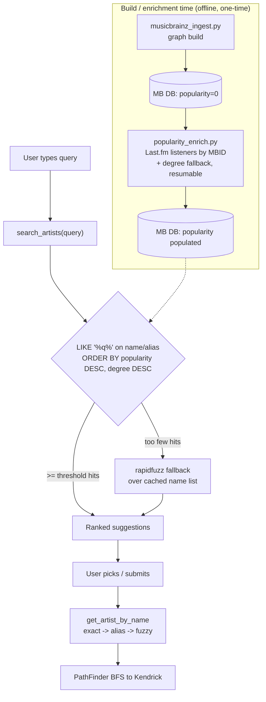

# feat: Search ranking, typo tolerance, popularity enrichment & preview refinement

**Product Contract preservation:** No upstream brainstorm; scope was confirmed live with the user (solo-mode scoping synthesis, 2026-07-06).

---

## Summary

The app's search is functionally broken for its most common case: **every one of the 119,729 MusicBrainz artists has `popularity = 0`**, so `search_artists`' `ORDER BY popularity DESC` is a no-op and results fall back to alphabetical. Typing "Mariah" surfaces "Mariah Adigun" and "Mariah Brooks" above **Mariah Carey**. This plan fixes ranking with a real popularity signal, adds typo/fuzzy tolerance so "Maria the scientist" resolves to "Mariah the Scientist", runs a timeboxed experiment on Spotify previews (default stays iTunes/Deezer), and applies the low-risk UI cleanups the user flagged. The full aesthetic redesign and a true typeahead dropdown component are **explicitly deferred** to the Track 2 design pass.

North star (per `STRATEGY.md`): optimize for **delight, surprise, and shareability** — a search that instantly finds the artist you meant is table stakes for that delight.

---

## Problem Frame

Testing surfaced a cluster of data-side and basic-UI issues, triaged live with the user:

1. **Search ranking is effectively random (alphabetical).** Root cause confirmed by direct DB query: all 119,729 artists have `popularity = 0`. MusicBrainz has no popularity metric, so the column was never populated, and `ORDER BY popularity DESC, name` degrades to `ORDER BY name`. This is the highest-value fix.
2. **No typo tolerance.** Both `search_artists` (LIKE `%q%`) and `get_artist_by_name` (exact / exact-alias) require the user to spell the artist correctly. "Maria the scientist" returns nothing.
3. **Spotify previews unavailable.** The app uses iTunes + Deezer because Spotify deprecated `preview_url` (2024-11-27). The user wants to *experiment* — not build — to see whether any Spotify preview/embed route is clean enough to adopt, and to fall back to iTunes if it's the same OAuth mess as the retired Spotify crawl.
4. **Basic UI is unrefined.** The 🔥/🎤 emoji read as unprofessional; the "N Degrees of separation" box, the artist cards, and the "Collaborated On" box are all oversized; the search label is long; the "Collaborated On" section doesn't say *whose* connection it is.

**Confirmed scope split (user, 2026-07-06):**
- **In scope:** popularity enrichment (research-led), search ranking fix, typo tolerance, Spotify preview *spike only*, basic CSS/markup cleanups, "Collaborated On" data-outlining refinement.
- **Deferred to Track 2 design pass:** modern search-bar redesign, true typeahead dropdown *component*, card re-styling beyond compacting, fancy copy/wording.

---

## Requirements

- **R1** — Search suggestions and exact/alias resolution rank prominent artists first (Mariah Carey above Mariah Adigun) using a real popularity signal, not alphabetical order.
- **R2** — The popularity signal is enriched from a free, MBID-matchable external source chosen on evidence, backfilled into the existing `popularity` column at build/enrichment time (not per-query), and resumable across interrupted runs.
- **R3** — A misspelled query that has no exact/substring match ("Maria the scientist") still surfaces the intended artist via fuzzy matching, without slowing the common (correctly-spelled) case.
- **R4** — A timeboxed spike determines whether a Spotify preview or embed route is viable and clean; the outcome (adopt / defer) is documented. The default preview path (iTunes → Deezer) is untouched unless the spike clearly wins.
- **R5** — Basic UI cleanups: remove the 🔥/🎤 emoji from the degree header, compact the degree box, artist cards, and preview box, and shorten the search label. CSS/markup only — no structural redesign.
- **R6** — The "Collaborated On" section identifies which pair of path artists the connection is between (data-outlining clarity).
- **R7** — All existing tests continue to pass; the legacy Spotify DB and depth-3 MB DB both still load under one schema (no regression to the dual-DB config or alias search).

---

## Key Technical Decisions

### KTD1 — Popularity signal: Last.fm `listeners` by MBID (primary), graph-degree as fallback/tiebreak

Researched four options against our nodes (which are keyed on **MBID**). Evidence gathered live 2026-07-06:

| Source | Auth | Key | Signal (Mariah Carey / Angeliq / Scientist) | Notes |
|---|---|---|---|---|
| **Last.fm `artist.getInfo`** | free API key (no OAuth) | **MBID** (native) | listeners + playcount | Best fit — MBID key means zero name-matching guesswork |
| Deezer `search/artist` | none | name search | `nb_fan` 3.43M / 118k / 25k | No key, confirmed working; but name-match risk on obscure/ambiguous artists |
| ListenBrainz `popularity/artist` | **token now required** | MBID (native) | listen counts | CC0, batch-friendly, but live probe returned auth-required ("AI scrapers") — docs stale |
| Spotify | OAuth client-creds | name/ISRC match | 0–100 | The retained-crawler "API mess"; avoid |
| Graph-degree (in-graph) | none | native | 192 / 29 / 27 edges | Free, instant, already works; coarse but a solid baseline |

**Decision:** Backfill `popularity` with Last.fm `listeners` (integer) keyed by each node's MBID. It is MBID-native (our nodes are MBIDs, so no fuzzy name-matching), needs only a single free API key (no OAuth handshake, unlike Spotify), and directly answers R1. **Graph-degree** (collaboration count) is computed as the universal baseline and the fallback wherever Last.fm returns no data, plus a secondary tiebreak. Deezer `nb_fan` is the documented no-key alternative if a Last.fm key proves unavailable.

Rationale for "not complex but solid" (user's phrasing): degree alone already fixes the headline Mariah bug for free, but Last.fm listeners give real cross-artist fidelity (e.g. distinguishing two genuinely-collaborative same-name artists) at the cost of one free key + a one-time enrichment run.

### KTD2 — Enrichment is a standalone, resumable post-build script

The graph build (`src/musicbrainz_ingest.py`) is a memory-bounded streaming join over the MB dump. Popularity enrichment is a different concern (external HTTP, rate-limited, re-runnable) and must not couple to dump parsing. Implement as a separate script over the `artists` table of an already-built DB. Follow the existing **migration-guard pattern** (`crawled`, `collaborators` columns in `database.py`) to add a `pop_enriched` marker so runs are resumable — `popularity = 0` is ambiguous (could be "no listeners" or "not yet checked"), so a distinct marker column is required. Reuse the **conservative-timeout, never-hang** lesson already encoded in `preview_fetcher.py` and the rate-limit hardening from `docs/plans/2026-07-01-002-fix-rate-limit-observability-hardening-plan.md`.

**Scale note:** ~120k artists at Last.fm's ~5 req/s ≈ 6–7 h for a full pass. Provide a `--min-degree` filter (default: enrich all) so a fast pass can enrich only artists with degree ≥ N (the ambiguous-collision set), letting graph-degree order the long tail. Surface progress + a final coverage count (how many enriched vs degree-only) — do not silently cap.

### KTD3 — Fuzzy matching: `rapidfuzz` fallback, triggered only when exact/LIKE is thin

Add `rapidfuzz` (fast C-backed) as the typo path. Keep the current LIKE query as the fast common case; when it returns zero (or very few) rows, fall back to `rapidfuzz.process.extract` over the cached artist-name list (loaded once via `@st.cache_resource`). This confines the cost to the typo path and keeps correctly-spelled searches instant. Alternatives rejected: SQLite FTS5 trigram (more schema/infra for a narrow need); `spellfix1` (requires loading a compiled extension — deployment friction for the coming public demo).

### KTD4 — Spotify previews: spike-only, safety-bounded, adopt only if runtime-volume-viable

Confirmed via research + live probe: `preview_url` is deprecated with no official replacement; the surviving routes are the unofficial `/v1/search` `preview_url` (needs OAuth client-credentials) and the embed iframe (oEmbed confirmed returning a player, but un-styleable and needing a track-ID lookup). Per the user: **experiment, don't build.** A throwaway spike script tests the cleanest route; if it re-introduces OAuth friction or is unreliable, we document the finding and keep iTunes/Deezer. No production wiring unless the spike clearly wins.

**Two separate risks, not one.** *Rate limiting* (HTTP 429) is metered per-app (client ID) over a rolling ~30s window and is recoverable/temporary — it throttles the app, not the personal account. An *account ban* comes from ToS abuse (redistributing audio, streaming manipulation), which a read-only metadata spike does not approach. The spike's danger is not the spike itself (a handful of requests) but **accidentally becoming a crawl**, which is what killed the retired Spotify crawler.

**Spike safety budget (hard, enforced in code):** ≤ 20 total requests; stop immediately on the first 429 and honor `Retry-After`; no retry-loop; **no iteration over the artists/collaborations tables** — only a fixed handful of hand-picked test tracks; client-credentials app token only, never a personal-account login. This makes "spike, not build" enforceable, not just intended.

**Adoption bar is higher than "it works."** If the spike succeeds technically, adopting Spotify previews means *more* requests at real scale — and that scale, on the public demo (ROADMAP #1), is where lockout risk actually lives. The current design fetches previews **live per song per render**; doing that against Spotify's per-app quota with unpredictable concurrent strangers would recreate the crawl problem. Therefore U4's decision gate requires a **runtime-volume projection**, and adoption is viable **only if** track-ID/preview resolution can be moved to a bounded, one-time **build-time** pass (same shape as U1 enrichment) with results persisted — so runtime makes zero app-keyed Spotify calls. The embed-iframe route fits this (IDs resolved once at build; the player then loads client-side from each user's browser = Spotify's load, not our quota). A route that *requires* live per-query Spotify calls at runtime is **not adoptable** regardless of spike success, and defers to iTunes/Deezer.

### KTD5 — UI cleanups are markup/CSS only

Emoji removal, compacting (padding/max-width/font-size), label shortening, and the "Collaborated On" pair label are all edits within `app.py`'s existing inline-HTML blocks and the `<style>` block. No new components, no restructuring — that is the deferred design pass's job.

---

## High-Level Technical Design

Search request flow after this plan (ranking + fuzzy layered onto the existing DB path):

The `popularity` column is the single seam between the offline enrichment and the live ranking — nothing in the query path changes shape, it just finally has real data to sort on.

---

## Implementation Units

### U1. Popularity enrichment script (Last.fm by MBID + degree fallback)

**Goal:** Populate the `popularity` column of a built MB DB with a real, MBID-matched prominence signal, resumably.
**Requirements:** R1, R2, R7
**Dependencies:** none (operates on an already-built DB)
**Files:**
- `src/popularity_enrich.py` (new) — CLI enrichment script
- `src/database.py` — add `pop_enriched` migration guard; add a bulk `set_popularity(artist_id, value)` / batch helper and a `get_artist_degree`/degree-backfill query
- `.env.example` — document `LASTFM_API_KEY`
- `requirements.txt` — no change if using stdlib `requests` (already present); add nothing for Last.fm
- `tests/test_popularity_enrich.py` (new)

**Approach:**
- Migration guard adds `pop_enriched INTEGER DEFAULT 0` to `artists` (mirror the existing `crawled`/`collaborators` guards).
- For each un-enriched artist: call Last.fm `artist.getInfo?mbid=<gid>` with the free API key; on success store `listeners` into `popularity` and set `pop_enriched=1`; on miss/empty, fall back to the artist's graph-degree (COUNT of edges) and still mark enriched.
- Compute degree once up front (single GROUP BY over `collaborations`) rather than per-artist.
- Rate-limit: cap ~5 req/s, conservative timeout (reuse `preview_fetcher.py`'s 6s posture), never hang; catch network/JSON errors → degree fallback, never crash the run.
- `--min-degree N` (default 0 = all) bounds runtime; `--db` path arg; resumable via `pop_enriched`.
- Log progress every N artists and a final summary: total, Last.fm-enriched, degree-fallback.

**Patterns to follow:** migration guards in `src/database.py:66-70,99-102`; conservative-timeout/graceful-degrade in `src/preview_fetcher.py`; rate-limit hardening plan `docs/plans/2026-07-01-002-*`.

**Execution note:** Enrichment is a long external-API run — start with a failing test on the fallback/marking logic (mockable) before wiring live HTTP.

**Test scenarios:**
- Artist with a Last.fm listeners value → `popularity` set to that integer, `pop_enriched=1`. (mock HTTP)
- Artist Last.fm returns no match / empty stats → `popularity` set to graph-degree, `pop_enriched=1`.
- Network error / malformed JSON for one artist → that artist falls back to degree, run continues (no raise).
- Re-run after partial completion → already-enriched artists (`pop_enriched=1`) are skipped.
- `--min-degree 2` → artists with degree < 2 are left degree-only / unprocessed per flag semantics.
- Degree computation: an artist with 3 edges gets degree 3 (covers dedup — undirected edge counted once).
- `Covers R2.` Resumability + fallback both exercised.

**Verification:** Run against a small fixture DB; `SELECT COUNT(*) FROM artists WHERE pop_enriched=1` equals processed count; Mariah Carey's `popularity` >> obscure Mariahs'.

---

### U2. Search ranking fix in `search_artists` and `get_artist_by_name`

**Goal:** With `popularity` now populated, make suggestion ordering and exact/alias resolution rank by prominence, with a prefix-match boost.
**Requirements:** R1, R7
**Dependencies:** U1 (needs `popularity` populated to see the effect; the code change is independent but is verified against enriched data)
**Files:**
- `src/database.py` — `search_artists` and the alias branch of `get_artist_by_name`
- `tests/test_database.py` — extend

**Approach:**
- `search_artists`: keep the LIKE-on-name-or-alias + `GROUP BY a.id`; change ordering to rank exact/prefix matches above mid-string matches, then by `popularity DESC`, then a degree tiebreak, then name. Prefix boost via a CASE expression (`name LIKE 'q%'` → 0 else 1) as the leading sort key so "Mariah" puts prefix hits first.
- `get_artist_by_name` alias branch already `ORDER BY a.popularity DESC` — verify it now resolves the popular canonical node when an alias is shared.
- No schema change; no change to the LEFT JOIN so the legacy Spotify DB (no aliases, popularity from Spotify) behaves as before.

**Patterns to follow:** existing `search_artists` at `src/database.py:365-399`; alias resolution at `src/database.py:344-362`.

**Test scenarios:**
- `search_artists("Mariah")` on enriched fixture → "Mariah Carey" ranks above "Mariah Adigun"/"Mariah Brooks".
- Prefix boost: query "Dra" ranks "Drake" (prefix) above an artist merely containing "dra" mid-name.
- Alias + popularity: existing "Kanye"→"Ye" tests still pass (R7).
- Legacy-DB shape: a DB with no aliases and Spotify popularity still orders by popularity (no regression).
- Tie handling: two equal-popularity artists fall back to degree then name deterministically.

**Verification:** Existing `tests/test_database.py` passes; new ranking assertions pass against a fixture with known popularity values.

---

### U3. Typo-tolerant fuzzy search fallback

**Goal:** A misspelled query with no exact/substring hit still surfaces the intended artist.
**Requirements:** R3, R7
**Dependencies:** none (layers on `search_artists`)
**Files:**
- `src/database.py` — fuzzy fallback in `search_artists` (or a helper); cached name-list accessor
- `app.py` — ensure the suggestion path uses the fallback (it already calls `search_artists`)
- `requirements.txt` — add `rapidfuzz`
- `tests/test_database.py` — extend

**Approach:**
- When LIKE returns fewer than a small threshold (e.g. < 3) rows, run `rapidfuzz.process.extract(query, names, limit=8, score_cutoff=~70)` over the artist-name list, map winners back to artist rows, and merge (dedup by id, LIKE hits first).
- Load the name→id list once; in the app it is cached (`@st.cache_resource`); in the DB layer expose a method that builds it lazily. ~120k names is fine for rapidfuzz (single-digit ms).
- Keep the correctly-spelled path on the pure-SQL branch — fuzzy only fires when SQL is thin, so common searches are unaffected.

**Patterns to follow:** `@st.cache_resource` usage in `app.py:48-64`; `search_artists` return shape.

**Test scenarios:**
- `Covers R3.` "Maria the scientist" (missing 'h') → "Mariah the Scientist" appears in results.
- One-char transposition / missing letter on a well-known name resolves to that artist.
- Correctly-spelled query with many LIKE hits → fuzzy path NOT invoked (assert via spy/threshold), results unchanged.
- Gibberish query below score cutoff → returns empty (no garbage matches).
- Fuzzy result rows have the same dict shape (`id`, `name`, `popularity`, `genres`) as LIKE rows.

**Verification:** New tests pass; manual check in-app that "Maria the scientist" surfaces the right artist.

---

### U4. Spotify preview spike (timeboxed experiment — NOT a build)

**Goal:** Determine on evidence whether a Spotify preview/embed route is clean enough to adopt; document the decision. Default preview path unchanged unless it clearly wins.
**Requirements:** R4
**Dependencies:** none
**Files:**
- `scripts/spike_spotify_preview.py` (new, throwaway/experimental — may be deleted after)
- `docs/musicbrainz-ingest-notes.md` or a short new note — record the finding
- (No change to `src/preview_fetcher.py` or `app.py` unless the spike wins.)

**Safety budget (hard, enforced in the spike script — see KTD4):** ≤ 20 total requests; abort on the first 429 and honor `Retry-After`; no retry-loop; NO iteration over the `artists`/`collaborations` tables (fixed hand-picked test tracks only); client-credentials app token only, never a personal-account login. The spike must be structurally incapable of becoming a crawl.

**Approach (timebox ~half a day):**
1. Try the `/v1/search` `preview_url` workaround with client-credentials OAuth (no user login): does the search response still include a playable `preview_url` in July 2026? Is auth a one-token client-credentials flow (acceptable) or the full user-OAuth mess (reject)?
2. If (1) fails, evaluate the embed iframe (`open.spotify.com/embed/track/{id}`): resolving track IDs still needs the search API; assess whether the un-styleable player is an acceptable UX vs the current custom `<audio>` element.
3. **Runtime-volume projection (required for a go):** estimate requests-per-search under the adopted design and check it against Spotify's per-app rate limit at public-demo concurrency. Confirm whether track-ID/preview resolution can move to a bounded one-time **build-time** pass with persisted results (making runtime app-keyed calls = 0). A route needing live per-query Spotify calls at runtime is a **no-go** even if step 1/2 succeed.

**Decision gate:** **adopt** only if ALL hold — single client-credentials token, reliable, UX not worse than iTunes/Deezer, AND a credible zero-runtime-call (build-time-resolved) path. Otherwise **defer** and keep iTunes/Deezer. Record the go/no-go with the volume reasoning.

**Execution note:** This is a spike. Do not wire results into the app or add production code paths during this unit. Its only deliverable is a working experiment (within the safety budget) + a written go/no-go that includes the volume assessment.

**Test scenarios:** `Test expectation: none — exploratory spike, no production behavior change.` (If the spike wins, adoption becomes a *separate* follow-up unit with its own tests.)

**Verification:** A documented finding (adopt/defer + why) committed to notes; if defer, no source changes remain.

---

### U5. Basic UI cleanups + "Collaborated On" pair label

**Goal:** Apply the low-risk visual refinements the user flagged, without touching the deferred redesign.
**Requirements:** R5, R6
**Dependencies:** none
**Files:**
- `app.py` — `display_path` (degree header), `display_artist_card`, the "Collaborated On" block, the search label, and the `<style>` block

**Approach:**
- **Degree header** (`display_path`, degrees 1 and 2+ branches): remove the 🔥 emoji; reduce padding (24px → ~16px) and font sizes so the box is more compact. Keep the "0 degrees / Kendrick himself" branch but drop/soften its 🎤.
- **Artist cards** (`display_artist_card`): reduce padding (32px → ~16–20px), `max-width` 500 → smaller, and the 2rem name size down — a tighter card, same content.
- **Preview box** ("Collaborated On" wrapper): trim padding and margins for compactness.
- **"Collaborated On" pair label (R6):** the section currently uses a generic pill; add the connecting pair to it (e.g. `Ye × Rihanna` under/next to the "Collaborated On" label) using `conn['from']['name']` and `conn['to']['name']`, which are already in scope in `display_path`. See Open Questions Q1 for the exact treatment.
- **Search label** (`st.text_input`): shorten "Enter an artist name:" to a tight label/placeholder. (Full search-bar restyle stays deferred.)
- No new components; edits confined to existing inline-HTML strings and the `<style>` block.

**Patterns to follow:** existing inline-HTML blocks in `app.py:111-267`; the "close every tag in one `st.markdown`" constraint noted at `app.py:193-196`.

**Test scenarios:** `Test expectation: none — presentational markup/CSS only.` Verify visually in the running app (degree box compact, no fire emoji, cards tighter, pair label present, preview box tighter).

**Verification:** Run the app; confirm each cleanup renders and no HTML block breaks (Streamlit's escaping constraint respected).

---

## Scope Boundaries

**In scope:** popularity enrichment (U1), search ranking (U2), typo tolerance (U3), Spotify preview spike (U4), basic UI cleanups + pair label (U5).

### Deferred to Follow-Up Work
- **Track 2 design pass:** modern search-bar redesign, true typeahead dropdown *component*, card re-styling beyond compacting, motion/interaction polish, fancy copy/wording.
- **Spotify preview adoption:** only if U4's spike wins — becomes its own unit with production wiring + tests.
- **Rebuild logistics:** the depth-3 graph is gitignored and rebuilt locally (~12 min); popularity enrichment is a separate ~hours-long run in the user's own terminal.

### Outside this plan's identity
- Deploying the public demo (ROADMAP #1), producer/credits graph (ROADMAP #5), mobile-responsive pass (ROADMAP #4).

---

## Open Questions

- **Q1 (R6, design-adjacent):** Exact treatment of the "Collaborated On" pair label — options: (a) `Ye × Rihanna` as a subtitle under the pill, (b) fold the pair into the pill text, (c) small "from → to" caption above the songs. Recommend (a) as the least-invasive data-clarity win; the richer treatment can go to the design pass. *Resolve during U5 or defer to design pass.*
- **Q2 (U1):** Full-graph enrichment (~6–7 h) vs a `--min-degree` fast pass. Recommend shipping the flag and letting the user choose at run time (default full, in their own terminal). *Execution-time choice.*
- **Q3 (U4):** If the `/v1/search` workaround needs anything beyond a single client-credentials token, treat as "API mess" → defer. *Resolved by the spike's decision gate.*

---

## Risks & Dependencies

- **Last.fm rate limits / long run (U1):** Mitigated by conservative pacing, resumability (`pop_enriched`), degree fallback on any failure, and the `--min-degree` bound. This is the project's known sore spot (the retired Spotify crawl) — treat rate-limit hygiene as first-class.
- **Spotify rate-limit / lockout (U4):** Two horizons. The *spike* is bounded by a hard ≤20-request budget and cannot iterate the graph, so its risk is near zero (429 throttles the app, not the account; bans require ToS abuse, not read-only reads). The *adoption* horizon is the real one — live per-query Spotify calls at public-demo scale would recreate the retired crawl's rate-limit wall. Mitigated by making build-time-resolved / zero-runtime-call a hard precondition of the KTD4 adoption gate; if that path isn't credible, U4 defers to iTunes/Deezer and the risk never materializes.
- **Fuzzy false positives (U3):** A too-low score cutoff surfaces junk. Mitigated by a conservative cutoff and firing fuzzy only when SQL is thin.
- **Dual-DB regression (R7):** Changes to `search_artists`/`get_artist_by_name` must preserve legacy-Spotify-DB behavior and existing alias tests. Covered by U2 test scenarios.
- **External dependency:** `LASTFM_API_KEY` required for full-fidelity enrichment; degree fallback means the app still ranks sensibly without it.

---

## Sources & Research

- Live DB probe (2026-07-06): all 119,729 artists `popularity=0`; degree signal Mariah Carey 192 vs obscure 1–2 edges.
- Deezer `search/artist` live probe: `nb_fan` Mariah Carey 3.43M / Angeliq 118k / Scientist 25k (no auth).
- ListenBrainz `popularity/artist` live probe: returns auth-required error (token now needed); docs stale.
- Spotify Web API changes (deprecating `preview_url`, 2024-11-27): https://developer.spotify.com/blog/2024-11-27-changes-to-the-web-api
- Spotify oEmbed live probe: returns embed iframe player (un-styleable), confirming the embed route exists.
- Last.fm `artist.getInfo` (MBID-keyed, listeners + playcount): https://www.last.fm/api/show/artist.getInfo
- Internal: `STRATEGY.md` (delight north star), `docs/plans/2026-07-01-002-fix-rate-limit-observability-hardening-plan.md` (rate-limit lesson), `src/preview_fetcher.py` (graceful-degrade posture), `src/database.py` (migration-guard pattern).

---

## Definition of Done

- `popularity` is populated across the MB DB via `src/popularity_enrich.py` (Last.fm listeners + degree fallback), resumably (R1, R2).
- "Mariah" ranks Mariah Carey first; ranking + prefix boost verified by tests (R1).
- "Maria the scientist" resolves to "Mariah the Scientist" via fuzzy fallback; common searches unaffected (R3).
- Spotify preview spike stays within the ≤20-request safety budget and produces a written adopt/defer decision that includes the runtime-volume assessment; default preview path intact unless the spike wins on all gate criteria (R4).
- Degree box has no fire emoji and is compact; artist cards and preview box are tighter; search label shortened; "Collaborated On" shows the connecting pair (R5, R6).
- Full test suite passes; legacy DB + alias search unregressed (R7).
