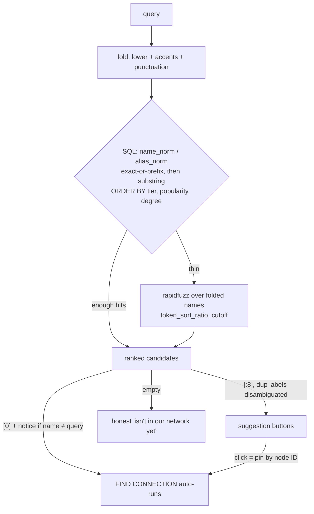

# fix: Unified search resolution — typos, accents, punctuation, duplicates never dead-end

**Product Contract preservation:** No upstream brainstorm; scope + both product forks confirmed live with the user (2026-07-06): submit **always auto-runs the top match** with a "Showing results for X" notice, and **prominence wins** exact-name collisions.

---

## Summary

Search is the app's make-or-break first touch, and it currently dead-ends on the most natural flow: type a near-miss ("rihana", "beyonce", "Maria the scientist") and click FIND CONNECTION → "isn't in our network yet" — *while the suggestions list is correctly showing the intended artist on the same screen*. Root cause: two disconnected resolution paths. `search_artists` (suggestions) got the fuzzy/rank upgrades; `get_artist_by_name` (submit) is still exact/alias-only.

Empirical research (22-case matrix + live UI reproduction on a fresh instance) also surfaced four deeper defects: **duplicate-name nodes resolve arbitrarily** (3,927 name groups / 9,704 artists; "The Game" ×3 can silently resolve to a 3-collab nobody over the 573-collab rapper), **punctuation blindness** ("Notorious BIG" can't find "The Notorious B.I.G.", "Tyler the Creator" can't find "Tyler, The Creator", "JAY Z" vs "JAY‐Z" U+2010), **alias-blind ranking** ("Biggie" suggestions rank "Biggie Bash" junk above The Notorious B.I.G.), and **indistinguishable duplicate suggestion labels** (three identical "The Game" buttons).

Fix: **one resolution pipeline** feeding both suggestions and submit, over **normalized (case/accent/punctuation-folded) name + alias columns** with a **precomputed degree column** — all free and local (SQLite + rapidfuzz, zero external calls). Submit never dead-ends when candidates exist: it runs the top candidate and says what it did.

---

## Problem Frame — empirical evidence (2026-07-06, fresh instance, live DB)

Live UI reproduction confirmed: "rihana" → suggestions correctly lead with RIHANNA → FIND CONNECTION still errors. (The user's original screenshots additionally reflected a stale `@st.cache_resource` instance; a restart resolves that layer, but the submit-path gap is real in fresh code.)

22-case matrix, both paths (condensed; ERROR = "isn't in our network yet"):

| Class | Query | Submit path | Suggestions top hit |
|---|---|---|---|
| exact popular | The Game | ⚠️ arbitrary node of 3 (573 vs 3 vs 3 collabs) | The Game ×3, indistinguishable |
| exact collision | Big | obscure "Big" | Big K.R.I.T. (B.I.G. missing — dots) |
| typo | rihana / Tayler Swift / Kendric Lamar | ❌ ERROR | ✅ correct artist first |
| accent | beyonce / Beyonse | ❌ ERROR | ✅ Beyoncé first |
| partial | Mariah the / Kend | ❌ ERROR | ✅ correct artist first |
| punctuation | Notorious BIG | ❌ ERROR | ❌ B.I.G. absent from both paths |
| punctuation | Tyler the Creator | ❌ ERROR | ✅ found (fuzzy) — submit still fails |
| alias | Kanye West | ✅ Ye | ✅ Ye |
| alias nickname | Biggie | ✅ B.I.G. (alias) | ⚠️ junk ("Biggie Bash") ranks above B.I.G. |
| gibberish | zxqwvk | ERROR (correct) | (none) (correct) |

Data-layer quantification: **3,927 duplicate-name groups covering 9,704 artists** ("TK"/"Solo"/"Killa" ×11 each). `get_artist_by_name`'s exact branch has **no ORDER BY** → arbitrary row on duplicates. "JAY‐Z" (U+2010) and "Jay Z" are distinct nodes only reachable by matching punctuation exactly.

UI observations for in-scope polish: 🎤 emoji still on suggestion buttons; 2-column suggestion grid pushes the top hit above the fold.

---

## Requirements

- **R1 — No false dead-ends.** Any query with plausible candidates resolves and runs; "isn't in our network yet" appears only when nothing clears the fuzzy cutoff (gibberish).
- **R2 — Submit auto-runs the top match** (user decision). When the resolved artist's name differs from the typed query, show a "Showing results for **X**" notice; suggestions remain visible as the escape hatch.
- **R3 — Prominence wins** (user decision). Same-name duplicates always resolve to the most prominent node; an exact-but-obscure match loses to a dramatically more prominent near-name. Obscure artists remain reachable by clicking their suggestion (resolves by node ID).
- **R4 — Accent/punctuation-blind matching** at the SQL layer: "beyonce"→Beyoncé, "Notorious BIG"→The Notorious B.I.G., "Tyler the Creator"→Tyler, The Creator, "JAY Z"→JAY‐Z, in both suggestions and submit.
- **R5 — Alias-aware ranking**: an alias prefix-match ranks like a name prefix-match ("Biggie" puts The Notorious B.I.G. first).
- **R6 — Duplicate suggestion labels are disambiguated** (e.g. collab-count qualifier) so three "The Game" buttons are tellable-apart.
- **R7 — Free and local.** SQLite + rapidfuzz only; zero external calls, zero cost. Search latency improves (precomputed degree replaces the live 300–600ms correlated subquery).
- **R8 — No regressions**: existing alias behavior, legacy Spotify DB compatibility, and the full test suite stay green; the empirical matrix is encoded as a permanent parametrized test.

---

## Key Technical Decisions

### KTD1 — One resolution pipeline, two consumers
A single `resolve` operation (query → ranked candidates) backs both the suggestions list and the submit button. Submit takes `candidates[0]`; suggestions render `candidates[:8]`. The two-path split *is* the root cause — after this change both consumers share one code path, and a **guard test pins the submit path to `resolve_artist`** so a future `app.py` edit can't quietly reintroduce the split (shared code is a convention until a test enforces it). Suggestion clicks bypass resolution entirely (pin by node ID).

### KTD2 — Ranking = match-tier, then prominence, with an explicit cross-tier override
Tiers on the **normalized** strings: exact = prefix (shared tier, per the shipped Mariah fix) > substring > fuzzy. Within a tier: prominence (see partial-enrichment rule below), then name. No special exact-match code path survives.

**Cross-tier prominence override (implements R3 — it does *not* fall out of tier ordering):** strict tier-first ordering would let an obscure exact "Big" beat The Notorious B.I.G. forever. Rule: a lower-tier candidate outranks a tier-0 hit when its prominence exceeds the tier-0 hit's by **≥ `CROSS_TIER_OVERRIDE_FACTOR` (default 50, a named constant pinned by the U2 matrix)**. Below the factor, exact wins; at/above it, prominence wins and the R2 notice reports the substitution.

**Partial-enrichment rule:** popularity is the within-tier prominence key only when the DB's enriched fraction (`pop_enriched=1`) is ≥ 90% (checked once at load, cached). Below that, rank degree-primary with popularity as tiebreak — otherwise, mid-enrichment, an enriched minor artist (25k listeners) outranks an unenriched superstar (popularity still 0).

### KTD3 — Normalized columns + precomputed degree, backfilled by migration guard
Add `name_norm` to `artists`, `alias_norm` to `artist_aliases`, `degree` to `artists` — backfilled via the existing migration-guard pattern (`crawled`, `pop_enriched`). Folding is **class-differentiated** (one shared function with the fuzzy processor): lowercase + NFKD accent-strip, then **dots/apostrophes delete** ("B.I.G." → "big"; a name that folds to empty falls back to raw lowercase, e.g. "!!!"), **hyphens (incl. Unicode variants)/commas/slashes → space**, whitespace collapse. The two R4 vector families demand different treatments — uniform punctuation→space would yield "b i g" and fail the plan's own headline case. Degree is a ranking key and a user-facing label, **not a one-time cache**: `refresh_degrees()` recomputes it from the migration guard AND as the final step of every graph build. This makes accents/punctuation first-class in indexed SQL LIKE (R4), kills the correlated degree subquery (R7), and costs ~seconds per DB. Free, local, no rebuild of the graph.

### KTD4 — Fuzzy layer folds punctuation too
`_fold_for_match` gains punctuation stripping so token comparison sees "the notorious big" — fixes the one case both current paths miss ("Notorious BIG"). Scorer stays `token_sort_ratio` (the WRatio substring-inflation lesson is already encoded in a comment + test).

### KTD5 — Parody/troll nodes: mitigate now, filter later
The user raised parody/bot artist nodes as a data-quality concern. Prominence-wins resolution neutralizes them in **same-tier collisions**, and the KTD2 cross-tier override extends that whenever the real artist clears the override factor. The residual exposure: a junk node named *exactly* a common misspelling whose real counterpart sits below the factor — accepted for now (R2's notice makes any substitution visible, and a U2 fixture documents the boundary behavior). A genuine filter (MB annotations, disambiguation strings, heuristics) is **deferred follow-up research**, not this plan.

---

## High-Level Technical Design

---

## Implementation Units

### U1. Normalized + degree columns with one-time backfill

**Goal:** Give SQL the folded strings and precomputed degree that every other unit ranks on.
**Requirements:** R4, R7, R8
**Dependencies:** none
**Files:** `src/database.py`, `src/musicbrainz_ingest.py`, `tests/test_database.py`
**Approach:** Extend `_fold_for_match`'s core into a shared `fold_name()` with class-differentiated punctuation per KTD3 (dots/apostrophes delete; hyphens/commas/slashes → space; empty-fold falls back to raw lowercase). Migration guards add `name_norm`, `degree` to `artists` and `alias_norm` to `artist_aliases`; when a column is created, backfill it in the same guard (single UPDATE pass + one degree GROUP BY — seconds on 119k rows) and index `name_norm`/`alias_norm`. `add_artist`/`add_artist_alias` populate the norm columns on insert. Degree is refreshable, not one-time: add `refresh_degrees()` (reusing `get_all_degrees`' single-pass GROUP BY), called from the migration-guard backfill and as the final step of the MB ingest build — a rebuilt DB starts with a fresh schema and zero edges, so without the build-end refresh every rebuild would ship all-zero degrees.
**Patterns to follow:** migration guards + backfill idiom in `src/database.py` (`crawled`, `pop_enriched`); `_fold_for_match`.
**Test scenarios:**
- Legacy DB (no norm columns) opens → columns added, backfilled: `name_norm` of "Beyoncé" = "beyonce", "The Notorious B.I.G." = "the notorious big" (dots delete), "JAY‐Z" = "jay z" (hyphen → space), "Tyler, The Creator" = "tyler the creator"; degree matches live edge counts.
- Fold asymmetry pinned in both directions: dots must delete (not space) and hyphens must space (not delete) — a uniform rule fails one family or the other.
- Name folding to empty ("!!!") falls back to raw lowercase, matching itself on lookup.
- New insert populates norm columns without backfill.
- Re-open of an already-migrated DB is a no-op for norm columns (idempotent).
- `refresh_degrees()`: a DB built edge-by-edge via `add_collaboration` ends with correct degree values after refresh; re-running after new edges updates counts (rebuild scenario).
- Legacy Spotify DB (aliases empty) migrates cleanly (R8).

### U2. `resolve_artist` — the single pipeline

**Goal:** One ranked-candidates function that both consumers use; retire divergent lookup logic.
**Requirements:** R1, R3, R4, R5
**Dependencies:** U1
**Files:** `src/database.py`, `tests/test_database.py`
**Approach:** `resolve_artist(query, limit)` → list of candidate dicts (standard artist shape + match tier + `degree`, read from the precomputed column on both the SQL and fuzzy paths — U4's collab-count labels need it). SQL pass over `name_norm`/`alias_norm` with tier CASE (exact-or-prefix on name **or alias** = tier 0, substring = 1) ordered by tier then prominence (KTD2's partial-enrichment rule decides the prominence key); when results are thin, fuzzy pass (existing `_fuzzy_search`, punctuation-folding processor per KTD4) merged in; then the KTD2 cross-tier override re-ranks the head. `resolve_artist` returns `[]` on no match — callers never index an unchecked `[0]`. `search_artists` becomes a thin wrapper. **`get_artist_by_name` is NOT routed through the pipeline:** it stays exact-name + exact-alias only — `scripts/verify_coverage.py` depends on those semantics to measure the no-connection rate, and fuzzy delegation would silently corrupt the project's own coverage instrument. It gains only duplicate-safety (prominence ORDER BY on the exact branch, matching the alias branch). Only `app.py`'s submit consumes the full pipeline. Kendrick self-lookup in `app.py` keeps working unchanged.
**Test scenarios (the empirical matrix, parametrized — permanent regression suite):**
- Covers R1/R4: each of "rihana", "beyonce", "Beyonse", "Maria the scientist", "Tayler Swift", "Kendric Lamar", "Mariah the", "Kend", "Notorious BIG", "Tyler the Creator", "JAY Z" resolves top-1 to the intended artist (fixture mirroring real names/prominence).
- Covers R3: "The Game" fixture ×3 (deg 573/3/3) → top-1 is the 573 node, deterministically.
- Covers R3, cross-tier override: "Big" (obscure exact) vs "The Notorious B.I.G." at ≥50× prominence → B.I.G. first; a variant below the factor → exact "Big" wins (`CROSS_TIER_OVERRIDE_FACTOR` pinned as a named constant).
- Partial-enrichment fixture: mixed-coverage DB (enriched minor artist, unenriched major) → degree-primary rule keeps the major first; fully-enriched fixture → popularity-primary.
- KTD5 boundary fixture: junk node named exactly a typo ("Rihana") vs real Rihanna → override resolves to Rihanna when the factor clears; documents accepted behavior at the boundary.
- Covers R5: "Biggie" alias-prefix ranks B.I.G. above "Biggie Bash"-style name matches.
- Gibberish "zxqwvk" → empty list (R1's honest case).
- Tie determinism: equal prominence falls back to name order.
- `get_artist_by_name` exact-only semantics preserved: "rihana" → None (coverage scripts unbroken); duplicate exact name → most prominent node; existing alias tests ("Kanye West"→Ye, case-insensitive, shared-alias-prefers-popular) still pass unchanged (R8).
- Guard (KTD1): `app.py`'s submit path resolves via `resolve_artist` — regression pin against reintroducing the two-path split.

### U3. Submit path auto-runs + "Showing results for" notice

**Goal:** FIND CONNECTION never falsely dead-ends (the headline bug).
**Requirements:** R1, R2, R3
**Dependencies:** U2
**Files:** `app.py`
**Approach:** Submit calls `resolve_artist`; empty → existing honest error; otherwise run `candidates[0]` and, when its name differs from the typed query (case-insensitive), render a compact notice: *Showing results for **Rihanna*** (link/hint that suggestions below offer alternatives). The notice is scoped to the same script run as the result — rendered inline with it, no `session_state` — so it naturally disappears on the next interaction, matching how every other message in the app behaves. Suggestion-click flow unchanged (already pins exact node). Keep the spinner and 0-degree/Kendrick special case.
**Test scenarios:** `Test expectation: none — thin UI glue over U2; behavior proven by the in-app verification protocol below.` (Resolution logic itself is fully covered in U2.)

### U4. Suggestions polish: alias-aware order, disambiguated duplicates, no 🎤

**Goal:** The suggestions list reflects the same ranking and stops showing indistinguishable/junk-led rows.
**Requirements:** R5, R6
**Dependencies:** U2
**Files:** `app.py`, `tests/test_database.py` (label-disambiguation helper if placed in DB layer)
**Approach:** Suggestions render `resolve_artist` output directly (alias-aware tiers arrive free from U2). Where two candidates share a display name, append a qualifier — recommended: collab count ("The Game · 573 collabs" / "The Game · 3 collabs"). When candidates still tie (same name AND same count — the HANA case), append a stable numbered suffix ordered by node id ("HANA · 2 collabs (2)") so labels are always distinct and deterministic. Drop the 🎤 prefix (user feedback). Single-column list ordering so the top hit is visually first (grid re-design itself stays deferred).
**Test scenarios:**
- Duplicate-label disambiguation: two "HANA" candidates → labels differ and are stable — including when their collab counts also tie (numbered-suffix fallback).
- Unique labels get no qualifier.

### U5. In-app verification protocol + suite green

**Goal:** Prove the fixes in the real UI, the way the user actually drives it, and keep the whole suite green.
**Requirements:** R1–R8
**Dependencies:** U1–U4
**Files:** `tests/test_database.py`, `tests/test_popularity_enrich.py` (unchanged, must stay green)
**Approach:** Full pytest run; then drive the fresh preview instance (port 8502 config `rabbit-hole-test`) through the key flows with screenshots: (1) "rihana" + FIND CONNECTION → auto-runs Rihanna with notice; (2) "beyonce" submit → Beyoncé; (3) "Notorious BIG" submit → The Notorious B.I.G.; (4) "The Game" submit → the 573-collab node; (5) suggestion click still pins exact node; (6) gibberish → honest error. Streamlit driving note: commit text input via React value-setter + `input` event + blur (Enter alone does not commit).
**Test scenarios:** covered by U2's parametrized matrix; this unit's deliverable is the green suite + screenshot evidence of the six flows.

---

## Scope Boundaries

**In scope:** everything above — resolution correctness, ranking, normalization, submit UX notice, suggestion label fixes.

### Deferred to Follow-Up Work
- **Parody/troll-artist filtering research** (user-raised): investigate MB disambiguation/annotation signals to down-rank or flag parody nodes. Prominence-wins already neutralizes them in collisions; revisit after real-user feedback.
- **Entity merge for punctuation-variant duplicates** ("Jay Z" vs "JAY‐Z"): resolution now picks the prominent one; actually merging nodes is an ingest/data question.
- **Search-bar component redesign + true typeahead dropdown**: Track 2 design pass (standing decision).
- **Precomputed-degree reuse in enrichment** (`popularity_enrich.py` could read the new `degree` column instead of recomputing): harmless optimization, not needed for correctness.

### Outside this product's identity
- Paid search services, hosted search engines, external AI ranking APIs — explicitly excluded by the free-and-local constraint (R7).

---

## Open Questions

- **Q1:** "Showing results for X" notice styling (inline caption vs `st.info`) — implementer's call within U3; keep it quiet, not another alert box.

---

## Risks & Dependencies

- **Fuzzy auto-run misfires** (R2 accepts this trade-off): a marginal fuzzy top-hit auto-runs a wrong artist. Mitigations: cutoff stays conservative (72), notice makes the substitution visible, suggestions offer one-click correction. Watch for real-user complaints before adding a confidence gate.
- **Backfill correctness on odd names** (empty after folding, e.g. "!!!"): fold falls back to the raw lowercase name when folding empties the string — add to U1 tests.
- **Streamlit cache staleness** during rollout: the running app must be restarted after upgrade (documented; bit the user once already).
- **Enrichment concurrency:** the user's Last.fm enrichment run writes in chunks; U1's backfill takes a brief write lock. Run the migration when enrichment is idle, or rely on SQLite's busy-wait (acceptable locally).

---

## Verification Contract

1. `python3 -m pytest` fully green (existing 50 + new matrix tests).
2. The six in-app flows in U5 pass with screenshot evidence on a fresh instance.
3. Latency spot-check: broad queries ("li", "the") return suggestions well under the current 300–600ms (precomputed degree).

## Definition of Done

- Every non-gibberish case in the 22-case matrix resolves to the intended artist on **both** paths — zero false "isn't in our network yet" (R1, R4).
- Submit always runs the top candidate; substitution is visibly noticed (R2).
- "The Game" and every duplicate-name lookup resolve deterministically to the most prominent node (R3).
- "Biggie" suggestions lead with The Notorious B.I.G.; duplicate labels disambiguated; 🎤 gone (R5, R6).
- Zero external calls added; suite green; legacy DB loads (R7, R8).

---

## Sources & Research

- Live UI reproduction + screenshots (fresh instance, port 8502, 2026-07-06): "rihana" suggestions-vs-submit contradiction captured; suggestion-click → "Rihanna × Kendrick Lamar" works.
- 22-case two-path matrix (this doc's Problem Frame table) — run against the real 119,729-node MB DB.
- Duplicate-name quantification: 3,927 groups / 9,704 artists; "The Game" node degrees 573/3/3; "JAY‐Z" U+2010 vs "Jay Z".
- Product decisions (user, 2026-07-06): always-auto-run top match; prominence wins collisions; parody-filter research deferred.
- Prior plan (shipped earlier today): `docs/plans/2026-07-06-001-feat-search-ranking-preview-refinement-plan.md` — this plan builds directly on its U2/U3 ranking + fuzzy work.
