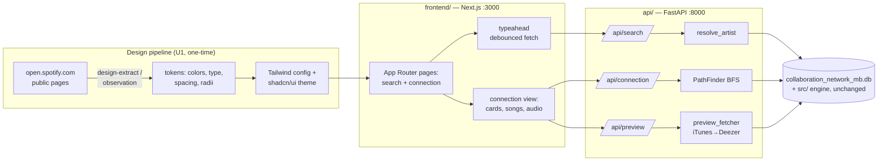

# feat: Spotify-inspired Next.js replatform — Track 2 begins

**Product Contract preservation:** No upstream brainstorm; scope, product framing, and both stack decisions confirmed live with the user (2026-07-06): the app is a **portfolio concept piece — "a feature I'd love to see in Spotify"** — with a Spotify-inspired (never asset-lifted) design system, built on Next.js because the user explicitly anticipates multi-page growth and possible monetization.

---

## Summary

Rabbit Hole's data layer is now excellent (unified search resolution shipped today, PR #21) but the presentation is bare Streamlit — which caps delight, blocks a real typeahead, and can't showcase the user's design taste (the portfolio's whole point). This plan replatforms the frontend: **Next.js + Tailwind + shadcn/ui styled by design tokens extracted from Spotify's public pages** (measurements, not files), with **Figtree** as the Circular-feel typeface and a **FastAPI wrapper** exposing the existing Python engine untouched. The Streamlit app stays alive as the working demo throughout. Built with a watch-it-being-built loop: every unit ends with a live preview screenshot.

North star (STRATEGY.md): delight, surprise, shareability — "a generic Streamlit UI caps how surprising/fun this can feel" (Track 2, verbatim).

---

## Problem Frame

1. **Streamlit's interaction ceiling is the standing blocker** for the deferred UX list: real typeahead dropdown, motion, hover states, component polish. Every prior UI improvement has been CSS injected through `unsafe_allow_html` against a framework that fights back.
2. **The portfolio memo requires design craft**: "as if it were in addition to Spotify." That means a faithful Spotify *feel* achieved safely — recreated tokens and look-alike type, zero lifted assets/code/trademarks (user's legal question resolved 2026-07-06: clean-room recreation + non-affiliation disclaimer is the established, safe genre).
3. **Growth is declared**: multi-page features, possibly a paid tier, plus STRATEGY Tracks 3–4 (any-artist template = dynamic routes; listening-pattern analysis = more views). The stack must not need a rewrite at page three.
4. **Research (2026-07-06, /last30days + landscape scan)**: design-token extraction is a mature 2026 tool genre — [design-extract](https://github.com/Manavarya09/design-extract) (DTCG tokens → Tailwind v4 config + shadcn/ui theme, MCP server for Claude Code), [dembrandt](https://github.com/dembrandt/dembrandt) (2.1K★ live). Public, attributed Spotify UI recreations are normal portfolio practice. Spotify itself dropped Circular for a custom face in 2024; the accepted free stand-ins are **Figtree** (designed as a Circular-alike) and DM Sans (`ss03`).

---

## Requirements

- **R1 — Stack:** Next.js (App Router) + Tailwind + shadcn/ui frontend; FastAPI backend wrapping the existing Python engine. All free/open-source; $0 services.
- **R2 — Engine parity, no logic duplication:** the API returns `resolve_artist`/pathfinder output verbatim; the frontend renders and never re-ranks or re-implements search policy. All behaviors shipped today survive: auto-run top match, "Showing results for X" notice, disambiguated duplicate labels, honest empty state.
- **R3 — Inspired, not lifted:** design system = tokens extracted/observed from Spotify's public pages + Figtree + original CSS/components. Hard exclusions: Spotify logo/wordmark as branding, their font files, any code/assets from their bundle. A visible "unofficial concept — not affiliated with Spotify" disclaimer plus the existing MusicBrainz/iTunes/Deezer attribution.
- **R4 — Real typeahead:** debounced-as-you-type dropdown with keyboard navigation, powered by `/api/search`; Enter runs the top candidate (same R2-policy).
- **R5 — Connection view parity+:** degrees header, artist cards, "Collaborated On" with pair labels, working 30s audio previews and store link-outs — redesigned in the new system, feature-complete vs. Streamlit (per U6's enumerated checklist, not a single side-by-side query). **Mobile-first responsive**: every screen works at 375px and desktop.
- **R6 — Watch it being built:** every UI unit ends with the dev server running in the preview browser and screenshots shared; the 16-case resolution matrix is driven through the new UI **at both 375px and desktop widths** before done.
- **R7 — Demo continuity:** `app.py`/Streamlit remains untouched and runnable throughout; the replatform lives beside it (`api/`, `frontend/`).
- **R8 — Python suite stays green** (78 tests); new API layer gets its own tests.

---

## Key Technical Decisions

### KTD1 — Next.js over static-Tailwind (decided with the user, alternatives documented)
Static HTML+Tailwind+vanilla JS was the faster-today option and was seriously weighed. Next.js wins on the user's own declared trajectory: multi-page growth, possible fee/accounts, Track 3 dynamic routes (`/artist/[name]`), component reuse, and portfolio signal (the 2026 industry-standard stack). The token pipeline is tailor-made for it — design-extract emits a shadcn/ui theme directly. Cost of choosing Next.js now ≈ a day of scaffold; cost of choosing static and outgrowing it ≈ a frontend rewrite.

### KTD2 — Two processes, one brain, one origin
`frontend/` (Next.js, port 3000) fronts all browser fetches through **same-origin `/api/*` via a Next.js rewrite** proxying to `api/` (FastAPI, port 8000) — no CORS middleware, no client-side API-origin env plumbing, and the deferred deploy plan inherits an origin-stable pattern. The API imports the engine from `src/` (note: `src/` modules use flat imports — `api/main.py` replicates app.py's `sys.path.insert(0, <repo>/src)`, it does not treat `src/` as a package). Python remains the single source of truth for ranking, resolution, pathfinding, and preview fetching (server-side, keeping the iTunes/Deezer accept-logic in one place). No search logic is ever reimplemented in TypeScript — that's how parity survives (R2).

### KTD3 — Token pipeline with a guaranteed floor
Primary: run **design-extract** against Spotify's public web pages → DTCG tokens + Tailwind config + shadcn theme. Secondary: **dembrandt**. Guaranteed fallback: a **hand-built token file from observation** — the core palette is already known and in production use in `app.py` today (#1DB954, #121212, #181818, #282828, #B3B3B3, 8/12px radii, 500px pills). The extractor upgrades fidelity and coverage (type scale, spacing rhythm, shadows); it is not a single point of failure. Risk noted: Spotify's web player may gate parts of its UI behind login — extract from the public landing/browse surfaces and fill gaps by observation.

### KTD4 — Type: Figtree, committed locally
Figtree (Google Fonts, OFL — redistribution permitted) was literally designed as a free Circular-alike; DM Sans + `ss03` is the documented alternate. Download the OFL files once, commit under `frontend/fonts/`, load via **`next/font/local`** — zero network dependency at build *or* runtime (`next/font/google` fetches from Google's servers at build time, and a flaky fetch silently swaps in a fallback font, corrupting the exact feel this system exists for). Provenance + license noted in DESIGN-NOTES.md. Never Circular or Spotify Mix files.

### KTD5 — Legal-safety checklist as an artifact
The plan's safety stance becomes a committed checklist in the repo (`frontend/DESIGN-NOTES.md`): tokens-by-observation ✓, original components ✓, look-alike open font ✓, no logo/wordmark/assets/code ✓, disclaimer copy ✓, "concept" framing in README ✓. This is portfolio armor: reviewers see the discipline, not just the resemblance.

### KTD6 — Deployment is explicitly out of scope here
Local-first build. Public deploy (Vercel for frontend + a small host for FastAPI + the 187MB DB) is its own follow-up plan aligned with ROADMAP #1; Streamlit remains the shareable demo until then (R7).

---

## High-Level Technical Design

---

## Implementation Units

### U1. Token extraction dry run → committed design tokens

**Goal:** A committed, legally-clean token set (colors, type scale, spacing, radii, shadows) + Tailwind/shadcn theme derived from Spotify's public surfaces.
**Requirements:** R3, R7
**Dependencies:** none
**Files:** `frontend/design/tokens.json`, `frontend/DESIGN-NOTES.md` (KTD5 checklist + extraction provenance), tooling scratch only
**Approach:** Run design-extract (then dembrandt if needed) against Spotify's public pages; review output for junk; merge with the observation-known core palette; document which tokens came from extraction vs. observation. If extractors fail entirely, hand-build from observation (guaranteed floor, KTD3). Include the disclaimer copy decision here.
**Test scenarios:** `Test expectation: none — design artifact; correctness is reviewed visually and via the KTD5 checklist.`
**Verification:** tokens file exists with ≥ core palette + type scale + radii; DESIGN-NOTES.md checklist all-checked; user has seen and approved the token swatch (screenshot).

### U2. FastAPI wrapper over the existing engine

**Goal:** The Python brain becomes an HTTP API without changing a line of engine logic.
**Requirements:** R2, R7, R8
**Dependencies:** none
**Files:** `api/main.py`, `api/requirements.txt` (fastapi, uvicorn), `tests/test_api.py`
**Approach:** Endpoints: `GET /api/search?q=` → `resolve_artist` candidates + disambiguated labels **+ a server-computed `matches_query` flag per candidate** (the exact comparison app.py uses today: `name.strip().lower() != query.strip().lower()`) so the "Showing results for X" notice decision is NEVER re-implemented client-side — Python `lower()` vs JS `toLowerCase()` diverge on Unicode, and that divergence would be an invisible parity break. `GET /api/connection?artist_id=` → path, degrees, per-hop song details; `GET /api/preview?song=&artists=` → preview URL + store link (server-side `get_preview`, in-process cache as today). **All endpoints are plain `def`, not `async def`** — the wrapped engine (sqlite, requests-based `get_preview` with 6s-per-provider timeouts) is synchronous; async endpoints would block the event loop and stall the typeahead behind slow iTunes calls. **Resolve Kendrick's node id at startup exactly as app.py's `resolve_kendrick_id` does** (RABBITHOLE_KENDRICK_ID env override, else `get_artist_by_name("Kendrick Lamar")`) and pass it explicitly as `to_artist_id` on every `find_connection` call — PathFinder's hardcoded default is a legacy Spotify id that returns no-path for the entire MusicBrainz graph. Browser traffic arrives same-origin via the Next.js rewrite (KTD2) — no CORS middleware needed. **Startup guard:** assert the DB file exists before constructing `CollaborationDatabase` (the constructor otherwise creates an empty DB and the API would silently serve an empty network). **Status semantics:** 404 only when `get_artist(artist_id)` is None; a known artist whose `find_connection` returns None gets 200 with `{"connection": null}` and U5 renders the existing no-connection message — the graph is fully connected today, but the planned bootleg-edge filter can disconnect components. DB path resolved once via `resolve_db_path`; note `_get_connection` already opens a fresh SQLite connection per call, which is what makes FastAPI's threadpool safe. Never re-rank in the API layer — serialize engine output as-is (R2).
**Patterns to follow:** `app.py`'s `resolve_db_path`/Kendrick-id resolution; `preview_fetcher`'s graceful-degrade.
**Test scenarios:**
- `/api/search?q=rihana` → candidates[0].name == "Rihanna" (parity with engine) and `matches_query` false (notice fires); `?q=Rihanna` → `matches_query` true (no notice).
- `/api/search?q=zxqwvk` → empty list, 200 (honest empty, not error).
- Duplicate-name query → labels field is disambiguated (reuses `disambiguate_labels`).
- `/api/connection` for a 1-degree artist → degrees, path, and song details shape.
- Unknown artist_id → 404 with clean message.
- `/api/preview` miss → `null` body, 200 (graceful, mirrors `get_preview`).
**Verification:** `pytest tests/test_api.py` green; full suite still 78+ green (R8).

### U3. Next.js scaffold wired to the design system

**Goal:** A running Next.js app that already *feels* Spotify: tokens live in Tailwind, Figtree loaded, dark shell, disclaimer + attribution footer.
**Requirements:** R1, R3
**Dependencies:** U1 **floor palette only** — the observation-known core palette (already live in app.py) is available immediately, so U2+U3 proceed in parallel with U1's extraction; final U1 tokens are a hot-swappable Tailwind-config change, not a sequencing gate (and the user's swatch approval gates the *swap*, not the scaffold)
**Files:** `frontend/` (create-next-app: App Router + TS + Tailwind), `frontend/tailwind.config.ts` (tokens), `frontend/app/layout.tsx` (Figtree via next/font, footer), shadcn/ui init
**Approach:** Scaffold; import U1 tokens as Tailwind theme + CSS vars; shadcn/ui init with the extracted theme; global dark background, Figtree; footer carries the unofficial-concept disclaimer + MusicBrainz (CC0)/iTunes/Deezer attribution (ported from app.py). `.gitignore` node_modules.
**Test scenarios:** `Test expectation: none — scaffold/styling; verified visually.`
**Verification:** `next dev` renders the shell in the preview browser; screenshot shared; token swatch page matches U1.

### U4. Search experience — the real typeahead

**Goal:** The search interaction Streamlit could never do: type → ranked dropdown → keyboard/click select → run.
**Requirements:** R2, R4
**Dependencies:** U2, U3
**Files:** `frontend/app/page.tsx`, `frontend/components/search-typeahead.tsx` (+ shadcn primitives)
**Approach:** Debounced (~150ms) fetch to `/api/search`; dropdown renders disambiguated labels with prominence context; arrow-key + Enter navigation; Enter with no selection runs candidates[0] (auto-run policy) with the "Showing results for **X**" notice driven by the API's `matches_query` flag (never a client-side string comparison); empty input → nothing; no results → honest empty message. Abort in-flight requests on keystroke (no stale dropdowns); during the debounce-to-response window the previous results stay visible with a subtle inline pending indicator (no flicker, no spinner takeover). **Known engine cost:** the fuzzy fallback measures ~190ms/call on the 119k-artist DB and fires on thin (<3 SQL hits) queries — typical mid-typo keystrokes. Mitigate in the API/UI layer (slightly longer debounce for short queries; accept ~350ms worst-case on typo states); if U6 proves that insufficient, precomputing folded name choices in `src/database.py` is pre-authorized as a **pure-performance exemption** to the engine-untouched stance (no ranking-logic change). **The dropdown is a dumb renderer of API order:** any list primitive's built-in filtering/sorting MUST be disabled — shadcn's Command (cmdk) fuzzy-filters and re-sorts items by default (`shouldFilter={false}` required), which would silently violate R2's never-re-rank contract in exactly the duplicate-name/prominence cases the screenshots wouldn't catch.
**Test scenarios (component-level where cheap, otherwise U6's live matrix):**
- Typing "rihana" shows Rihanna first in the dropdown.
- Order parity: rendered dropdown order is identical to the `/api/search` candidates array order for a duplicate-name fixture query (guards against primitive re-sorting).
- Enter with no selection navigates to Rihanna's connection with the notice.
- Selecting the 2nd item runs that exact node (id-pinned).
- Escape closes; stale-response race doesn't repaint (abort verified by rapid typing).
**Verification:** live in preview: type-pause-see flows screenshotted.

### U5. Connection view — the delight screen

**Goal:** The path result redesigned in the new system, feature-complete vs. Streamlit and visibly *better*.
**Requirements:** R2, R5
**Dependencies:** U2, U3
**Files:** `frontend/app/connection/[id]/page.tsx`, `frontend/components/{degree-header,artist-card,collab-section,audio-preview}.tsx`
**Approach:** Degrees header (compact, no emoji — carry today's decisions); artist cards; "Collaborated On" blocks with the pair label ("Rihanna × Kendrick Lamar"), per-song rows with audio previews and store link-outs. **Preview semantics: fetch `/api/preview` on first play-interaction, never on mount** — a many-song page bursting parallel preview fetches would trip iTunes' ~20/min soft limit and previews would silently vanish. **Loading state: skeleton cards matching the final layout** (the page assembles, never pops from blank). **"+N more collaborations" = inline expand, focus preserved.** **Accessibility bar (inherits U4's):** every interactive element keyboard-reachable, audio controls labeled, expansion focus-managed. **States enumerated:** loading, 0-degree Kendrick easter-egg, known-artist-no-connection (from the API's `{"connection": null}`), unknown-artist not-found, preview-miss row (no player, store-search link stays). Responsive at 375px + desktop (R5). Motion/hover polish within token constraints.
**Test scenarios:**
- 1-degree and 3-degree paths render all hops with pair labels between consecutive artists.
- Preview miss renders the row without a player (graceful), store-search link still present.
- 0-degree (Kendrick himself) shows the dedicated state.
**Verification:** side-by-side screenshots vs. Streamlit for the same query; user sign-off.

### U6. Parity matrix + watch-it-built verification

**Goal:** Prove the new frontend preserves every data-layer win shipped today, live.
**Requirements:** R2, R6, R8
**Dependencies:** U4, U5
**Files:** `.claude/launch.json` (frontend + api dev entries), `tests/test_api.py` (matrix subset)
**Approach:** First, extract a **one-time enumerated parity checklist** from app.py's connection-view behaviors (every state and affordance as a line item, appended to DESIGN-NOTES.md) — U5's "feature-complete" claim is verified against that checklist, not a single side-by-side query. Then drive the 16-case resolution matrix (as encoded in `tests/test_database.py`'s `MATRIX` list) through the new UI in the preview browser at **375px and desktop** (typo, accent, punctuation, duplicate-name, alias, gibberish); screenshot the six headline flows; confirm notice/labels/empty-state parity; full Python suite + API tests green; Streamlit app still boots (R7).
**Test scenarios:** the matrix cases as API-level assertions (cheap, fast) + the six UI flows as the manual/screenshot protocol.
**Verification:** all screenshots delivered; suites green; a short parity note appended to `frontend/DESIGN-NOTES.md`.

---

## Scope Boundaries

**In scope:** everything above — tokens, API wrapper, scaffold, typeahead, connection view, parity verification.

### Deferred to Follow-Up Work
- **Public deployment** (Vercel + API host + DB hosting) — own plan, aligns with ROADMAP #1 (KTD6).
- **Copy/wording pass** — user explicitly deferred "fancy copy" until the data/design foundations settle.
- **Motion/micro-interaction deep polish** — beyond tasteful hover/transition defaults; revisit after first user feedback.
- **Streamlit retirement** — only after the new app deploys publicly.
- **Track 3/4 features** (any-artist seed routes, listening analysis) — the stack now supports them; not built here.

### Outside this plan's identity
- Paid design services, Spotify API usage (settled: none survives), lifting any Spotify asset/code (hard exclusion, KTD5).

---

## Open Questions

- **Q1 (U1):** If extraction quality on Spotify's logged-out pages is poor, how much manual curation is acceptable before the extractor stops paying for itself? *Resolve during U1 — the observation floor caps the downside.*
- **Q2 (U5):** Path visualization ambition — vertical card flow (Streamlit-parity, safe) vs. a more graph-like connected visual. *Recommend starting vertical, revisit in polish; implementer's call with user screenshot feedback.*
- **Q3 (U5, deploy-adjacent):** Server-render the connection page (SSR fetch to FastAPI) so shared links carry OG/social preview metadata? Shareability is the north star, and client-only rendering yields blank link cards. *Not required for local build; decide before the deploy follow-up — leaning yes.*

---

## Risks & Dependencies

- **Extractor vs. login wall:** Spotify's richest UI sits behind auth; public surfaces may yield partial tokens. Mitigation: KTD3's observation floor + curate from the public landing/browse pages. Never log in through the extractor (keeps the clean-room story clean).
- **Node toolchain novelty in this repo:** first JS build surface. Mitigation: standard create-next-app defaults, lockfile committed, `.nvmrc`; agent does the driving.
- **Two-process dev ergonomics:** two servers to run. Mitigation: both in `.claude/launch.json`; documented one-liner in README.
- **Scope temptation:** a redesign invites endless polish. Mitigation: R6's parity matrix is the definition of "done enough"; polish beyond it goes to the deferred list.
- **Trademark drift over time:** future contributors might add a Spotify logo "for realism." Mitigation: KTD5 checklist committed in-repo.

---

## Verification Contract

1. Python suite green (78+) and new `tests/test_api.py` green.
2. The six headline UI flows + 16-case matrix verified in the live preview with screenshots (R6).
3. KTD5 legal-safety checklist fully checked in `frontend/DESIGN-NOTES.md`.
4. Streamlit app boots unchanged (R7).

## Definition of Done

- Committed token set + design notes with provenance and safety checklist (R3).
- FastAPI serves search/connection/preview with engine parity, tested (R2, R8).
- Next.js app: Spotify-feel shell, real typeahead, connection view with working audio previews — all built under the watch-it-built loop with screenshots at every unit (R1, R4, R5, R6).
- Streamlit demo untouched and running (R7). $0 spent (R1).

---

## Sources & Research

- Live decisions (user, 2026-07-06): portfolio-concept framing; inspired-not-lifted constraint accepted; Next.js locked over static after growth discussion.
- /last30days run (2026-07-06): design-token extraction ecosystem (design-extract w/ MCP + Tailwind/shadcn emitters; dembrandt 2.1K★ live), extraction-vs-cloning doctrine (superdesign.dev), Figtree/DM Sans as Circular stand-ins (learnui.design; Spotify moved to custom "Spotify Mix" 2024 per sensatype.com), thriving public Spotify-clone genre (igorbabko, eduamdev, AryanBV repos). Raw: `~/Documents/Last30Days/recreating-famous-app-designs-spotify-clones-design-tokens-tailwind-raw-v3.md`.
- Internal: `STRATEGY.md` Track 2 (verbatim motivation), plans 001/002 (today's data-layer wins this plan must preserve), `app.py` (existing token usage + attribution footer to port).
