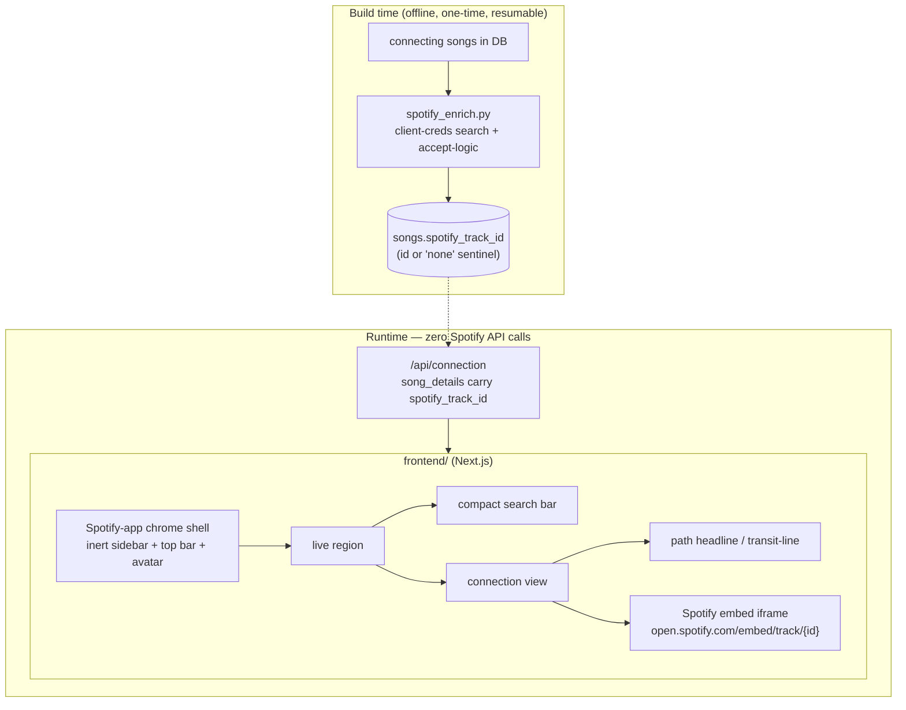

# feat: Spotify embeds, Spotify-app chrome, and results-page path treatment

**Product Contract preservation:** No upstream brainstorm; scope + all three forks confirmed live with the user (2026-07-06). This plan is written to be self-contained for a fresh session (the current one is low on context) — it carries the research evidence inline so an implementer needs nothing but this file and the repo.

> **Context for a new session:** Rabbit Hole is a "six degrees of Kendrick Lamar" concept. The data engine (Python: `src/`) is done and solid — unified search resolution (plans 001/002, shipped, PR #21). A Next.js + FastAPI frontend exists (plan 003, built + verified): `frontend/` (Next.js 16, Tailwind v4, Figtree, tokens in `frontend/app/globals.css`), `api/main.py` (FastAPI wrapping the engine), typeahead + connection view working. **Run it:** `python3 -m uvicorn api.main:app --port 8000` then `cd frontend && npm run dev` (→ localhost:3000; `/api/*` is proxied to :8000 via `next.config.ts` rewrite). The retired Streamlit app (`app.py`) still runs independently. This plan is the *next* design+preview pass on top of plan 003.

---

## Summary

Three design/preview upgrades to the Next.js app, plus one documented data deferral:

1. **Replace iTunes/Deezer previews with Spotify embeds.** iTunes/Deezer miss real songs (e.g. "Slow Down" — Friday/Mariah the Scientist — has no iTunes preview), and the "Search on Apple Music" link-out is high-friction (it only pre-fills the search box; the user must still hit enter). **Research confirmed (2026-07-06, live probe): the Spotify embed iframe plays a 30s preview for logged-out visitors, resolves the exact failing song, needs no visitor auth, and does not depend on the dead `preview_url`.** Adopting it retires the reliability misses, the link-out friction, *and* the Deezer/Apple attribution the user dislikes.
2. **Wrap the app in an inert Spotify-web-app chrome** (left sidebar, top bar, profile avatar) so it reads as "a feature living inside Spotify" — the portfolio memo. The chrome is visually complete but non-interactive; Rabbit Hole is the one live surface. Built clean-room from the existing design tokens (no Spotify logo/wordmark/assets).
3. **Results-page path treatment** — a path headline / transit-line ("Larry June → Dom Kennedy → Kendrick Lamar", echooo.me-inspired) at the top, and a tighter modern search bar.
4. **Deferred (documented, not built): spurious-edge data cleanup** — the Count Basie × Busta Rhymes "Topsy" compilation artifact is real; captured with evidence for a dedicated later data pass.

---

## Problem Frame

Evidence gathered live 2026-07-06:

- **Preview reliability:** `get_preview` (iTunes→Deezer, `src/preview_fetcher.py`) returns nothing for some real songs. User-reported: "Like That" (Metro Boomin/Future) shows a preview; "Slow Down" (Friday/Mariah the Scientist) does not, forcing a manual "Search on Apple Music" click that only pre-fills the box.
- **Spotify embed feasibility — CONFIRMED:** the embed iframe (`open.spotify.com/embed/track/{id}`) plays a 30s preview for anonymous users (standard behavior, verified via Spotify docs + community 2026). Track-ID resolution via **client-credentials** search (the app's existing `SPOTIFY_CLIENT_ID/SECRET`) works for all test songs including "Slow Down" (`4LycrPCWsqESQ08I3ghkrT`). Crucially, the embed plays via the track ID and does **not** need `preview_url` (which is dead for API apps) — that's why it works where iTunes/Deezer fail.
- **What "not feasible" would have meant** (user asked): not "can't be coded," and not the `preview_url` death. The only real risk is **rate limits** if track IDs are resolved live per-render at demo scale (the retired-crawl trap). Mitigated by resolving IDs **once at build time** and persisting them — runtime then makes zero app-keyed Spotify calls.
- **Network-connection UI inspiration** (`/last30days`, 2026-07-06): echooo.me visualizes shortest paths between people "like a metro transit map." The linear transit-line metaphor fits a single shortest path far better than a node-graph hairball — it's the richer form of the user's requested "A → B → Kendrick" headline.
- **Chrome legality:** look-and-feel (layout, dark surfaces, nav shape) is not protected; recreating it clean-room is the established concept-portfolio genre. The hard lines: no Spotify logo/wordmark as branding, no lifted assets/code, and (notably) **using Spotify's actual captured screenshot as a backdrop is *more* fraught than a from-scratch lookalike** — so build the chrome, don't paste a screenshot.
- **Data bug — CONFIRMED real:** Count Basie ↔ Busta Rhymes connect via a recording "Topsy" credited `['Busta Rhymes', 'Count Basie', 'S. Mos']`. "Topsy" is a 1937 Basie standard; this is a compilation/mislabel artifact (same family as the known bootleg spurious edges). Deferred per user.

---

## Requirements

- **R1 — Spotify embed previews:** connecting songs play via the Spotify embed iframe, showing a 30s preview to logged-out visitors. The player is Spotify's own (no custom player — user's explicit preference).
- **R2 — Zero runtime Spotify API calls:** track IDs are resolved once at build/enrichment time and persisted; the running app never calls Spotify's API per render (rate-limit safety).
- **R3 — Retire iTunes/Deezer from the UI** once embeds are in: drop the "Search on Apple Music" link-out friction and the Deezer/Apple attribution. Songs with no resolved Spotify ID degrade gracefully (no player, no broken link).
- **R4 — Spotify-app chrome:** an inert but visually faithful Spotify-web-app shell (left sidebar, top bar, profile avatar) wraps the app; Rabbit Hole is the one live surface. Clean-room, no Spotify logo/wordmark/assets.
- **R5 — Results path treatment:** the connection page leads with a path headline / transit-line ("A → B → … → Kendrick Lamar").
- **R6 — Modern compact search bar:** narrower, with a search affordance; not the current full-width pill.
- **R7 — Legal-safety preserved:** the KTD5 checklist from plan 003 (`frontend/DESIGN-NOTES.md`) is extended to cover the chrome and the Spotify embed usage (embeds are Spotify's sanctioned sharing mechanism; attribution updated).
- **R8 — No regressions:** Python suite + API tests stay green; the engine and search behavior from plans 001/002/003 are untouched; Streamlit still boots.

---

## Key Technical Decisions

### KTD1 — Spotify embeds are the preview mechanism; iTunes/Deezer retire
The embed iframe plays a reliable 30s preview via track ID, bypassing the dead `preview_url`. It fixes the reliability misses and the link-out friction in one move, drops the Deezer/Apple attribution, and is on-brand (the user *wants* the Spotify player). This reopens and reverses plan 001's "Spotify preview NO-GO" — that decision was correct under its constraints (custom player wanted, embed seen as a downgrade); all three constraints have since flipped.

### KTD2 — Track IDs resolved at build time, persisted in the DB (the feasibility crux)
Resolve each connecting song's Spotify track ID once via client-credentials search (reusing `preview_fetcher.py`'s title/artist accept-logic to reject wrong matches), store it on the `songs` table (`spotify_track_id`). Runtime reads the stored ID and renders the embed — **zero app-keyed Spotify calls at request time**, so no rate-limit exposure at demo scale. Same bounded, resumable, one-time pattern as the popularity enrichment (`src/popularity_enrich.py`). Songs that don't resolve store a sentinel ("checked, none") so the pass is resumable and the UI degrades gracefully.

### KTD3 — Spotify-app chrome is a real, inert Next.js layout (not a screenshot, not clickable)
Build the surrounding chrome (sidebar, top bar, avatar) from scratch with the existing tokens as a Next.js layout. It is **intentionally inert** — nav items don't route anywhere — which is standard and honest for a single-feature concept pitch. Rejected: pasting the user's real Spotify screenshot as a backdrop (doesn't scale/respond, reads as flaky, and is the more legally fraught path). The one live region hosts the current search + connection views.

### KTD4 — Results treatment: path headline first, transit-line as the visual
Lead the connection page with the full chain as a headline ("Larry June → Dom Kennedy → Kendrick Lamar"), rendered as a linear transit-line (echooo.me-inspired: stations = artists, a brand-green line threading them). The existing card + "Collaborated On" detail stays below as the expandable substance. A linear path suits this far better than a node graph.

### KTD5 — Search bar: compact, icon-led, centered
Shrink the full-width pill to a modern, narrower search field with a leading search icon. Behavior (typeahead, keyboard nav, auto-run, notice) is unchanged from plan 003 — this is presentation only.

---

## High-Level Technical Design

The `spotify_track_id` column is the single new seam: build-time writes it, the connection payload carries it, the embed renders it. Nothing calls Spotify at runtime.

---

## Implementation Units

### U1. `spotify_track_id` column + build-time enrichment

**Goal:** Every connecting song has a resolved Spotify track ID (or a "none" sentinel), persisted, so runtime never calls Spotify.
**Requirements:** R1, R2, R8
**Dependencies:** none
**Files:** `src/database.py` (migration guard for `songs.spotify_track_id`; getter/setter; expose id in `get_collaboration_song_details`), `src/spotify_enrich.py` (new CLI), `.env.example` (already documents SPOTIFY creds), `tests/test_spotify_enrich.py` (new)
**Approach:** Migration guard adds `spotify_track_id TEXT` to `songs` (mirror the `pop_enriched`/`name_norm` guard idiom). New `spotify_enrich.py`: client-credentials token, then for each song with a NULL track id, search `q="{title} {artists}"` and accept the top hit only if it passes `preview_fetcher._title_matches` + `_artist_matches` (reuse — don't reinvent); store the id, or a `"none"` sentinel on miss (resumable). Rate-limit (~5–10 req/s), abort on 429 honoring Retry-After, never crash the run. `--min-degree`/`--limit` bounds like the popularity pass. `get_collaboration_song_details` returns `spotify_track_id` alongside name/collaborators.
**Patterns to follow:** `src/popularity_enrich.py` (resumable, rate-limited, sentinel), `src/preview_fetcher.py` accept-logic, migration guards in `src/database.py`.
**Execution note:** Start with a failing test on the accept/sentinel/resume logic (mock the search call) before wiring live HTTP.
**Test scenarios:**
- Song whose search returns a title+artist match → stores that track id.
- Song whose top hit fails artist match → stores `"none"` sentinel, not a wrong id.
- Network error / 429 on one song → run continues (that song left for retry) / aborts cleanly on 429 per budget.
- Re-run skips songs already resolved (id or sentinel present).
- `get_collaboration_song_details` includes `spotify_track_id` for enriched songs and null/none for others.
- Covers R2: after a run, a second run makes zero search calls (all resolved).

### U2. Spotify embed player + retire iTunes/Deezer from the UI

**Goal:** Songs render Spotify's embed player from the stored track id; iTunes/Deezer link-outs and attribution are removed.
**Requirements:** R1, R3, R7
**Dependencies:** U1
**Files:** `api/main.py` (carry `spotify_track_id` in the connection song_details; remove/retire `/api/preview` iTunes path or leave dormant), `frontend/app/components/audio-preview.tsx` → replace with `spotify-embed.tsx`, `frontend/app/components/connection-view.tsx` (use the embed), `frontend/app/components/site-footer.tsx` (attribution: drop Deezer/Apple, note Spotify), `frontend/DESIGN-NOTES.md` (R7 checklist), `tests/test_api.py`
**Approach:** The connection payload already carries `song_details`; add `spotify_track_id`. Frontend renders `<iframe src="https://open.spotify.com/embed/track/{id}" allow="encrypted-media" loading="lazy">` (the `allow="encrypted-media"` attribute is mandatory — without it the embed refuses to play previews). Lazy-load (only mount the iframe when the song row is in view / expanded) so a many-song page doesn't spawn dozens of iframes at once. No track id → no player, no broken link (graceful). Footer: replace "Apple Music / iTunes and Deezer" with a Spotify note; keep MusicBrainz (CC0).
**Patterns to follow:** the lazy/fetch-on-interaction posture from plan 003's audio-preview; the "close every tag" discipline.
**Test scenarios:**
- `/api/connection` song_details include `spotify_track_id`.
- Song with an id → an embed iframe with that id and `allow="encrypted-media"` renders.
- Song with `"none"`/null id → no iframe, no link-out, row still shows title + collaborators.
- Footer no longer references Apple/Deezer; references Spotify + MusicBrainz.
- Resolves feedback: "Search on Apple Music" friction is gone (no link-out).

### U3. Spotify-app chrome shell (inert)

**Goal:** An inert but faithful Spotify-web-app shell wraps the app; Rabbit Hole is the one live surface.
**Requirements:** R4, R7
**Dependencies:** none (visual; can proceed in parallel with U1/U2)
**Files:** `frontend/app/components/app-chrome.tsx` (new: left sidebar + top bar + avatar), `frontend/app/layout.tsx` (wrap children in the chrome), `frontend/public/` (a placeholder avatar asset — the user's photo or a generic circle), `frontend/DESIGN-NOTES.md` (chrome legal note)
**Approach:** Left sidebar (Home / Search / Your Library nav items — inert, styled with tokens), top bar (back/forward chevrons, a search pill echo, profile avatar top-right per the user's ask), main content = the live Rabbit Hole feature. Everything except the feature is non-interactive (cursor-default, aria-hidden or clearly decorative). Clean-room: shapes and spacing recreated from observation, **no Spotify logo/wordmark**, no lifted icons (use a neutral icon set or simple SVGs). Responsive: the sidebar collapses on mobile (the chrome must not break the 375px work from plan 003).
**Patterns to follow:** plan 003 token usage; `frontend/app/globals.css` `@theme`.
**Test scenarios:** `Test expectation: none — presentational shell; verified visually in the preview at desktop + 375px.` Verify: avatar top-right, sidebar present, feature fully usable inside the shell, nothing else routes, mobile doesn't break.

### U4. Results-page path headline / transit-line

**Goal:** The connection page leads with the full chain as a headline / transit-line.
**Requirements:** R5
**Dependencies:** none (enhances the connection view; independent of U1/U2)
**Files:** `frontend/app/components/connection-view.tsx`, `frontend/app/components/path-headline.tsx` (new)
**Approach:** Above the degree box, render the chain as "Larry June → Dom Kennedy → Kendrick Lamar" — as a linear transit-line (stations = artist chips on a brand-green line, echooo.me-inspired) that scrolls horizontally on mobile. The existing degree header + cards + "Collaborated On" detail stays below. Data is already in `connection.path`.
**Patterns to follow:** existing connection-view rendering; token-based styling.
**Test scenarios:**
- 1-degree path → "Artist → Kendrick Lamar" headline.
- 3-degree path (Frank Sinatra chain) → all 4 stations in order on the line.
- Long names / 3-degree line stays legible on 375px (horizontal scroll or wrap).

### U5. Modern compact search bar

**Goal:** Replace the full-width pill with a narrower, icon-led modern search field.
**Requirements:** R6
**Dependencies:** none
**Files:** `frontend/app/components/search-typeahead.tsx`, `frontend/app/page.tsx`
**Approach:** Constrain max-width, add a leading search icon, tighten padding; keep the dropdown, keyboard nav, auto-run, and notice behavior exactly as-is (presentation only). Ensure the dropdown still aligns under the narrower field.
**Test scenarios:** `Test expectation: none — presentational; verified visually.` Behavioral parity (typeahead, keyboard, auto-run) confirmed unchanged in the preview.

### U6. Verification pass

**Goal:** Prove the new preview + chrome + results work end-to-end without regressing the engine.
**Requirements:** R1–R8
**Dependencies:** U1–U5
**Files:** `tests/` (suite), `frontend/DESIGN-NOTES.md` (parity + legal notes)
**Approach:** Full Python + API suite green. Drive the preview at :3000: "Slow Down" (the formerly-broken song) now plays via embed; a no-id song degrades gracefully; the chrome renders with avatar top-right and the feature live inside; the path headline shows the chain; the compact search bar works; all at desktop + 375px. Screenshot the headline flows. Confirm Streamlit still boots (R8).
**Test scenarios:** engine/API assertions in the suite; the UI flows as the screenshot protocol.

---

## Scope Boundaries

**In scope:** Spotify embed previews (U1/U2), inert Spotify-app chrome (U3), path headline/transit-line (U4), compact search bar (U5), verification (U6).

### Deferred to Follow-Up Work
- **Spurious-edge data cleanup (HIGH priority, own plan).** The Count Basie × Busta Rhymes "Topsy" edge (credited `['Busta Rhymes','Count Basie','S. Mos']`) is a compilation/mislabel artifact — a class, not a one-off (cf. the known bootleg spurious edges). A future data pass should detect and filter this class at build time (e.g. compilation/various-artists release-group guards extending the existing Official-only + DJ-mix filters), which requires a graph rebuild. Evidence captured here so the next session starts with a concrete case.
- **Logged-in full-track playback** via the Spotify iframe API (vs. the 30s anonymous preview) — not needed for the concept.
- **Public deployment** (still deferred from plan 003; the build-time track-id resolution makes runtime deploy-friendly).
- **Copy/wording pass** — still deferred.

### Outside this plan's identity
- Reopening settled decisions: MusicBrainz source, Official-only edges, DJ-mix exclusion, depth-3, alias types 1/2. The data-cleanup deferral *extends* these filters; it does not reopen them.
- Any Spotify logo/wordmark/asset/screenshot usage (hard exclusion).

---

## Open Questions

- **Q1 (U1 scale):** How many connecting songs need resolution, and do we resolve all of them or bound to reachable/popular subsets first? Recommend: resolve all at build (bounded, resumable, one-time); measure the count and runtime in the first pass and add `--min-degree` if it's too long. *Execution-time measurement.*
- **Q2 (U3 avatar):** Use the user's actual profile photo (they asked to put "my profile picture top right") or a neutral placeholder? Recommend a committed placeholder in `public/` that the user swaps for their photo. *Trivial, implementer's call.*
- **Q3 (U4 ambition):** Transit-line visual (recommended, echooo-inspired) vs. a plain text "A → B → C" headline as a v1. Recommend transit-line but ship the text headline first if time-boxed.

---

## Risks & Dependencies

- **Track-ID resolution scale / rate limits (U1):** the real risk. Mitigated by build-time resolution (not runtime), rate-limited + resumable + 429-abort, sentinel on miss. If the full-graph pass is too long, bound with `--min-degree`. This is the same sore-spot discipline as the retired Spotify crawl and the popularity enrichment.
- **Match quality (U1):** search may return a wrong version/cover. Mitigated by reusing `preview_fetcher`'s title+artist accept-logic; a wrong-but-plausible id would play the wrong track — prefer the sentinel over a loose match.
- **Embed reliability / `allow="encrypted-media"` (U2):** omitting that iframe attribute silently downgrades to no playback (documented Spotify gotcha) — it's a required, tested detail.
- **Coverage gaps (U2):** obscure songs won't resolve; the UI must degrade to no-player cleanly (no broken link). iTunes/Deezer are removed from the UI but the code can stay dormant as a documented future fallback if coverage proves thin.
- **Chrome legal (U3):** clean-room only; the DESIGN-NOTES checklist is the guard against a future contributor adding the real logo "for realism."
- **Requested-but-unverified:** the sixdegreesofkanyewest.com teardown was inconclusive (JS SPA; fetch returned only the shell). The embed approach is confirmed independently, so this does not block — but we're inferring, not copying, their exact integration.

---

## Verification Contract

1. Python + API suites green (no engine/search regression from plans 001/002/003).
2. In the live preview (desktop + 375px): "Slow Down" plays via Spotify embed; a no-id song degrades gracefully; the Spotify-app chrome renders with avatar top-right and the feature live inside; the path headline/transit-line shows the chain; the compact search bar works with unchanged typeahead behavior.
3. A build-time `spotify_enrich.py` run persists track ids; a second run makes zero Spotify calls (R2).
4. Footer no longer references Apple/Deezer; `DESIGN-NOTES.md` legal checklist covers chrome + embeds.
5. Streamlit app still boots (R8).

## Definition of Done

- Connecting songs play 30s previews via the Spotify embed player; the formerly-broken "Slow Down" works; iTunes/Deezer link-out and attribution are gone; no-id songs degrade gracefully (R1–R3).
- Track ids are build-time-resolved and persisted; runtime makes zero Spotify API calls (R2).
- The app renders inside an inert, clean-room Spotify-web-app chrome with the profile avatar top-right; Rabbit Hole is the one live surface (R4, R7).
- The connection page leads with the path headline/transit-line; the search bar is compact and modern (R5, R6).
- Suites green; Streamlit boots; the "Topsy" data issue is documented for a dedicated follow-up (R8).

---

## Sources & Research

- Live Spotify probe (2026-07-06): client-credentials search resolved "Slow Down" (`4LycrPCWsqESQ08I3ghkrT`), "Like That", "No More Parties in LA" — all with `preview_url=null`, confirming the embed (which ignores `preview_url`) is the working path.
- Spotify embed behavior (30s preview for logged-out; `allow="encrypted-media"` required): https://developer.spotify.com/documentation/embeds/tutorials/troubleshooting and Spotify community threads (2026).
- `/last30days` (2026-07-06): echooo.me — shortest-path-between-people visualized as a metro transit map (raw saved under `~/Documents/Last30Days/`); F1 teammate network graph (r/formula1) — node-graph, less suited to a single path.
- Data bug (live DB query): Count Basie × Busta Rhymes via "Topsy" credited `['Busta Rhymes','Count Basie','S. Mos']` — compilation/mislabel artifact.
- Internal: plan 003 (Next.js/FastAPI foundation this builds on), plan 001 (the original Spotify-preview NO-GO this reverses, and why the constraints flipped), `src/preview_fetcher.py` (accept-logic to reuse), `src/popularity_enrich.py` (build-time enrichment pattern), `frontend/DESIGN-NOTES.md` (KTD5 legal checklist), memory: bootleg spurious-edges + DJ-mix exclusion.
