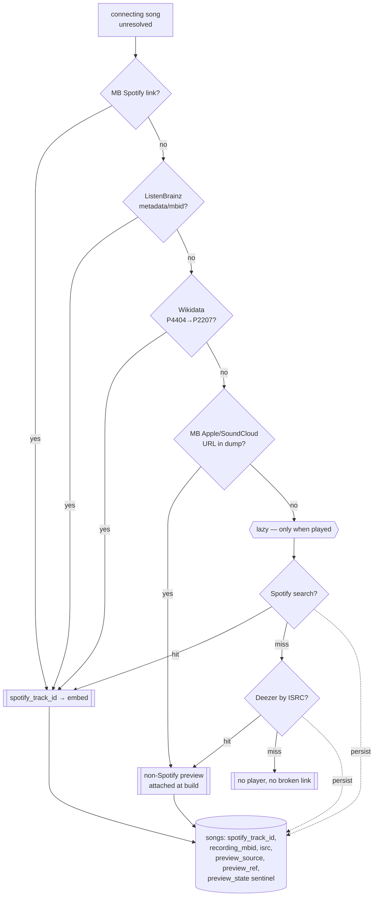

# feat: Layered preview sourcing — MB links → ListenBrainz → Wikidata → ISRC/multi-service → lazy tail

> **⛔ SUPERSEDED (2026-07-06) — do NOT build the offline units.** Plan 007's feasibility spike (`scripts/preview_coverage_spike.py`) measured Spotify-id resolvability on real *displayed* songs and found the offline sources far too thin to justify this pipeline: **ListenBrainz-metadata 14.9%, MusicBrainz URL links ~4.6%**, versus **~78% for Spotify's own search (the lazy path)**. The offline extraction/ingest/backfill/ISRC units (U1–U6) were therefore **not built**. What shipped instead is the **lazy resolve-on-Play + persist** path (this plan's U8, promoted to the primary), delivered via plan 007's U3 — see `docs/plans/2026-07-06-007-feat-preview-coverage-feasibility-plan.md` (Findings & Decision) and `frontend/DESIGN-NOTES.md`. This document is kept for the record; its layered offline design is the road not taken.

**Product Contract preservation:** No upstream brainstorm; the source **waterfall** was decided live with the user (2026-07-06): use MB Spotify URLs, then ISRC via Deezer/SoundCloud/Apple, then try ListenBrainz and Wikidata, and finally lazy-resolve-on-Play as the last resort "if what we have doesn't work." **That build decision was reversed by plan 007's spike (see the SUPERSEDED banner above) — only the lazy tail shipped.** Creative expansions live in `docs/plans/2026-07-06-006-feat-rabbit-hole-enrichment-roadmap-plan.md`.

> **Context for a new session:** Rabbit Hole ("six degrees of Kendrick Lamar"): engine in `src/` (Python), FastAPI in `api/main.py`, Next.js in `frontend/`. Plan 004 (shipped) added the **Spotify embed player** — the connection page plays a 30s preview from a `songs.spotify_track_id` alone, **no runtime Spotify API call**. Plan 004 resolved ids via a Spotify **search** crawl, impractical at ~563k songs. This plan sources ids/previews from data we largely already own, stacking sources cheapest-first, with lazy Spotify search only as the final fallback. Graph built by `src/musicbrainz_ingest.py`; DB is `data/collaboration_network_mb.db`; dump tables staged in `data/mb_raw/mbdump/`.

---

## Summary

Populate each connecting song's preview by walking a **source waterfall**, stopping at the first hit, cheapest/most-owned first. Sources that yield a **Spotify track id** (→ the embed player, the user's preferred experience) are tried before non-Spotify previews, and the rate-limited runtime path is dead last:

1. **MusicBrainz Spotify track links** (offline, exact) → Spotify id → embed. *Measured coverage of our connecting recordings: 4.6%.*
2. **ListenBrainz `spotify_metadata_index`** (MetaBrainz API, CC0, batchable) → Spotify id → embed. *Catalog-matched to Spotify, so potentially higher on popular songs; the plan-007 spike quantifies it.*
3. **Wikidata** (P4404 MB-recording → P2207 Spotify-track, CC0, one SPARQL/dump pass) → Spotify id → embed. *Thin but free.*
4. **MB-stored service URLs** (Apple Music / SoundCloud / Bandcamp — already in the dump, offline) → attached at build as a non-Spotify fallback where present.
5. **Lazy-on-Play + persist** (runtime, last resort): the first time an unresolved song is *played*, try a Spotify search (→ embed, preferred) then Deezer-by-ISRC (→ non-Spotify preview), and persist the result. **Deezer is lazy, never a batch pass** — it's a per-track API (~10 req/s, verified) that would take *hours* over the full graph; resolved on-Play it's a single cached call.

Layers 1–3 (Spotify-id sources → embed) and the offline MB-URL/ISRC attach run at build time with **no Spotify quota exposure**; layer 5 (Deezer + Spotify search) touches the network only for the trickle of viewed-but-unresolved songs. The embed stays primary; gap songs degrade to a non-Spotify preview or no player — never a broken link. Public-traffic guardrails are deferred to a deployment plan.

---

## Problem Frame

- **The crawl doesn't scale.** Plan 004's search crawl is one Spotify call per song × 563,826 songs → impractical at dev-app rate limits (the retired-crawl trap; `STRATEGY.md` Track 1, 2026-07-04).
- **No single offline source is enough (measured this session).** Of 1,396,847 recordings connecting ≥2 of our 119,729 artists: MB Spotify link **4.6%**, ISRC **28.6%**, either **28.7%** — a **~71% gap**. Hence the waterfall: stack several partial sources, and let the lazy tail mop up only what's actually viewed.
- **ISRC ≠ Spotify player.** ISRC's 28.6% mostly buys a Deezer/Apple/SoundCloud preview, not the embed. So Spotify-id sources (MB/ListenBrainz/Wikidata) come first; ISRC-multi-service is a fallback tier.
- **A track id already plays a preview** (verified plan 004) — any source that yields a Spotify id is immediately embeddable.
- **The app only shows viewed songs.** ≤3 songs per edge on viewed shortest paths — so the 71% offline gap is mostly songs no one sees; the lazy tail resolves just the viewed remainder, once each.
- **Current DB lacks recording MBIDs.** `songs` has `song_name`+`collaborators`+`spotify_track_id` (plan 004), not recording MBID — needed to attach dump/ListenBrainz/Wikidata data exactly. New builds populate it; a no-rebuild backfill matches by title+lineup.

---

## Requirements

- **R1 — Waterfall sourcing:** each song's preview is resolved by trying sources in the fixed order (MB link → ListenBrainz → Wikidata → ISRC/multi-service → lazy), stopping at the first hit; a per-song sentinel makes each layer touch only what prior layers left unresolved.
- **R2 — Spotify-id sources first:** MB links, ListenBrainz, and Wikidata (all yielding a Spotify track id → embed) are exhausted before falling to non-Spotify previews; lazy Spotify search is strictly last.
- **R3 — Recording-MBID linkage:** songs carry their recording MBID so MB/ListenBrainz/Wikidata data attaches exactly; new builds populate it inline, and a no-rebuild backfill exists for the current DB.
- **R4 — ISRC multi-service fallback (Deezer is lazy):** MB-stored Apple/SoundCloud/Bandcamp URLs are attached offline at build; the Deezer-by-ISRC network lookup runs **lazily on-Play** (never a batch pass), stored with its source.
- **R5 — Multi-source rendering:** the UI renders the Spotify embed when a track id exists; otherwise a graceful non-Spotify player/link; else no player — never a broken link.
- **R6 — Lazy + persist tail:** a still-unresolved song resolves on first Play (Spotify search + accept-logic) and persists; each song resolves at most once, ever.
- **R7 — Resumable, offline-heavy, no-crash:** every batch layer is resumable (sentinel), chunk-committed, and degrades on error; offline layers make no network calls; ListenBrainz is batched and Wikidata is a single polite query (good User-Agent, honor 429); Deezer is lazy (single call on-Play).
- **R8 — No regressions:** Python + API suites green; engine/search and the shipped embed (plans 001–004) keep working; Streamlit boots.
- **R9 — Guardrails deferred, not forgotten:** runtime abuse/rate-limit protection for public traffic is deferred to the deployment plan; the lazy tail is documented as demo-safe only.

---

## Key Technical Decisions

### KTD1 — A fixed source waterfall, Spotify-id sources first, lazy last
Resolve in a fixed order and stop at the first hit: (1) MB Spotify links, (2) ListenBrainz, (3) Wikidata — all → a Spotify id and the embed; then (4) ISRC→Deezer/SoundCloud/Apple → a non-Spotify preview; then (5) lazy Spotify search at runtime. Rationale: prefer the embed (user's preference), prefer owned/free/batchable sources over the rate-limited Spotify API, and never pre-crawl for songs no one views. A per-song sentinel (`preview_state`) records which layers have been tried so each pass is resumable and each layer only works the remainder. Reverses plan 004's "one big Spotify-search crawl" — search survives only as the runtime tail.

### KTD2 — Attach at ingest (exact); standalone backfill for the current DB
Extend `musicbrainz_ingest.py` to persist each song's **recording MBID** and attach the MB-link Spotify id / ISRC / service URLs inline (the ingest already iterates recordings — exact, no matching). Since a depth-3 rebuild is already the roadmap, this is the clean primary. For value without a rebuild, a standalone backfill matches existing songs by recording MBID (post-rebuild) or by base-title + credited-lineup (reusing `dedup_songs` + `preview_fetcher` accept-logic). Prefer the sentinel over a loose match.

### KTD3 — ListenBrainz as a batch Spotify-id source (not a Spotify crawl)
Use `labs.api.listenbrainz.org` `spotify-id-from-mbid` (by recording MBID) and `spotify-id-from-metadata` (by artist+title) — POST a JSON array (batched), get back `spotify_track_ids`. It's a MetaBrainz service over the CC0 `mapping.spotify_metadata_index` (Spotify's catalog matched to MB) — gentle limits, no Spotify dev-quota. Prefer the metadata endpoint for coverage (catalog match), fall back to the MBID endpoint where a recording MBID exists. **Coverage is unproven** — the plan-007 spike measures it on real displayed songs; if it lands high, it becomes the dominant offline layer.

### KTD4 — Wikidata as a cheap CC0 Spotify-id source
One SPARQL query (or a pass over the CC0 Wikidata dump) for items carrying both P4404 (MB recording id) and P2207 (Spotify track id) yields a recording-MBID → Spotify-id map. Coverage is thin (Wikidata is stronger at artist-level P1902 than per-recording), but it's free and a single pass — worth stacking. Store like any other Spotify-id source.

### KTD5 — ISRC/Deezer is LAZY, not a batch pass (the runtime-cost fix)
Deezer's ISRC lookup (`GET api.deezer.com/track/isrc:{isrc}`) is **one request per track** at ~10 req/s (verified community limit; exceeding it returns error code 4). Batching it over the ~hundreds of thousands of gap songs would take **hours** (the run's only multi-hour risk). So there is **no Deezer work at build time**: the MB-stored Apple/SoundCloud/Bandcamp URLs (already in the dump) are attached offline at build (free, KTD2), but the *Deezer network lookup moves to the lazy tail* (KTD6) — one cached call per viewed song. This single change keeps the batch build under ~an hour.

### KTD6 — Lazy-on-Play + persist is the last resort (Spotify search THEN Deezer); guardrails deferred
A song still unresolved after the batch layers resolves on first Play: try `spotify_enrich.search_track` + accept-logic first (→ Spotify id → embed, the preferred player); if that misses and the song has an ISRC, try Deezer-by-ISRC (→ non-Spotify preview). Persist whichever hits (id or `preview_source`/`preview_ref`), else the `"none"` sentinel. Each is a single, cached call — safe at demo scale (a handful of resolutions, each once, ever). Public-traffic protection (rate limit, budget, per-IP, token cache, memoization, CDN) is deferred to the deployment plan; this plan documents the seam so the lazy endpoint isn't shipped public without guardrails.

---

## High-Level Technical Design

Layers 1–3 (Spotify-id sources) plus the offline MB-URL/ISRC attach are build-time batch passes; the lazy branch (Spotify search, then Deezer-by-ISRC) is a runtime last resort touching only *viewed* songs. Each layer only processes songs earlier layers left unresolved (`preview_state`).

### Build runtime (verified 2026-07-06)

| Layer | Shape | Time |
|---|---|---|
| MB offline extraction (`mb_preview_index` + ingest/backfill) | local dump scans, no network | ~tens of min (CPU/IO) |
| ListenBrainz | batch **~5,000 MBIDs/request, ~2s/req** (probed live; no rate-limit headers) | **~6–15 min** for all songs |
| Wikidata | one SPARQL query (only **16,459** P4404+P2207 pairs exist globally) | **~seconds** |
| Deezer + Spotify search | **lazy on-Play**, single cached call | ~0 upfront |

Batch build ≈ **under an hour**, dominated by local dump scans. The multi-hour risk (per-track Deezer over the whole graph) is removed by making Deezer lazy.

---

## Implementation Units

### U1. `mb_preview_index.py` — offline recording→preview index from the dump

**Goal:** Reusable offline builder: `recording_mbid → {spotify_track_id, isrc, apple_url, soundcloud_url, bandcamp_url}` from the extracted dump tables.
**Requirements:** R1, R4, R7
**Dependencies:** none (tables in `data/mb_raw/mbdump/`)
**Files:** `src/mb_preview_index.py` (new), `tests/test_mb_preview_index.py` (new)
**Approach:** Parse `url` (regex `spotify.com/track/{id}` + Apple/SoundCloud/Bandcamp hosts), join `l_recording_url` (entity0=recording row-id, entity1=url-id) → recording row-id, map row-id → recording MBID via `recording` (id→gid). Parse `isrc` (row-id → ISRC). Emit keyed by recording MBID. Stream the big files; mirror `musicbrainz_ingest.py` style. Pure parsing — no network.
**Patterns to follow:** `src/musicbrainz_ingest.py` column-index + streaming-join; `_split`.
**Execution note:** Failing test first on a tiny fixture set of dump rows.
**Test scenarios:** spotify `/track/` and `spotify:track:` forms → id extracted; Apple/SoundCloud-only recording → service URL set, no Spotify id; ISRC row → isrc set; no-relationship recording → absent; malformed line → skipped.

### U2. Recording-MBID + preview columns + attach at ingest

**Goal:** New builds persist recording MBID and attach MB-link Spotify id / ISRC / service URLs inline; introduce the preview columns + sentinel.
**Requirements:** R1, R3, R7, R8
**Dependencies:** U1
**Files:** `src/database.py` (migration guards: `songs.recording_mbid`, `songs.isrc`, `songs.preview_source`, `songs.preview_ref`, `songs.preview_state`; setters), `src/musicbrainz_ingest.py` (carry recording MBID through `_bfs`/`_write`; attach from U1 index), `tests/test_musicbrainz_ingest.py`, `tests/test_database.py`
**Approach:** Carry the representative recording MBID per written song (alongside title in `credit_songs`/`_bfs`). In `_write`, attach from the U1 index. `preview_state` records the highest layer tried (`unresolved`→`mb`→`listenbrainz`→`wikidata`→`isrc`→`lazy`/`none`) so downstream passes are resumable. Migration guards mirror plan 004's `spotify_track_id` guard; keep its id/`"none"`/NULL semantics.
**Patterns to follow:** plan 004 migration guard; `dedup_songs`; `get_collaboration_song_details`.
**Test scenarios:** build over a fixture dump where a connecting recording has a Spotify link → song gets that id + recording_mbid + `preview_state='mb'`; ISRC-only recording → isrc set, id NULL; no data → NULL fields, `preview_state='unresolved'`; guard adds columns to a pre-existing DB; `get_collaboration_song_details` returns the new fields.

### U3. `spotify_from_musicbrainz.py` — no-rebuild MB-link backfill

**Goal:** Populate MB-link Spotify ids / ISRC / service URLs on the **existing** DB without a rebuild.
**Requirements:** R1, R3, R7
**Dependencies:** U1, U2 (columns)
**Files:** `src/spotify_from_musicbrainz.py` (new CLI), `tests/test_spotify_from_musicbrainz.py` (new)
**Approach:** Load the U1 index. For each `unresolved` song: attach by `recording_mbid` if present, else re-derive the dump's credit→(recording MBID, title, lineup) mapping and match by base-title + lineup overlap (accept-logic). Set fields + advance `preview_state` to `mb` (or sentinel). Resumable/chunked; `--limit`/`--min-degree`.
**Patterns to follow:** `spotify_enrich` (resumable/sentinel/chunk), `musicbrainz_ingest` (credit mapping), `preview_fetcher` accept-logic.
**Test scenarios:** matched by MBID → id set; matched by confident title+lineup → id set; wrong-title collision (lineup mismatch) → sentinel not wrong id; re-run skips resolved; no index entry → advance state, no crash.

### U4. `listenbrainz_resolve.py` — batch Spotify-id via ListenBrainz

**Goal:** Resolve `preview_state ∈ {unresolved, mb-miss}` songs to a Spotify id via ListenBrainz.
**Requirements:** R1, R2, R7
**Dependencies:** U2 (columns); benefits from U3 having run first (so it only works the remainder)
**Files:** `src/listenbrainz_resolve.py` (new CLI), `tests/test_listenbrainz_resolve.py` (new)
**Approach:** For remaining songs, POST batches to `labs.api.listenbrainz.org/spotify-id-from-metadata` (`artist_name`+`track_name`, from the song's lineup + title) and, where a `recording_mbid` exists, `spotify-id-from-mbid`. Take the first `spotify_track_ids` entry that passes accept-logic; store id + `preview_state='listenbrainz'`, else advance state. Batched, rate-limited, resumable, degrade-on-error. Injectable fetch seam for tests.
**Patterns to follow:** `spotify_enrich` resumable loop + accept-logic; batch POST with a bounded batch size.
**Execution note:** The plan-007 spike sets the expected hit rate and batch size before a full run.
**Test scenarios:** metadata endpoint returns an id passing accept-logic → stored; endpoint returns an id failing accept-logic → rejected, state advanced; MBID endpoint used when recording_mbid present; batch of N → N results mapped; network error on a batch → left for retry; re-run skips resolved.

### U5. `wikidata_resolve.py` — CC0 Spotify-id via P4404→P2207

**Goal:** Resolve remaining songs with a recording MBID to a Spotify id via Wikidata.
**Requirements:** R1, R2, R7
**Dependencies:** U2 (recording_mbid)
**Files:** `src/wikidata_resolve.py` (new CLI), `tests/test_wikidata_resolve.py` (new)
**Approach:** One SPARQL query to `query.wikidata.org` (or a pass over the CC0 dump) for items with both P4404 (MB recording id) and P2207 (Spotify track id) → a `recording_mbid → spotify_track_id` map; attach to remaining songs with a matching recording MBID; set `preview_state='wikidata'` or advance. Single bounded pass (thin coverage — cheap). Injectable fetch seam.
**Patterns to follow:** resumable/sentinel loop; SPARQL result → dict.
**Test scenarios:** recording MBID present in the map → id set; not in map → state advanced; malformed SPARQL row → skipped; re-run skips resolved.

### U6. `deezer_isrc.py` — single-track ISRC→preview resolver (used lazily, NOT batched)

**Goal:** A single-track function resolving one song's ISRC to a Deezer 30s preview + link, invoked on-Play by the lazy tail (U8) — never a batch pass over the graph (KTD5).
**Requirements:** R4, R7
**Dependencies:** U2 (isrc field). MB-stored Apple/SoundCloud/Bandcamp URLs are attached offline at build via U1/U2 — no work here.
**Files:** `src/deezer_isrc.py` (new; may reuse the Deezer client already in `src/preview_fetcher.py`), `tests/test_deezer_isrc.py` (new)
**Approach:** `resolve(isrc) -> Preview | None` via `GET https://api.deezer.com/track/isrc:{isrc}` (free, no auth → 30s preview + link). Tight timeout; graceful `None` on miss/error (never raise) so a slow third party can't hang a render. Deezer's ~10 req/s limit is a non-issue since it's one call per *viewed* song. Injectable fetch seam for tests.
**Patterns to follow:** `src/preview_fetcher.py` Deezer client (timeouts, graceful None).
**Test scenarios:** ISRC with a Deezer hit → returns preview url + link; miss → `None`; network/parse error → `None` (no raise); malformed/empty ISRC → `None`.

> A batch ISRC gap-fill CLI is intentionally **not** built (KTD5): Deezer is per-track at ~10 req/s, so a full-graph batch would take hours. This resolver is the lazy building block the runtime tail calls instead.

### U7. API + frontend: carry and render multi-source previews

**Goal:** The payload carries `preview_source`/`preview_ref`; the UI renders the embed when possible, a graceful fallback otherwise.
**Requirements:** R5, R8
**Dependencies:** U2–U6 (fields populated)
**Files:** `api/main.py` (include the fields in `song_details`), `frontend/lib/api.ts` (types), `frontend/app/components/spotify-embed.tsx` → generalize to `preview.tsx` (switch on source), `frontend/app/components/connection-view.tsx`, `frontend/app/components/site-footer.tsx` (attribution reflects sources used), `frontend/DESIGN-NOTES.md`, `tests/test_api.py`
**Approach:** `spotify` → embed iframe (unchanged, primary); `deezer` → small native `<audio>` (lazy on Play); `apple`/`soundcloud`/link-only → labeled link-out; none → no player. Footer attributes whichever sources appear.
**Patterns to follow:** shipped `spotify-embed.tsx` lazy-on-click; plan 004 footer/legal discipline.
**Test scenarios:** payload includes `preview_source`+`preview_ref`; spotify source → embed with `allow="encrypted-media"`; deezer source → native audio; no source → no player; footer lists only sources in use.

### U8. Lazy + persist runtime tail — Spotify search THEN Deezer (last resort)

**Goal:** A song still unresolved after the batch layers resolves on first Play — Spotify search first (embed, preferred), then Deezer-by-ISRC — and persists.
**Requirements:** R4, R6, R9
**Dependencies:** U6 (Deezer resolver), U7
**Files:** `api/main.py` (resolve-on-Play endpoint), `frontend/app/components/preview.tsx` (call it on Play when unresolved), `tests/test_api.py`
**Approach:** On Play for an unresolved song: (1) `spotify_enrich.search_track` + accept-logic → on hit, persist `spotify_track_id` (embed). (2) On miss, if the song has an `isrc`, call `deezer_isrc.resolve` → on hit, persist `preview_source='deezer'` + `preview_ref`. (3) Else persist the `"none"` sentinel. Return the result; the component renders the right player. A second view reads the cache — no repeat calls. Document in code + `DESIGN-NOTES.md` that this endpoint needs guardrails (rate limit, budget, per-IP) before public deployment (deferred, R9).
**Patterns to follow:** `spotify_enrich` search/accept; `deezer_isrc` (U6); plan 004 lazy-on-interaction.
**Test scenarios:**
- Unresolved, Spotify search hits → persists id, returns embed; second call makes no search.
- Spotify miss + ISRC present + Deezer hit → persists `preview_source='deezer'`, returns fallback player.
- Spotify miss + no ISRC (or Deezer miss) → persists `"none"`, degrades to no player.
- Already-resolved song → endpoint makes no external call.
- `DESIGN-NOTES.md` records the pre-public guardrail deferral.

### U9. Verification pass

**Goal:** Prove the waterfall end-to-end without regressing engine/UI.
**Requirements:** R1–R9
**Dependencies:** U1–U8
**Files:** `tests/`, `frontend/DESIGN-NOTES.md`
**Approach:** Full Python + API suite green. Live preview (desktop + 375px): a song resolved via each layer type plays its correct player (embed for MB/ListenBrainz/Wikidata; native for Deezer; none for no-source); lazy resolves one on Play and persists. Record per-layer contribution counts on the real DB. Streamlit boots.
**Test scenarios:** engine/API assertions; UI flows as the screenshot protocol; a per-layer coverage read-out logged.

---

## Scope Boundaries

**In scope:** the full source waterfall (U1–U6), multi-source rendering (U7), lazy tail (U8), verification (U9).

### Deferred to Follow-Up Work
- **Public-deployment guardrails** — rate limit, daily budget, per-IP, token caching, memoization, CDN. The lazy tail is demo-safe only. Own plan.
- **Creative enrichment roadmap** — `docs/plans/2026-07-06-006-...-plan.md`.
- **Full ListenBrainz/Wikidata bulk ingestion** — if the API paths prove too slow at scale, revisit bulk-dump ingestion; the API/SPARQL paths are the near-term choice.

### Outside this plan's identity
- Reopening settled data decisions (MusicBrainz source, Official-only edges, DJ-mix exclusion, depth-3, alias types 1/2).
- A bespoke audio player — the embed + a minimal native fallback are the players.

---

## Open Questions

- **Q1 (rebuild vs. backfill):** ship via a depth-3 rebuild that attaches inline (U2) or the no-rebuild backfill (U3)? Recommend U3 now, U2 folds in at the next rebuild. *User's call at execution.*
- **Q2 (source ordering by real coverage):** the plan-007 spike measures per-source hit rates on displayed songs — if ListenBrainz-metadata dominates, run it before the weaker MB-link pass. *Resolved by the 007 spike.*
- **Q3 (Wikidata pass mechanism):** live SPARQL vs. dump pass — recommend SPARQL first (one query, thin result set). *Implementer's call.*

---

## Risks & Dependencies

- **Partial coverage per layer (measured: MB 4.6%, ISRC 28.6%, ~71% gap).** Mitigated by the waterfall + lazy tail; the design assumes no single source suffices.
- **ListenBrainz coverage unproven; quick probes were inconclusive/biased.** Mitigated by the 007 spike measuring it on real displayed songs before a full U4 run; U4 degrades cleanly if the hit rate is low.
- **Third-party API dependence (ListenBrainz, Deezer, Wikidata).** All free/friendlier than Spotify, but treat as network: batched, rate-limited, resumable, graceful None.
- **Match quality (backfill U3, metadata U4).** Reuse accept-logic; prefer the sentinel over a wrong id (a wrong id plays the wrong song).
- **Recording-MBID plumbing (U2).** Contained ingest change; covered by extended tests.
- **Lazy tail without guardrails (U8/R9).** Demo-safe; must not go public without the deferred guardrails.

---

## Verification Contract

1. Python + API suites green (no regression from plans 001–004).
2. Batch layers make **zero** Spotify API calls; ListenBrainz is batched (~5,000 MBIDs/request, verified) and Wikidata is one polite SPARQL query (good User-Agent, honor 429); Deezer runs only lazily on-Play (single cached call), never batched; a per-layer contribution read-out is recorded on the real DB.
3. Live preview (desktop + 375px): a song from each layer type renders its correct player; a no-source song degrades; the lazy path resolves one on Play and persists (second view makes no call).
4. Footer/attribution reflects sources actually used; `DESIGN-NOTES.md` records the U8 pre-public guardrail requirement.
5. Streamlit app still boots (R8).

## Definition of Done

- Connecting songs resolve a preview via the waterfall (MB link → ListenBrainz → Wikidata → ISRC/multi-service → lazy), Spotify-id sources first, lazy last (R1, R2).
- Songs carry their recording MBID; offline layers make zero Spotify calls (R3, R7).
- The UI renders the embed when possible, a graceful non-Spotify fallback otherwise, no broken links (R5).
- The lazy tail resolves the viewed remainder once each; public guardrails documented as deferred (R6, R9).
- Suites green; Streamlit boots; the crawl is retired as the primary path (R8).

---

## Sources & Research

- **Session measurements (2026-07-06):** our graph = 119,729 artists; 1,396,847 connecting recordings — MB Spotify link 4.6% (63,632), ISRC 28.6% (399,199), either 28.7% (400,569), gap 71.3%. Global co-credited floors: 3.1% / 20.3%. 890,679 Spotify track URLs / 824,670 recordings with a link in the dump. 563,826 connecting songs (crawl scale).
- **ListenBrainz labs** (`labs.api.listenbrainz.org`): `spotify-id-from-metadata` (artist+title) and `spotify-id-from-mbid` (recording MBID); POST JSON array → `spotify_track_ids`; over CC0 `mapping.spotify_metadata_index`. **Verified live 2026-07-06:** accepts batches of ≥5,000 MBIDs/request in ~2s, returns **no** `X-RateLimit` headers (lightweight labs service, no published SLA — send a good User-Agent, pace politely, honor 429). Core `api.listenbrainz.org` docs (readthedocs, updated 2026-07-03) use X-RateLimit headers + 429. Coverage still unproven — the 007 spike measures it.
- **Wikidata** (`query.wikidata.org` SPARQL): P4404 (MB recording id) + P2207 (Spotify track id), CC0. **Verified live 2026-07-06:** the two-property join works and returns recording-MBID→Spotify-id rows; **only 16,459 such pairs exist globally** → a thin layer (likely hundreds of hits in our graph). WDQS limits ([query limits](https://www.wikidata.org/wiki/Wikidata:SPARQL_query_service/query_limits), as of May 2026): 60s query-time/min (burst 120s), 5 parallel queries/IP, good User-Agent **required**, honor 429; WDQS is slower in 2026.
- **Deezer**: `GET https://api.deezer.com/track/isrc:{isrc}` — free, no-auth, 30s preview + link; ~50 req/5s (~10/s) community-reported limit (exceed → error code 4) → **used lazily on-Play only, never batched** (KTD5).
- **Plan 004** (`docs/plans/2026-07-06-004-...-plan.md`): shipped embed + `songs.spotify_track_id`; a track id alone plays.
- **`src/musicbrainz_ingest.py` / `src/spotify_enrich.py` / `src/preview_fetcher.py`**: ingest join to extend; resumable/sentinel + accept-logic + Deezer client to reuse.
- **Gating spike:** `docs/plans/2026-07-06-007-feat-preview-coverage-feasibility-plan.md` (per-source coverage → ordering). **Companion:** `docs/plans/2026-07-06-006-...-plan.md` (creative roadmap). **Memory:** [MusicBrainz dump enrichment goldmine](/Users/jojo/.claude/projects/-Users-jojo-Documents-projects-six-degrees-kdot/memory/musicbrainz-dump-enrichment-goldmine.md).
