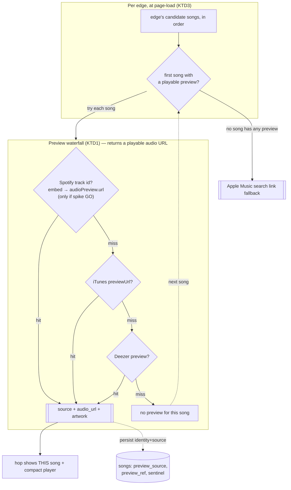

# feat: Inline preview waterfall + results redesign (six-degrees chain, K.Dot score)

**Product Contract preservation:** No upstream brainstorm; scope + refinements confirmed live with the user (2026-07-06) from testing feedback on the shipped lazy-preview results page. Anchored to `STRATEGY.md` (delight/surprise/shareability; the demo only needs previews for songs people actually view).

> **Context for a new session:** Rabbit Hole ("six degrees of Kendrick Lamar"): engine in `src/` (Python), FastAPI in `api/main.py`, Next.js in `frontend/`. Today the connection page (`frontend/app/components/connection-view.tsx`) shows a transit-line node viz + a degree box + a wide card listing up to 3 songs per edge, each with a "Play preview" button that lazily resolves a Spotify **track id** and mounts the Spotify **embed iframe** (plan 004 + plan 007). The problem: many songs never resolve, so their Play buttons are **dead**, and playback is inconsistent. This plan replaces that with a **preview waterfall** that returns a directly-playable audio URL (so we can guarantee a preview exists before showing a song) and **redesigns the results page** into a vertical "six-degrees-of-Kanye-West"-style chain. Preview-source reverse-engineering was **exhausted and verified live (2026-07-06)** — see Sources.

---

## Summary

Two linked changes, driven by testing feedback:

1. **Inline preview waterfall + compact custom player (the unblock).** A server resolver returns a *directly-playable* 30s audio URL for a (title, artists) pair from the first source that has one — **Spotify embed `audioPreview.url`** (reverse-engineered, verified working) → **iTunes `previewUrl`** (sanctioned, broad) → **Deezer** (ISRC/search). The frontend plays it in a small in-app `<audio>` player — uniform across sources, no iframe. Because we resolve *before* render, we can **only show songs that actually have a preview** — **no dead Play buttons** (the top priority). If an edge has no previewable song from any source, we degrade to an **Apple Music search link** (the rare fallback).

2. **Results-page redesign.** Lead with the existing transit-line node viz, **enhanced so Kendrick clearly reads as the anchor/base node**, with the degree count above it phrased as a playful **"{Artist}'s (k)dot score is: {N}"**. Below, a vertical **six-degrees chain** — artist → one compact song+preview card → arrow → next artist → … → Kendrick — replacing the wide multi-song box. **One song per hop** (the first with a playable preview).

---

## Problem Frame

- **Dead Play buttons (the core complaint).** Today a song shows "Play preview" before we know a preview exists; many resolve to nothing, leaving an unclickable dead button. Fix: resolve *before* showing, and only show songs with a confirmed preview.
- **Previews were thought unreachable — they're not (exhausted + verified 2026-07-06):**
  - **Spotify:** the API `preview_url` is dead, but `open.spotify.com/embed/track/{id}` still ships `__NEXT_DATA__` JSON with `"audioPreview":{"url":"https://p.scdn.co/mp3-preview/…"}` — a real, directly-playable mp3. Verified live for a real track; it's the documented community workaround.
  - **iTunes Search API:** `previewUrl` still returns a real `.m4a` preview, no auth, broad coverage (had Jay Rock "Cruel"). Verified live.
  - **Deezer:** free ISRC/search preview (already in `src/preview_fetcher.py`).
  - **Apple auto-play-via-URL** (the user's question): not needed — we play the iTunes `previewUrl` mp3 inline directly; the Apple *search link* stays only as the last-resort fallback when no source has a preview.
- **Layout feedback:** the results box is too wide; the user wants a compact, "six-degrees-of-Kanye-West"-style vertical chain (artist → song+preview → next artist), the "Collaborated On" framing moved into that chain, and one song per hop.
- **Node viz feedback:** the transit-line is liked, but Jay Rock reads as the base; Kendrick should be the visually-anchored base node, with the degree count moved above it.
- **Copy feedback:** frame the degree count as a playful "K.Dot score" ({Artist}'s (k)dot score is: {N}).

---

## Requirements

- **R1 — No dead Play buttons:** a song is shown only if a playable preview is confirmed to exist (resolved before render). No unclickable/again-and-again-empty buttons.
- **R2 — Inline preview waterfall:** a server resolver returns a directly-playable 30s audio URL from the first available source in order: Spotify embed `audioPreview.url` → iTunes `previewUrl` → Deezer. Returns the source, audio URL, and artwork; returns "no preview" cleanly when all miss.
- **R3 — Compact in-app player:** previews play in a small custom `<audio>`-based player, uniform across sources — not the Spotify iframe.
- **R4 — One song per hop:** each edge shows the single first song that has a playable preview (not a list).
- **R5 — Apple Music search fallback:** when an edge has no previewable song from any source, show an Apple Music search link (link-out) instead of a player. This is the only remaining link-out.
- **R6 — Six-degrees chain layout:** the connection page renders a vertical chain — artist → compact song+preview card → down-arrow → next artist → … → Kendrick — replacing the wide multi-song box; compact width.
- **R7 — Node viz + K.Dot copy:** keep the transit-line node viz on top, enhanced so **Kendrick is the clearly-anchored base node**; the degree count sits above it as "{start artist}'s (k)dot score is: {N}".
- **R8 — Resolve-at-page-load, persisted, no regressions:** preview resolution happens per edge at view time (a few network calls, persisted so repeat views are instant); Python + API suites stay green; Streamlit still boots.
- **R9 — Source legality recorded:** iTunes/Deezer are sanctioned APIs; the Spotify embed `audioPreview` scrape is a documented community workaround (gray-area vs. Spotify ToS) — record it in `frontend/DESIGN-NOTES.md`, keep the sanctioned iTunes source fully capable so the app never *depends* solely on the scrape, and keep it demo-scoped (pre-public guardrails still deferred).

---

## Key Technical Decisions

### KTD1 — Preview waterfall returns a directly-playable audio URL
One server resolver, cheapest/most-on-brand first: (1) if we can get/there-is a Spotify track id, fetch its embed page and extract `audioPreview.url`; (2) else iTunes Search `previewUrl`; (3) else Deezer. Return `{source, audio_url, artwork_url, matched_title, matched_artist}` or `None`. Reuse `src/preview_fetcher.py` (iTunes + Deezer clients + title/artist accept-logic); add a small Spotify-embed scraper. All three verified live 2026-07-06. This is what makes previews *reliable* instead of hit-or-miss.

### KTD2 — Compact custom `<audio>` player replaces the Spotify iframe
Since every source now yields a real mp3/m4a URL, play it in a small in-app player (art thumbnail, title/artist, play/scrub, source attribution). Uniform regardless of source, compact, and controllable — unlike the iframe. The iframe is retired as the player (the reverse-engineered `audioPreview.url` is the same preview the iframe would play). This resolves the "player mechanism" fork the user had on hold — the research made the custom player clearly better.

### KTD3 — Resolve per edge at page-load; show the first previewable song; persist identity
"No dead buttons" (R1) requires knowing a preview exists before render, so resolution moves from on-Play to page-load. For each edge, walk its candidate songs in order and pick the **first** whose waterfall yields a preview; that becomes the hop's shown song. Persist the resolution **per song** (source + identifier + "none" sentinel) so repeat views are instant and each song resolves at most once. **Preview URLs can expire** (scdn/iTunes/Deezer are signed/rotating), so persist the *identity* (spotify_track_id / iTunes id / ISRC + winning source), and resolve the actual audio URL at serve time behind a short in-process cache — never persist a volatile URL as truth. *(Exact persistence shape is an Open Question — see Q1.)*

### KTD4 — Node viz: Kendrick is the anchored base node; degree count above as K.Dot score
Keep the transit-line, but make Kendrick unmistakably the base: a distinct anchored treatment (e.g., always right/end-anchored, filled brand-green, a small "K.DOT" / base marker, larger node) vs. the plainer searched-artist node. Move the degree count above the viz, phrased "{start}'s (k)dot score is: {N}". Exact visual is a design detail to iterate in preview (Q2).

### KTD5 — Vertical six-degrees chain replaces the wide card box
Render the path as a vertical chain (echoing six-degrees-of-Kanye-West): artist chip → one compact song+preview card → down-arrow → next artist → … → Kendrick. Retire the wide "Collaborated On" box and the 3-song stack. Compact max-width. The "collaborated on" relationship is conveyed by the card sitting *between* two artists.

### KTD6 — Gate the Spotify scrape behind a feasibility spike (experiment before commitment)
Because the embed scrape is gray-area (R9) and reverse-engineered, **prove it's worth it on a sample before wiring it as a source.** A first spike (U1) resolves a good chunk (~50–100 tracks spanning genres/eras/popularity, drawn from real displayed songs) through the embed scrape and records: hit-rate (% with a non-null `audioPreview.url`), stability (shape consistency, failures), and safe-scraping behavior (see KTD7). It ends in a recorded **GO / NO-GO**: on GO, the scrape becomes the waterfall's first tier; on NO-GO (or thin hit-rate), it's dropped and **iTunes → Deezer** carry the waterfall (the app already degrades to those cleanly). This mirrors the plan-007 spike discipline — measure before building.

### KTD7 — Safe, minimal scraping posture
If the scrape is GO, treat it as a polite, best-effort enhancement over the sanctioned iTunes source — never a hammer: a browser-like `User-Agent`, a conservative rate (≤~1–2 req/s), an in-process + persisted cache so each track's embed is fetched at most once ever, graceful failure/short backoff on any error or shape change, no parallel bursts, and demo-scoped only (pre-public guardrails deferred, R9). The sanctioned iTunes/Deezer sources remain first-class so the app never *depends* on the scrape.

---

## High-Level Technical Design



**Results layout (KTD4/KTD5):**

```
   ┌───────────── transit-line (Kendrick = anchored base) ─────────────┐
   Jay Rock ───────────── Kendrick Lamar ★ (base)
   "Jay Rock's (k)dot score is: 1"      ← degree count, above the viz
   ────────────────────────────────────────────────
   Jay Rock
     ↓  [ ♪ Cruel — compact preview player ]
   Kendrick Lamar
```

---

## Implementation Units

### U1. Spotify embed preview scraper — spike-first, GO/NO-GO gated

**Goal:** Prove (on a real sample) that the embed `audioPreview.url` scrape is worth adopting and safe to run; if GO, ship it as a hardened scraper that returns a track's preview mp3 (or None).
**Requirements:** R2, R9 (KTD6, KTD7)
**Dependencies:** none — **this unit gates the Spotify tier of U2.**
**Files:** `scripts/spotify_scrape_spike.py` (new; measurement), `src/spotify_preview.py` (new; the hardened scraper, built only on GO), `tests/test_spotify_preview.py` (new)
**Approach:** **Phase 1 (spike, measure first):** sample ~50–100 real displayed songs' Spotify track ids (spanning genres/eras/popularity), fetch each embed page with a browser-like User-Agent at a conservative rate, parse `__NEXT_DATA__`, and record hit-rate (non-null `audioPreview.url`), shape stability, and failure behavior. Print a clear table + a **GO/NO-GO** recommendation; record it in this plan's Findings. **Phase 2 (harden, only on GO):** `src/spotify_preview.py` — `preview(track_id) -> {audio_url, artwork} | None` via embed fetch + `__NEXT_DATA__` parse of `entity.audioPreview.url`; conservative timeout; graceful None on any network/parse/shape failure (never raise); in-process cache keyed by track id (KTD7). Injectable fetch seam for tests. **On NO-GO:** skip `spotify_preview.py`; U2's waterfall starts at iTunes.
**Patterns to follow:** `src/preview_fetcher.py` (timeouts, graceful None, cache); `scripts/preview_coverage_spike.py` (plan-007 spike shape — sample real displayed songs, print a table, recommend).
**Execution note:** Measurement spike first (GO/NO-GO recorded) before hardening; then start the scraper with a failing test parsing a saved fixture of the embed HTML (trimmed `__NEXT_DATA__` blob) → asserts the extracted mp3 URL.
**Test scenarios (the hardened scraper, on GO):**
- Embed HTML with `audioPreview.url` present → returns that mp3 URL + artwork.
- Embed HTML with `audioPreview: {url: null}` (some tracks) → returns None.
- Malformed / missing `__NEXT_DATA__` → None, no raise.
- Network error / timeout → None, no raise.
- Cache: two calls for the same id fetch once.
- Spike itself: `Test expectation: none — measurement; correctness is a representative sample (real displayed songs, popularity-spread) + a recorded GO/NO-GO with the hit-rate.`

### U2. Preview waterfall resolver

**Goal:** One entry point returning the best directly-playable preview for a (title, artists[, spotify_track_id, isrc]) request.
**Requirements:** R2, R5
**Dependencies:** U1
**Files:** `src/preview_resolver.py` (new; or extend `src/preview_fetcher.py`), `tests/test_preview_resolver.py` (new)
**Approach:** Waterfall: (1) **only if U1's spike was GO** — if a Spotify track id is available (stored, or resolved via the existing `spotify_enrich`/ListenBrainz path), try `spotify_preview` (U1); (2) iTunes via `preview_fetcher` (`previewUrl`); (3) Deezer via `preview_fetcher`. Return `{source, audio_url, artwork_url, matched_title, matched_artist}` or None. Reuse `preview_fetcher`'s `_accept` title+artist logic so a wrong track is never returned. Also expose an `apple_search_url(title, artist)` helper for the R5 fallback. The Spotify tier is a clean toggle so a NO-GO (or a later shape break) drops it without touching iTunes/Deezer.
**Patterns to follow:** `src/preview_fetcher.py` accept-logic + provider fallthrough; `src/spotify_enrich.py` id resolution.
**Test scenarios:**
- Spotify id present + embed has preview → source='spotify', audio_url set.
- Spotify miss, iTunes hit → source='itunes'.
- Spotify + iTunes miss, Deezer hit → source='deezer'.
- All miss → None (caller shows Apple search fallback).
- A candidate that fails title/artist accept-logic is skipped (no wrong-track preview).

### U3. Edge-preview API — first previewable song per edge, persisted

**Goal:** For a given edge (two artist ids), return the first candidate song that has a playable preview (+ its preview), or an Apple-search fallback; persist the resolution.
**Requirements:** R1, R4, R8
**Dependencies:** U2; `src/database.py` (persist preview identity/source per song — extends the plan-004 `spotify_track_id` column; add `preview_source`, `preview_ref` or reuse existing; migration guard)
**Files:** `api/main.py` (new `GET /api/edge-preview`), `src/database.py` (getters/setters + migration guard), `tests/test_api.py`, `tests/test_database.py`
**Approach:** Given the edge's ordered songs (from `get_collaboration_song_details`), walk them; for each, run the U2 waterfall; return the first hit as `{song, source, audio_url, artwork_url}` and persist that song's resolved source+identity (sentinel on miss so re-runs skip). If no song hits, return `{fallback: apple_search_url(top_song, artist)}`. Resolve the *audio_url* fresh (short in-process cache) even when identity is persisted (KTD3 URL-expiry). Never raises; degrades to fallback.
**Patterns to follow:** plan 007 `resolve-preview` endpoint (persist + cache + graceful); `_spotify_token` cache in `api/main.py`.
**Test scenarios:**
- Edge with a previewable song → returns that song + source + audio_url; persists identity; a second call makes no new upstream fetch (served from persisted identity + URL cache).
- Edge whose only previewable song is the 2nd candidate → returns the 2nd, not the 1st.
- Edge with no previewable song anywhere → returns the Apple-search fallback, no player.
- Upstream error on one source → waterfall continues; endpoint never 500s.
- Unknown edge → 404.

### U4. Results redesign — six-degrees chain + compact custom player

**Goal:** Replace the wide multi-song box with a vertical chain and a compact in-app player fed by the edge-preview API.
**Requirements:** R3, R4, R6
**Dependencies:** U3
**Files:** `frontend/app/components/connection-view.tsx` (rework), `frontend/app/components/preview-player.tsx` (new; replaces the `spotify-embed.tsx` role), `frontend/lib/api.ts` (edge-preview client + types), `frontend/app/components/site-footer.tsx` (attribution: Spotify/Apple/Deezer as used)
**Approach:** Render the path as a vertical chain: artist chip → (per edge) a compact card that calls `/api/edge-preview`, shows a brief loading state, then the chosen song with a small custom `<audio>` player (artwork thumb, title, "with …", source label, play/scrub) — or the Apple-search link on fallback → down-arrow → next artist → … → Kendrick. Retire the iframe embed and the 3-song stack. Compact max-width (`max-w-md`-ish). Lazy per-edge fetch on mount is fine (a path has few edges).
**Patterns to follow:** existing token styling; plan 007 lazy-fetch posture; `frontend/AGENTS.md` (read the Next guide before writing).
**Test scenarios:** `Test expectation: none — presentational; verified visually in the preview (desktop + 375px): chain renders, chosen song plays inline, fallback link shows when no preview, no dead buttons, no console errors.`

### U5. Node viz enhancement + K.Dot score copy

**Goal:** Make Kendrick the clearly-anchored base node; move the degree count above the viz as the K.Dot score.
**Requirements:** R7
**Dependencies:** none (can proceed with U4)
**Files:** `frontend/app/components/path-headline.tsx` (enhance), `frontend/app/components/connection-view.tsx`
**Approach:** In the transit-line, give Kendrick a distinct anchored treatment (end-anchored, filled brand-green, a small base/"K.DOT" marker; searched artist plainer) so directionality reads as "→ base". Above the viz, render "{start artist}'s (k)dot score is: {N}" (N = degrees). Keep horizontal scroll at 375px.
**Patterns to follow:** existing `path-headline.tsx` transit-line; token styling.
**Test scenarios:** `Test expectation: none — presentational; verified visually: Kendrick reads as base/anchor, K.Dot score copy correct for 1- and 3-degree paths, legible at 375px.`

### U6. Verification pass

**Goal:** Prove no dead buttons, the waterfall, the redesign, and no regressions.
**Requirements:** R1–R9
**Dependencies:** U1–U5
**Files:** `tests/` (suite), `frontend/DESIGN-NOTES.md` (source legality + player note, R9)
**Approach:** Full Python + API suite green. Live preview (desktop + 375px): every shown song has a working inline preview (Spotify/iTunes/Deezer); a no-preview edge shows the Apple-search fallback (no dead button); the six-degrees chain + anchored-Kendrick viz + K.Dot copy render; Streamlit still boots. Record the source-legality note (R9) in DESIGN-NOTES.
**Test scenarios:** engine/API assertions in the suite; UI flows as the screenshot protocol.

---

## Scope Boundaries

**In scope:** the preview waterfall (U1–U2), edge-preview resolution + persistence (U3), the six-degrees chain + compact player (U4), node-viz + K.Dot copy (U5), verification (U6).

### Deferred to Follow-Up Work
- **Random-artist button and share buttons** (the user's "nice-to-have later").
- **Public-deployment guardrails** — rate limit, per-IP, daily budget, caching/CDN. Preview resolution makes upstream calls; demo-safe only until guardrails land.
- **Cover art / artist photos across the whole UI** — plan 006 roadmap (E4); this plan only uses the per-track artwork the waterfall already returns.

### Outside this plan's identity
- Reopening settled data decisions (MusicBrainz source, Official-only edges, depth-3).
- The offline preview-sourcing pipeline (plan 005, superseded) — sourcing is now this live waterfall.

---

## Open Questions

- ~~Q1 (persistence shape)~~ **RESOLVED (user, 2026-07-06):** persist the **identity** — per-song `{preview_source, preview_ref}` (spotify_track_id / iTunes id / ISRC + winning source) + the "none" sentinel — and **re-resolve the volatile audio URL at serve** (short in-process cache). Never persist the expiring mp3 URL as truth. (Now a decision in KTD3, not an open question.)
- **Q2 (Kendrick base-node visual):** Exact anchored treatment (crown/marker vs. fill/size vs. pinned position) — a design detail to iterate in the live preview. *Design call at U5.*
- **Q3 (edge-preview timing):** Resolve all edges in one `/api/connection` call (slower first paint, simpler) vs. per-edge lazy fetch on mount (fast chain paint, previews fill in)? Recommend per-edge lazy (fast chain, no dead buttons since a card only appears resolved). *Decide at U3/U4.*

---

## Risks & Dependencies

- **Spotify embed scrape fragility / ToS (R9).** The `__NEXT_DATA__` shape can change, and scraping is gray-area vs. Spotify ToS. Mitigated: **the U1 feasibility spike decides GO/NO-GO before we commit** (KTD6); iTunes (sanctioned) is a full first-class source so the app never depends solely on the scrape; the Spotify tier is a clean toggle that drops on NO-GO or a later shape break; safe/minimal scraping posture (KTD7); demo-scoped. Recorded in DESIGN-NOTES.
- **Preview URL expiry (KTD3).** scdn/iTunes/Deezer URLs are signed/rotating. Mitigated by persisting identity, not the URL, and resolving fresh at serve with a short cache.
- **Resolve-at-load latency (R8).** Per-edge waterfall adds network calls on first view. Mitigated: few edges per path, per-edge lazy fetch (chain paints instantly, cards fill), persisted so repeat views are instant. The user accepted "slightly more work per first view" for zero dead buttons.
- **Coverage still imperfect.** A rare edge may have no preview anywhere → the Apple-search fallback (R5) covers it; never a dead button.
- **Next.js version caveat (`frontend/AGENTS.md`).** Read the bundled Next guide before writing frontend code.

---

## Verification Contract

1. Python + API suites green (no engine/search regression from plans 001–007); Streamlit boots (R8).
2. The U1 Spotify-scrape spike ran on a real sample and recorded a **GO/NO-GO** with its hit-rate; the waterfall's Spotify tier is present only on GO, and iTunes/Deezer carry it either way (KTD6, R9).
2. In the live preview (desktop + 375px): every shown song plays an inline preview via the compact player (Spotify/iTunes/Deezer confirmed across a few artists); **no dead Play buttons**; a no-preview edge shows the Apple-search fallback (R1, R2, R3, R5).
3. Each hop shows exactly one song; the layout is the compact vertical six-degrees chain (R4, R6).
4. The node viz reads with Kendrick as the anchored base; the "{artist}'s (k)dot score is: {N}" copy is correct for 1- and 3-degree paths (R7).
5. `frontend/DESIGN-NOTES.md` records the source-waterfall legality note + the retired iframe (R9).

## Definition of Done

- A feasibility spike measured the Spotify embed scrape on a real sample and recorded GO/NO-GO before it was wired in; safe/minimal scraping posture applied (KTD6, KTD7, R9).
- Previews are reliable and inline: a song is shown only when a playable preview exists, played in the compact in-app player; the (gated) Spotify-embed-`audioPreview` + iTunes + Deezer waterfall is the source; no dead Play buttons (R1–R4).
- Preview identity is persisted (source + ref), not the expiring URL, which is re-resolved at serve (KTD3).
- No-preview edges degrade to an Apple Music search link (R5).
- The results page is the compact vertical six-degrees chain; Kendrick reads as the anchored base node; the degree count shows as the K.Dot score (R6, R7).
- Suites green; Streamlit boots; source legality recorded (R8, R9).

---

## Sources & Research

- **Live probes (2026-07-06):** Spotify embed `https://open.spotify.com/embed/track/45J4avUb9Ni0bnETYaYFVJ` → `__NEXT_DATA__` contained `"audioPreview":{"url":"https://p.scdn.co/mp3-preview/…"}` (real mp3). iTunes Search `previewUrl` returned a playable `.m4a` for "luther" and Jay Rock "Cruel". Both directly playable in `<audio>`.
- **Spotify preview reverse-engineering:** [rexdotsh/spotify-preview-url-workaround](https://github.com/rexdotsh/spotify-preview-url-workaround) and Spotify Community threads (2025–2026) confirm the API `preview_url` is dead but the embed `__NEXT_DATA__` `audioPreview.url` persists — fetch embed → parse `__NEXT_DATA__` → `audioPreview.url`.
- **Existing code to reuse:** `src/preview_fetcher.py` (iTunes + Deezer clients, `_accept` title/artist logic), `src/spotify_enrich.py` (Spotify id resolution), `api/main.py` (`_spotify_token` cache, plan-007 resolve endpoint), `frontend/app/components/spotify-embed.tsx` (the iframe player being replaced).
- **Prior plans:** 004 (embed player), 007 (lazy resolve-on-Play, Path B — this plan supersedes its player mechanism), 005 (offline sourcing, superseded), 006 (creative roadmap). `STRATEGY.md` (delight/shareability).
