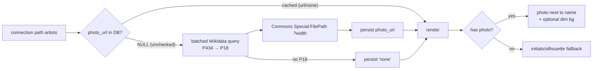

# feat: Artist photos in the results chain (Wikidata) + simplified header + motion

**Product Contract preservation:** No upstream brainstorm; scope confirmed live with the user (2026-07-06). Follow-on to plans 008 (waterfall + six-degrees chain) and 009 (rich card + calmer flow) on branch `feat/preview-waterfall-results`. Anchored to `STRATEGY.md` (delight/shareability) and the plan-006 roadmap (E4 artist photos, B2 metadata). **Not built this session — the user will execute it in a fresh session.**

> **Context for a new session:** Rabbit Hole ("six degrees of Kendrick Lamar"): engine in `src/` (Python), FastAPI in `api/main.py`, Next.js in `frontend/`. The connection page (`frontend/app/components/connection-view.tsx`) renders a **vertical six-degrees chain** — each artist as a `ChainNode` pill, with a `PreviewCard` (`preview-player.tsx`) between hops — plus a **top transit-line node viz** (`path-headline.tsx`) and a "(k)dot score" header. Artist nodes are keyed on **MusicBrainz MBID** (the `id`). The home search box (`search-typeahead.tsx` / `app/page.tsx`) has placeholder "Search an artist — e.g. Drake, SZA…". This plan adds artist photos, simplifies the header, and experiments with motion.

---

## Summary

Four changes to the results experience, from testing feedback:

1. **Simplify the search placeholder** to just "Search an artist" (drop the "e.g. Drake, SZA…" examples).
2. **Remove the top transit-line** node viz — it's redundant now that the vertical chain shows the same flow.
3. **Show each path artist's photo** next to their name in the chain, sourced from **Wikidata → Wikimedia Commons** (good-quality sized thumbnails), resolved from the artist's MBID and **persisted** so it's resolved once per artist. Graceful fallback (initials/silhouette) when no photo exists.
4. **Two optional/experimental units** (captured for the build session to take or skip): a **dim artist-photo background** behind each artist→song block, and subtle **float-in / motion** so results feel alive.

---

## Problem Frame

- **Placeholder is noisy.** "Search an artist — e.g. Drake, SZA…" — the examples aren't needed; "Search an artist" is cleaner.
- **The top transit-line duplicates the chain.** Freddie Gibbs → Dom → Kendrick appears both in the top node viz and the vertical chain below. Redundant; drop the top viz.
- **The chain is text-only.** Names without faces feel flat; artist photos next to each name make it richer and more shareable.
- **Photos are available from Wikidata (probed live 2026-07-06):** a batched SPARQL query maps `P434` (MusicBrainz artist ID) → `P18` (image) → a Wikimedia Commons `Special:FilePath` URL that accepts `?width=N` for good-quality sizing. **Coverage is partial** — of Kendrick / Freddie Gibbs / Dom Kennedy, the first two had photos and Dom Kennedy had none — so a fallback avatar is required.
- **Deploy concern (user):** runtime Wikidata calls at public scale. Mitigated by persisting each resolved photo URL (resolve once per artist; repeat visitors hit cache; only new artists query Wikidata). Heavy public traffic would still want an offline pass / CDN — deferred.
- **Motion is off-brand but worth trying.** Spotify is static; a subtle float-in could make the reveal feel alive. Experimental.

---

## Requirements

- **R1 — Simplified placeholder:** the search box reads "Search an artist" (no examples).
- **R2 — Remove the top transit-line:** the `PathHeadline` node viz is removed from the connection page; the vertical chain is the sole path visualization. The "(k)dot score" header stays.
- **R3 — Artist photos in the chain:** each path artist shows a good-quality photo next to their name, from Wikidata `P18` → Commons (sized via `?width`), with a graceful fallback (initials or silhouette) when none exists.
- **R4 — Persisted, deploy-friendly resolution:** photo URLs resolve at request time in a single batched query per connection and are **persisted per artist** (URL or a "none" sentinel) so each artist is resolved from Wikidata at most once; the running app serves cached URLs thereafter.
- **R5 — (Optional/experimental) Dim photo background:** behind each artist's name block flowing into its song card, show the artist's photo as a very dim background accent.
- **R6 — (Optional/experimental) Motion:** results animate/float in with subtle movement for a more "alive" feel; must respect `prefers-reduced-motion`.
- **R7 — No regressions:** the preview cards + chain (plans 008/009) keep working; Python + API suites green; Streamlit boots.

---

## Key Technical Decisions

### KTD1 — Wikidata `P434` → `P18` → Commons, batched per path
Resolve photos from the artist MBID (our node id) via a single batched SPARQL query for all of a connection's artists: `?item wdt:P434 <mbid>; OPTIONAL wdt:P18 <image>`. The `P18` value is a Commons `Special:FilePath` URL; append `?width=320` (tune) for a crisp, right-sized thumbnail served directly to an ``. One query per connection (2–4 artists), good `User-Agent`, honor 429 (WDQS limits per plan 008 research). Verified live 2026-07-06.

### KTD2 — Persist each resolved photo URL (resolve once, ever)
Add `artists.photo_url` (a Commons URL, a `"none"` sentinel when Wikidata has no `P18`, or NULL = unchecked). The resolver only queries Wikidata for artists still NULL; resolved values persist, so repeat requests and repeat artists are cache hits. This is what makes runtime resolution deploy-tolerable (per the user's concern); a full offline pass over all ~120k artists is deferred.

### KTD3 — Graceful fallback avatar (coverage is partial)
Wikidata `P18` coverage is incomplete (Dom Kennedy had none in the probe). When `photo_url` is the `"none"` sentinel or missing, render a deterministic fallback — the artist's initials on a tokened circle (or a neutral silhouette) — never a broken image.

### KTD4 — Remove the transit-line; photos carry the visual identity
Drop `PathHeadline` from the connection page (R2). The vertical chain + artist photos become the identity of the results; Kendrick still reads as the base via the existing chain-node treatment (plan 009).

### KTD5 — (Optional) Dim photo background accent
Behind an artist's name block (the segment flowing into its song card), paint the artist photo as a very low-opacity, blurred/darkened background so it reads as texture, not clutter. Reuses the resolved `photo_url`; skipped when the artist has none.

### KTD6 — (Optional) Motion, reduced-motion-safe
Subtle entrance animation (chain nodes + cards float/fade in on mount, slight stagger). Pure CSS/transition where possible; gate behind `prefers-reduced-motion: reduce` (no motion for users who opt out). Experimental — easy to remove if it fights the Spotify feel.

---

## High-Level Technical Design

---

## Implementation Units

### U1. Artist-photo resolver + persistence (backend)

**Goal:** Resolve + persist Wikidata photo URLs for a connection's artists, exposed to the frontend.
**Requirements:** R3, R4
**Dependencies:** none
**Files:** `src/artist_photo.py` (new — batched SPARQL `P434`→`P18`→Commons URL; graceful None), `src/database.py` (migration guard `artists.photo_url`; getter/setter, bulk), `api/main.py` (resolve + persist a path's artists; include `photo_url` per path artist in the connection payload, or a `/api/artist-photos` batch endpoint), `tests/test_artist_photo.py` (new), `tests/test_database.py`, `tests/test_api.py`
**Approach:** `artist_photo.resolve(mbids) -> {mbid: url|None}` via one WDQS query (VALUES list), Commons URL + `?width`; conservative timeout, good User-Agent, honor 429, graceful `{}` on failure. The connection endpoint collects the path's artist MBIDs, resolves only those with `photo_url` NULL, persists results (URL or `"none"`), and returns each path artist's `photo_url` (normalized: real URL or null). In-process cache + the DB column together mean an artist is queried at most once.
**Patterns to follow:** plan-008 `edge_preview` (resolve-at-request + persist + graceful), plan-008 Wikidata query discipline, `database.py` migration-guard idiom.
**Execution note:** Start with a failing test on the resolver using an injected SPARQL-fetch seam (no network) asserting the mbid→url map + the no-`P18` → None case.
**Test scenarios:**
- Two MBIDs, one with `P18` and one without → map has a Commons URL for the first, None for the second.
- SPARQL/network error → returns `{}` (no raise); caller leaves rows unchecked for retry.
- Migration guard adds `photo_url` to an existing DB; setter persists URL and the `"none"` sentinel.
- Connection endpoint: a path artist with a stored URL returns it; an unchecked one resolves + persists; a second request makes no new Wikidata query.
- `"none"`-sentinel artist is not re-queried.

### U2. Photos in the chain + simplified header (frontend)

**Goal:** Show artist photos next to names; drop the top transit-line; simplify the placeholder.
**Requirements:** R1, R2, R3
**Dependencies:** U1
**Files:** `frontend/app/components/search-typeahead.tsx` and/or `frontend/app/page.tsx` (placeholder → "Search an artist"), `frontend/app/components/connection-view.tsx` (remove `PathHeadline`; add avatars to `ChainNode`), `frontend/lib/api.ts` (carry `photo_url` on path artists), `frontend/app/components/path-headline.tsx` (removed from the page; delete if now unused)
**Approach:** Placeholder text change. Remove the `PathHeadline` render + import. `ChainNode` gains an avatar: a good-quality rounded photo (from `photo_url`, sized via the Commons `?width`) or the KTD3 fallback (initials/silhouette). Keep the "(k)dot score" header + the calmer chain (plan 009).
**Patterns to follow:** `connection-view.tsx` chain nodes; `preview-player.tsx` `` + fallback tile pattern; token styling; `frontend/AGENTS.md` (read the Next guide before writing).
**Test scenarios:** `Test expectation: none — presentational; verified live: placeholder reads "Search an artist"; no top transit-line; each artist shows a photo or a clean fallback; good quality; desktop + 375px; no console errors.`

### U3. (Optional/experimental) Dim artist-photo background

**Goal:** A very dim artist photo behind each artist→song block for texture.
**Requirements:** R5
**Dependencies:** U1, U2
**Files:** `frontend/app/components/connection-view.tsx`, possibly `frontend/app/components/preview-player.tsx`
**Approach:** Behind the artist name block flowing into its song card, render the photo as a low-opacity, blurred/darkened background layer; skip when no photo. Keep text contrast; must not fight the album-color card (plan 009).
**Test scenarios:** `Test expectation: none — experimental presentational; verified visually: subtle, legible, skipped when no photo.`

### U4. (Optional/experimental) Motion / float-in

**Goal:** Results animate in for a more alive feel.
**Requirements:** R6
**Dependencies:** U2
**Files:** `frontend/app/components/connection-view.tsx`, `frontend/app/globals.css`
**Approach:** Subtle staggered fade/float-in on the chain nodes + cards at mount. CSS transitions/keyframes; gate behind `prefers-reduced-motion: reduce`. Experimental — remove cleanly if it clashes.
**Test scenarios:** `Test expectation: none — experimental presentational; verified visually + prefers-reduced-motion disables it.`

### U5. Verification pass

**Goal:** Prove photos + header changes work without regressions.
**Requirements:** R1–R7
**Dependencies:** U1–U4
**Files:** `tests/` (suite), `frontend/DESIGN-NOTES.md`
**Approach:** Full Python + API suite green. Live preview (desktop + 375px): placeholder simplified; no top transit-line; artist photos (good quality) or fallbacks in the chain; optional bg/motion if built; Streamlit boots. Record the Commons image-licensing/attribution note (see Risks) in DESIGN-NOTES.
**Test scenarios:** engine/API assertions in the suite; UI flows as the screenshot protocol.

---

## Scope Boundaries

**In scope:** placeholder (R1), remove transit-line (R2), artist photos + persistence (U1/U2), verification (U5). Optional experimental: dim bg (U3), motion (U4).

### Deferred to Follow-Up Work
- **Offline artist-photo enrichment** over all ~120k artists — for heavy public traffic / to avoid any first-request Wikidata latency. Runtime-batch + persistence covers demo scale.
- **Public-deployment guardrails / CDN** — the connection endpoint now also does a Wikidata query for unresolved artists; demo-safe with persistence, but heavy traffic wants caching/CDN (shared deferral with plans 008/009).
- **Higher-fidelity images / cropping** (face-centered thumbnails) beyond Commons `?width`.

### Outside this plan's identity
- Reopening the preview waterfall (plans 008/009) or settled data decisions.
- Spotify artist images (scrape/ToS territory) — Wikidata is the chosen source.

---

## Open Questions

- **Q1 (payload shape):** Attach `photo_url` to path artists in `/api/connection`, or a separate `/api/artist-photos?mbids=` the chain calls on mount? Recommend attaching to `/api/connection` (one round trip; the path is already fetched there). *Decide at U1.*
- **Q2 (image width):** What `?width` balances quality vs. weight for the chain avatars (and the dim bg)? Recommend ~160–320px for avatars; tune in preview. *Execution-time.*
- **Q3 (fallback style):** Initials-on-circle vs. neutral silhouette for no-photo artists? Recommend initials (more identifiable). *Design call at U2.*

---

## Risks & Dependencies

- **Wikidata coverage is partial (KTD3).** Many artists lack `P18` (Dom Kennedy in the probe). Mitigated by the fallback avatar; the chain never shows a broken image.
- **Wikidata rate/latency at public scale (R4).** Mitigated by per-artist persistence (resolve once) + in-process cache + honoring 429; offline pass/CDN deferred for heavy traffic.
- **Commons image licensing/attribution.** `P18` images are Wikimedia Commons, mostly free licenses but terms vary (some CC-BY/CC-BY-SA want attribution). Hotlinking `Special:FilePath` is generally acceptable; for a public launch, add a Commons/Wikidata attribution line and consider caching/proxying. Record in `frontend/DESIGN-NOTES.md` (extends the R9 legal checklist).
- **Motion vs. the Spotify feel (R6).** Experimental; `prefers-reduced-motion`-gated and easy to drop.
- **Next.js caveat (`frontend/AGENTS.md`)** — read the bundled guide before frontend edits.

---

## Verification Contract

1. Python + API suites green (no regression from plans 001–009); Streamlit boots (R7).
2. `/api/…` returns a `photo_url` per path artist (URL or null); an unchecked artist resolves + persists; a second request makes no new Wikidata query; a no-`P18` artist persists `"none"` and isn't re-queried (R3, R4).
3. Live preview (desktop + 375px): placeholder reads "Search an artist"; the top transit-line is gone; each chain artist shows a good-quality photo or a clean fallback; optional dim-bg/motion behave if built; no console errors (R1–R3, R5, R6).
4. `DESIGN-NOTES.md` records the Commons attribution/licensing note.

## Definition of Done

- The search placeholder is "Search an artist"; the top transit-line is removed; the vertical chain shows each artist's photo (Wikidata→Commons, good quality) or a graceful fallback (R1–R3).
- Photo URLs are persisted per artist so resolution happens at most once (deploy-friendly); coverage gaps degrade cleanly (R4, KTD3).
- Optional dim-background and motion are either shipped (reduced-motion-safe) or explicitly skipped by the build session (R5, R6).
- Suites green; Streamlit boots; Commons attribution recorded (R7).

---

## Sources & Research

- **Live Wikidata probe (2026-07-06):** batched SPARQL `?item wdt:P434 <mbid>; OPTIONAL wdt:P18 <image>` for Kendrick / Freddie Gibbs / Dom Kennedy → Commons `Special:FilePath` URLs for the first two, **no image for Dom Kennedy** (coverage gap → fallback required). `Special:FilePath/<file>?width=320` → 302 to a sized image, usable directly in ``.
- **WDQS limits** (plan 008 research, WDQS docs as of May 2026): 60s query-time/min, good `User-Agent` required, honor 429 — a per-connection batch query is trivial load.
- **Existing code:** `frontend/app/components/connection-view.tsx`, `path-headline.tsx`, `preview-player.tsx`, `search-typeahead.tsx`; `api/main.py`; `src/database.py` (MBID-keyed artist nodes).
- **Prior plans:** 008 (chain + waterfall), 009 (rich card + calmer flow), 006 roadmap (E4 artist photos / B2 metadata). Memory: [MusicBrainz dump enrichment goldmine](/Users/jojo/.claude/projects/-Users-jojo-Documents-projects-six-degrees-kdot/memory/musicbrainz-dump-enrichment-goldmine.md).
