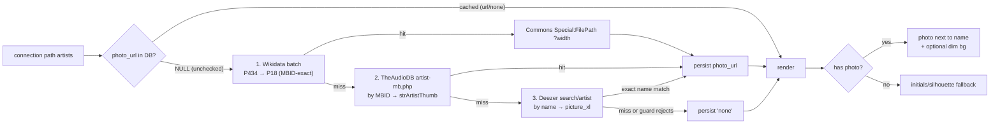

# feat: Artist photos (Wikidata + TheAudioDB + Deezer waterfall) + simplified header + retire Streamlit

**Product Contract preservation:** No upstream brainstorm; scope confirmed live with the user (2026-07-06). Follow-on to plans 008 (waterfall + six-degrees chain) and 009 (rich card + calmer flow) on branch `feat/preview-waterfall-results`. Anchored to `STRATEGY.md` (delight/shareability) and the plan-006 roadmap (E4 artist photos, B2 metadata). **Not built this session — the user will execute it in a fresh session.**

> **Context for a new session:** Rabbit Hole ("six degrees of Kendrick Lamar"): engine in `src/` (Python), FastAPI in `api/main.py`, Next.js in `frontend/`. The connection page (`frontend/app/components/connection-view.tsx`) renders a **vertical six-degrees chain** — each artist as a `ChainNode` pill, with a `PreviewCard` (`preview-player.tsx`) between hops — plus a **top transit-line node viz** (`path-headline.tsx`) and a "(k)dot score" header. Artist nodes are keyed on **MusicBrainz MBID** (the `id`). The home search box (`search-typeahead.tsx` / `app/page.tsx`) has placeholder "Search an artist — e.g. Drake, SZA…". This plan adds artist photos, simplifies the header, and experiments with motion.

---

## Summary

Four changes to the results experience, from testing feedback:

1. **Simplify the search placeholder** to just "Search an artist" (drop the "e.g. Drake, SZA…" examples).
2. **Remove the top transit-line** node viz — it's redundant now that the vertical chain shows the same flow.
3. **Show each path artist's photo** next to their name in the chain, from a **coverage waterfall** so the chain rarely looks empty: **Wikidata→Commons (MBID-exact, free-licensed) → TheAudioDB (MBID-exact) → Deezer artist image (name-matched, exact-name guard)**, good-quality sized thumbnails, resolved from the MBID and **persisted** so each artist is resolved once. Graceful fallback (initials/silhouette) only when *no* source has a photo.
4. **Decommission Streamlit** — the legacy `app.py` UI is fully superseded by the Next.js app and nothing depends on it; remove it (and drop the "Streamlit boots" checks).
5. **Two optional/experimental units** (captured for the build session to take or skip): a **dim artist-photo background** behind each artist→song block, and subtle **float-in / motion** so results feel alive.

---

## Problem Frame

- **Placeholder is noisy.** "Search an artist — e.g. Drake, SZA…" — the examples aren't needed; "Search an artist" is cleaner.
- **The top transit-line duplicates the chain.** Freddie Gibbs → Dom → Kendrick appears both in the top node viz and the vertical chain below. Redundant; drop the top viz.
- **The chain is text-only.** Names without faces feel flat; artist photos next to each name make it richer and more shareable.
- **Photos are available from Wikidata (probed live 2026-07-06):** a batched SPARQL query maps `P434` (MusicBrainz artist ID) → `P18` (image) → a Wikimedia Commons `Special:FilePath` URL that accepts `?width=N` for good-quality sizing. **Coverage is partial** — of Kendrick / Freddie Gibbs / Dom Kennedy, the first two had photos and Dom Kennedy had none — so a fallback avatar is required.
- **Deploy concern (user):** runtime Wikidata calls at public scale. Mitigated by persisting each resolved photo URL (resolve once per artist; repeat visitors hit cache; only new artists query Wikidata). Heavy public traffic would still want an offline pass / CDN — deferred.
- **Motion is off-brand but worth trying.** Spotify is static; a subtle float-in could make the reveal feel alive. Experimental.

---

## Requirements

- **R1 — Simplified placeholder:** the search box reads "Search an artist" (no examples).
- **R2 — Remove the top transit-line:** the `PathHeadline` node viz is removed from the connection page; the vertical chain is the sole path visualization. The "(k)dot score" header stays.
- **R3 — Artist photos in the chain (maximize coverage):** each path artist shows a good-quality photo next to their name, resolved via a multi-source waterfall — Wikidata `P18`→Commons (MBID-exact), then TheAudioDB (MBID-exact), then Deezer artist image (name-matched, guarded by artist-name accept-logic) — with a graceful fallback (initials/silhouette) only when no source has one.
- **R4 — Persisted, deploy-friendly resolution:** the photo (and its source) resolves at request time and is **persisted per artist** (URL or a "none" sentinel) so each artist is resolved at most once; the running app serves cached URLs thereafter. Wikidata is batchable by MBID (one SPARQL VALUES query per connection); TheAudioDB and Deezer are one HTTP call per artist.
- **R5 — (Optional/experimental) Dim photo background:** behind each artist's name block flowing into its song card, show the artist's photo as a very dim background accent.
- **R6 — (Optional/experimental) Motion:** results animate/float in with subtle movement for a more "alive" feel; must respect `prefers-reduced-motion`.
- **R7 — No regressions:** the preview cards + chain (plans 008/009) keep working; Python + API suites green.
- **R8 — Decommission Streamlit:** remove the legacy `app.py` UI, its two `.claude/launch.json` entries, and `streamlit` from `requirements.txt`; drop the now-moot "Streamlit boots" verification from plans/DESIGN-NOTES. (Confirmed 2026-07-06: nothing in `src/`, `api/`, or `frontend/` imports `app.py` or streamlit — the engine in `src/` is shared and independent.)

---

## Key Technical Decisions

### KTD1 — Photo coverage waterfall (exact-keyed first, then name-matched)
Maximize coverage by stacking sources, MBID-exact before name-matched, stopping at the first hit:
1. **Wikidata `P18`** — batched SPARQL by `P434` (MBID) for all of a connection's artists → Commons `Special:FilePath` URL + `?width=320` for a crisp thumbnail. Free-licensed (attribution varies — CC-BY/CC-BY-SA; see Risks), MBID-exact. Partial coverage (verified: Kendrick/Gibbs yes, Dom Kennedy no).
2. **TheAudioDB** `artist-mb.php?i=<mbid>` → `strArtistThumb`. Free, **MBID-exact** (no mismatch risk), **one call per MBID** (not batchable). Filled Dom Kennedy in the probe.
3. **Deezer** `search/artist?q=<name>` → `picture_xl` (1000×1000). Free, no-auth, **broad** coverage — but matched by *name*, so it MUST pass an **exact normalized-name match** (a small helper reusing `preview_fetcher._normalize`), **not** the bidirectional-substring `_artist_matches`. That helper was built for finding a connecting artist inside a track's combined credit string and would accept containment collisions like "June" → "Larry June"; photo identity is one-to-one, so require equality. (The probe mis-matched "C-San" → "C-kan"; a substring guard also wrongly accepts near-names.)

Verified live 2026-07-06. This ordering favors exact matches (Wikidata, TheAudioDB) and only falls to Deezer-by-name under a guard, while Deezer's breadth backstops the long tail. **Not using Spotify's artist image** (scrape/ToS territory — see Risks); the clean sources above give broad coverage without it.

### KTD2 — Persist each resolved photo URL (resolve once, ever)
Add `artists.photo_url`: a validated image URL, a `"none"` sentinel (**the full waterfall was consulted and every source missed**), or NULL (unchecked **or** a source errored/timed out last time — retry later). The resolver only queries sources for artists still NULL; resolved URLs and `"none"` misses persist so repeat requests and repeat artists are cache hits, while transient failures stay retryable. This is what makes runtime resolution deploy-tolerable (per the user's concern); a full offline pass over all ~120k artists is deferred.

### KTD3 — Graceful fallback avatar (coverage is partial)
Wikidata `P18` coverage is incomplete (Dom Kennedy had none in the probe). When `photo_url` is the `"none"` sentinel or missing, render a deterministic fallback — the artist's initials on a tokened circle (or a neutral silhouette) — never a broken image. The avatar `` also carries an `onError` handler that swaps in the same fallback if a persisted URL later 404s or times out (Commons/Deezer/TheAudioDB hotlinks can rot) — value-based fallback alone doesn't cover a load failure on a URL already marked valid.

### KTD4 — Remove the transit-line; photos carry the visual identity
Drop `PathHeadline` from the connection page (R2). The vertical chain + artist photos become the identity of the results; Kendrick still reads as the base via the existing chain-node treatment (plan 009).

### KTD5 — (Optional) Dim photo background accent
Behind an artist's name block (the segment flowing into its song card), paint the artist photo as a very low-opacity, blurred/darkened background so it reads as texture, not clutter. Reuses the resolved `photo_url`; skipped when the artist has none.

### KTD6 — (Optional) Motion, reduced-motion-safe
Subtle entrance animation (chain nodes + cards float/fade in on mount, slight stagger). Pure CSS/transition where possible; gate behind `prefers-reduced-motion: reduce` (no motion for users who opt out). Experimental — easy to remove if it fights the Spotify feel.

### KTD5b — Decommission Streamlit (`app.py`)
Independent of the photo work. The Streamlit UI (`app.py`) was the pre-plan-003 interface, fully replaced by the Next.js app; nothing in `src/`/`api/`/`frontend/` depends on it (verified). Remove `app.py`, its two `launch.json` configs, and `streamlit` from `requirements.txt`; the shared engine in `src/` is untouched. This also retires the "Streamlit boots" regression gate that plans 004–009 carried. **Caveat:** one test reads `app.py`'s source (see U6) and must be retargeted or removed, or the suite breaks.

## High-Level Technical Design

---

## Implementation Units

### U1. Artist-photo resolver + persistence (backend)

**Goal:** Resolve + persist Wikidata photo URLs for a connection's artists, exposed to the frontend.
**Requirements:** R3, R4
**Dependencies:** none
**Files:** `src/artist_photo.py` (new — the coverage waterfall: Wikidata batch → TheAudioDB by MBID → Deezer by name w/ accept-logic; graceful None), `src/database.py` (migration guard `artists.photo_url`; getter/setter, bulk), `api/main.py` (resolve + persist a path's artists; include `photo_url` per path artist in the connection payload, or a `/api/artist-photos` batch endpoint), `tests/test_artist_photo.py` (new), `tests/test_database.py`, `tests/test_api.py`
**Approach:** `artist_photo.resolve(artists) -> {mbid: PhotoResult}` where each artist carries `(mbid, name)` (Deezer needs the name) and `PhotoResult` is a validated URL, `NO_PHOTO` (all three sources consulted, none hit), or `UNAVAILABLE` (a source errored/timed out before the waterfall completed) — the tri-state is what lets persistence tell "genuinely no photo" from "retry later" (KTD2). Waterfall per artist (KTD1): (1) Wikidata `P18` — one batched WDQS query by `P434` for all still-unresolved MBIDs; (2) TheAudioDB `artist-mb.php?i=<mbid>` → `strArtistThumb` (public test key as a constant, env-overridable — demo-adequate; production keys are Patreon-gated and out of scope with the other deferred scale work); (3) Deezer `search/artist?q=<name>` → `picture_xl`, accepted only if the returned artist name is an **exact normalized-name match** to the query (reuse `preview_fetcher._normalize`; do NOT use `_artist_matches`, whose bidirectional-substring rule accepts containment collisions like "June"→"Larry June"). Before returning a URL, **validate** it is a well-formed `https://` URL on an expected-host allowlist (Commons / TheAudioDB / Deezer CDNs); a candidate that fails validation is treated as a miss, not persisted. Conservative timeouts, good User-Agent, honor Wikidata 429, graceful skip on any source failure (never raise). Injectable fetch seams per source for offline tests. The connection endpoint resolves only artists whose `photo_url` is NULL and persists: the URL on success, the `"none"` sentinel on `NO_PHOTO`, and **leaves the row NULL on `UNAVAILABLE`** so a transient failure retries on a later request (mirrors `resolve_preview` in `api/main.py`: sentinel on a checked miss, NULL on `RateLimited`/`RequestException`). It returns each path artist's `photo_url` (normalized: real URL or null). In-process cache + the DB column mean an artist is resolved at most once, and a genuine no-photo artist is never re-queried.
**Patterns to follow:** plan-008 `edge_preview` (resolve-at-request + persist + graceful) and its tri-state sentinel/NULL persistence in `resolve_preview` (`api/main.py`), plan-008 Wikidata query discipline, `preview_fetcher._normalize` (name normalization), `database.py` migration-guard idiom.
**Execution note:** Start with a failing test on the waterfall using injected per-source fetch seams (no network) asserting source order + the exact-name guard + the all-miss (`NO_PHOTO`) vs all-error (`UNAVAILABLE`) split. Cap total photo resolution per connection request (~2–3s overall budget, on top of plan-008's preview resolution); artists not resolved within budget return null and stay NULL for a later request, so a slow-upstream day can't hold the connection response for tens of seconds.
**Test scenarios:**
- Wikidata hits → Commons URL (source=wikidata), later sources not consulted.
- Wikidata miss, TheAudioDB hits by MBID → its thumb (source=theaudiodb).
- Wikidata + TheAudioDB miss, Deezer exact-name-matches → `picture_xl`; a Deezer result whose name is NOT an exact normalized match — both the disjoint case ("C-San" vs "C-kan") and the containment case ("June" vs "Larry June") — is rejected → `NO_PHOTO` (no wrong face).
- A returned URL that fails scheme/host validation is treated as a miss (not persisted).
- All sources definitively miss → `NO_PHOTO` (persist `"none"`). Any source errors/times out → `UNAVAILABLE` (no raise; row left NULL for retry).
- Migration guard adds `photo_url`; setter persists a URL and the `"none"` sentinel, and leaves NULL on `UNAVAILABLE`.
- Connection endpoint: stored URL is returned as-is; an unchecked artist resolves + persists; a second request makes no new upstream call; a `"none"` artist is not re-queried; an artist left NULL after `UNAVAILABLE` IS re-queried on a later request.

### U2. Photos in the chain + simplified header (frontend)

**Goal:** Show artist photos next to names; drop the top transit-line; simplify the placeholder.
**Requirements:** R1, R2, R3
**Dependencies:** U1
**Files:** `frontend/app/components/search-typeahead.tsx` and/or `frontend/app/page.tsx` (placeholder → "Search an artist"), `frontend/app/components/connection-view.tsx` (remove `PathHeadline`; add avatars to `ChainNode`), `frontend/lib/api.ts` (carry `photo_url` on path artists), `frontend/app/components/path-headline.tsx` (removed from the page; delete if now unused)
**Approach:** Placeholder text change. Remove the `PathHeadline` render + import. `ChainNode` gains an avatar: a good-quality rounded photo (from `photo_url`, sized via the Commons `?width`) or the KTD3 fallback (initials/silhouette). The avatar `` needs an `onError` handler that swaps to the fallback on load failure — the `preview-player.tsx` pattern being copied only guards a null URL, not a runtime 404, so following it verbatim would leave broken-image glyphs possible (KTD3). Keep the "(k)dot score" header + the calmer chain (plan 009).
**Patterns to follow:** `connection-view.tsx` chain nodes; `preview-player.tsx` `` + fallback tile pattern (extend it with `onError`, which it lacks); token styling; `frontend/AGENTS.md` (read the Next guide before writing).
**Test scenarios:** `Test expectation: none — presentational; verified live: placeholder reads "Search an artist"; no top transit-line; each artist shows a photo or a clean fallback; good quality; desktop + 375px; no console errors.`

### U3. (Optional/experimental) Dim artist-photo background

**Goal:** A very dim artist photo behind each artist→song block for texture.
**Requirements:** R5
**Dependencies:** U1, U2
**Files:** `frontend/app/components/connection-view.tsx`, possibly `frontend/app/components/preview-player.tsx`
**Approach:** Behind the artist name block flowing into its song card, render the photo as a low-opacity, blurred/darkened background layer; skip when no photo. Keep text contrast; must not fight the album-color card (plan 009).
**Test scenarios:** `Test expectation: none — experimental presentational; verified visually: subtle, legible, skipped when no photo.`

### U4. (Optional/experimental) Motion / float-in

**Goal:** Results animate in for a more alive feel.
**Requirements:** R6
**Dependencies:** U2
**Files:** `frontend/app/components/connection-view.tsx`, `frontend/app/globals.css`
**Approach:** Subtle staggered fade/float-in on the chain nodes + cards at mount. CSS transitions/keyframes; gate behind `prefers-reduced-motion: reduce`. Experimental — remove cleanly if it clashes.
**Test scenarios:** `Test expectation: none — experimental presentational; verified visually + prefers-reduced-motion disables it.`

### U6. Decommission Streamlit

**Goal:** Remove the superseded legacy Streamlit UI cleanly.
**Requirements:** R8
**Dependencies:** none (independent of the photo work)
**Files:** delete `app.py`; `.claude/launch.json` (remove the two `streamlit` configs); `requirements.txt` (remove `streamlit`); `tests/test_database.py` (the `test_guard_submit_path_uses_resolve_artist` test reads `app.py`'s source via `Path(__file__).parent.parent / "app.py"` — retarget it at the Next.js submit path or remove it, else the suite fails `FileNotFoundError`); `README.md` and `docs/ROADMAP.md` (both open by describing the project as "a Streamlit web app" — update those lines); `frontend/DESIGN-NOTES.md` (drop the "Streamlit boots" claim). Grep `streamlit`/`app.py` once more before deleting to confirm no live reference.
**Approach:** Confirm (re-grep) nothing in `src/`/`api/`/`frontend/` imports `app.py` or streamlit; then delete `app.py`, its launch configs, and the dependency. **One test reads `app.py` as source text** (`tests/test_database.py::test_guard_submit_path_uses_resolve_artist`, which pins the historical two-path `resolve_artist` bug) — rewrite it to pin the same regression against the current Next.js submit path, or remove it; leaving it makes the suite fail once `app.py` is gone, breaking this unit's own "suites green" expectation. Update the README/ROADMAP lines that call the project a Streamlit app. The shared engine in `src/` stays. Retire the "Streamlit boots" regression gate carried by plans 004–009 (it's moot once the app is gone).
**Patterns to follow:** n/a (removal).
**Test scenarios:** `Test expectation: none — removal; but the app.py-reading test in tests/test_database.py MUST be retargeted/removed first. Verify: Python + API suites still pass; no import or test references app.py/streamlit; README/ROADMAP no longer describe a Streamlit app.`

### U5. Verification pass

**Goal:** Prove photos + header changes work without regressions.
**Requirements:** R1–R8
**Dependencies:** U1–U4, U6
**Files:** `tests/` (suite), `frontend/DESIGN-NOTES.md`
**Approach:** Full Python + API suite green. Live preview (desktop + 375px): placeholder simplified; no top transit-line; artist photos (good quality) or clean fallbacks in the chain across a spread of artists (incl. previously-photoless ones like Dom Kennedy, now filled by the waterfall); optional bg/motion if built. **Coverage spot-check:** run the resolver over a random sample of ~100 DB artists and record the per-source hit-rate, so the "most artists have a photo" claim is measured rather than assumed (the live probe only covered ~5 mainstream artists, where every source is strongest). Confirm Streamlit is gone (no `app.py`, no streamlit dep) and the suites still pass. Record the artist-image attribution/licensing note (see Risks) in DESIGN-NOTES.
**Test scenarios:** engine/API assertions in the suite; UI flows as the screenshot protocol.

---

## Scope Boundaries

**In scope:** placeholder (R1), remove transit-line (R2), artist photos + persistence (U1/U2), verification (U5). Optional experimental: dim bg (U3), motion (U4).

### Deferred to Follow-Up Work
- **Offline artist-photo enrichment** over all ~120k artists — for heavy public traffic / to avoid any first-request Wikidata latency. Runtime-batch + persistence covers demo scale.
- **Public-deployment guardrails / CDN** — the connection endpoint now also does a Wikidata query for unresolved artists; demo-safe with persistence, but heavy traffic wants caching/CDN (shared deferral with plans 008/009).
- **Higher-fidelity images / cropping** (face-centered thumbnails) beyond Commons `?width`.

### Outside this plan's identity
- Reopening the preview waterfall (plans 008/009) or settled data decisions.
- Spotify artist images (scrape/ToS territory) — Wikidata is the chosen source.

---

## Open Questions

- **Q1 (payload shape):** Attach `photo_url` to path artists in `/api/connection`, or a separate `/api/artist-photos?mbids=` the chain calls on mount? Recommend attaching to `/api/connection` (one round trip; the path is already fetched there) **with the per-request resolution budget from U1's execution note**, so a cold path with several unchecked artists can't stack multiple upstream timeouts onto time-to-first-result. *Decide at U1.*
- **Q2 (image width):** What `?width` balances quality vs. weight for the chain avatars (and the dim bg)? Recommend ~160–320px for avatars; tune in preview. *Execution-time.*
- **Q3 (fallback style):** Initials-on-circle vs. neutral silhouette for no-photo artists? Recommend initials (more identifiable). Specify at U2: how initials are derived for one-word stage names ("Drake"→"D", "SZA"→"SZA"?) and non-Latin names, and how the circle's background is colored — recommend a deterministic hash of the MBID onto the existing token palette so a given artist is always the same color. No avatar pattern exists in the codebase to copy. *Design call at U2.*

---

## Risks & Dependencies

- **Coverage (the "feels empty" concern).** Wikidata `P18` alone is partial (Dom Kennedy had none), so the **waterfall** is the mitigation: TheAudioDB (MBID-exact) and Deezer (broad, name-matched) fill most gaps — Dom Kennedy resolves via both in the probe. The fallback avatar is only for the rare all-miss; the chain never shows a broken image.
- **Deezer name-mismatch (KTD1).** Deezer matches by name, so it can return the wrong artist ("C-San"→"C-kan" in the probe). Mitigated by requiring an **exact normalized-name match** (not the substring `_artist_matches`, which would accept containment collisions like "June"→"Larry June"); prefer the MBID-exact sources (Wikidata, TheAudioDB) first. A wrong face is worse than the fallback.
- **Persisted external URLs (security).** `photo_url` comes from three external APIs and is persisted verbatim, then rendered in an `` served to every future visitor — and persistence is "once, ever". Mitigated by validating each candidate at resolve time (well-formed `https://`, expected-host allowlist: Commons / TheAudioDB / Deezer CDNs) before persisting; anything else is treated as a miss (U1).
- **Rate/latency at public scale (R4).** Multiple upstreams per unresolved artist. Mitigated by per-artist persistence (resolve once) + in-process cache + honoring 429; the offline pass/CDN is deferred for heavy traffic.
- **Image licensing/attribution.** Wikimedia Commons `P18` images are mostly free licenses but terms vary (CC-BY/CC-BY-SA want attribution); Deezer/TheAudioDB images are hotlinked from their CDNs under their terms. Hotlinking is fine for a demo; for a public launch, add an attribution line and consider caching/proxying. Record in `frontend/DESIGN-NOTES.md`.
- **Spotify artist images — the legality question (answered).** *Not legal advice.* Scraping Spotify's public pages/embeds for images is **not "illegal" in a criminal sense** (US precedent — e.g. hiQ v. LinkedIn — holds that scraping public data isn't a CFAA crime), but it **violates Spotify's Terms of Service / Developer Terms** (a contract matter). Practical risk is a takedown / cease-and-desist / API-key ban, not prosecution. Because Wikidata + TheAudioDB + Deezer give broad coverage through sanctioned/CC channels, **this plan does not use Spotify images** — no need to take on the ToS risk for photos. (The plan-008 `audioPreview` preview scrape is the same gray area and already flagged demo-only.)
- **Motion vs. the Spotify feel (R6).** Experimental; `prefers-reduced-motion`-gated and easy to drop.
- **Next.js caveat (`frontend/AGENTS.md`)** — read the bundled guide before frontend edits.

---

## Verification Contract

1. Python + API suites green (no regression from plans 001–009) (R7).
2. `app.py`, its launch configs, and the `streamlit` dependency are removed, no code references them, and the `app.py`-reading test (`test_guard_submit_path_uses_resolve_artist`) is retargeted or removed so the suite still passes; README/ROADMAP no longer describe a Streamlit app (R8).
3. `/api/…` returns a `photo_url` per path artist (URL or null) resolved via the waterfall (Wikidata→TheAudioDB→Deezer-with-exact-name-guard); an unchecked artist resolves + persists; a second request makes no new upstream call; a definitively no-photo artist persists `"none"` and isn't re-queried, while an artist whose sources errored is left NULL and retried; a Deezer name that isn't an exact normalized match (disjoint or containment) is rejected; a URL failing scheme/host validation is treated as a miss (R3, R4).
4. Live preview (desktop + 375px): placeholder reads "Search an artist"; the top transit-line is gone; each chain artist shows a good-quality photo (including previously-photoless ones like Dom Kennedy) or a clean fallback (including on a runtime image-load failure); optional dim-bg/motion behave if built; no console errors (R1–R3, R5, R6).
5. `DESIGN-NOTES.md` records the image attribution/licensing note.

## Definition of Done

- The search placeholder is "Search an artist"; the top transit-line is removed; the vertical chain shows each artist's photo via the coverage waterfall (Wikidata→TheAudioDB→Deezer, good quality) or a graceful fallback — the U5 coverage spot-check confirms the measured hit-rate over a ~100-artist sample (rather than asserting "most" from the 5-artist probe) (R1–R3).
- Photo URLs are persisted per artist so resolution happens at most once (deploy-friendly), with a tri-state that leaves transient failures retryable; Deezer name-mismatches (disjoint or containment) are rejected; persisted URLs are host/scheme-validated; coverage gaps and runtime load failures degrade cleanly (R4, KTD1).
- Optional dim-background and motion are either shipped (reduced-motion-safe) or explicitly skipped by the build session (R5, R6).
- Streamlit (`app.py` + dep + launch configs) is removed and no code references it (including the retargeted `app.py`-reading test and updated README/ROADMAP); suites green; image attribution recorded (R7, R8).

---

## Sources & Research

- **Live photo-source probes (2026-07-06):**
  - Wikidata: batched SPARQL `?item wdt:P434 <mbid>; OPTIONAL wdt:P18 <image>` for Kendrick / Freddie Gibbs / Dom Kennedy → Commons `Special:FilePath` URLs for the first two, **none for Dom Kennedy**. `Special:FilePath/<file>?width=320` → 302 to a sized image, usable directly in ``.
  - Deezer `search/artist?q=<name>` → `picture_xl` (1000×1000), free/no-auth, **broad** — filled Dom Kennedy, Freddie Gibbs, Larry June. Name-matched: "C-San" mis-matched "C-kan" → needs name accept-logic.
  - TheAudioDB `artist-mb.php?i=<mbid>` (test key) → `strArtistThumb`, **MBID-exact** — also filled Dom Kennedy.
- **Streamlit decommission check (2026-07-06):** nothing in `src/`/`api/`/`frontend/` imports `app.py` or streamlit; `streamlit` appears only in `requirements.txt` (1) and `.claude/launch.json` (2 configs) — safe to remove.
- **WDQS limits** (plan 008 research, WDQS docs as of May 2026): 60s query-time/min, good `User-Agent` required, honor 429 — a per-connection batch query is trivial load.
- **Existing code:** `frontend/app/components/connection-view.tsx`, `path-headline.tsx`, `preview-player.tsx`, `search-typeahead.tsx`; `api/main.py`; `src/database.py` (MBID-keyed artist nodes).
- **Prior plans:** 008 (chain + waterfall), 009 (rich card + calmer flow), 006 roadmap (E4 artist photos / B2 metadata). Memory: [MusicBrainz dump enrichment goldmine](/Users/jojo/.claude/projects/-Users-jojo-Documents-projects-six-degrees-kdot/memory/musicbrainz-dump-enrichment-goldmine.md).
