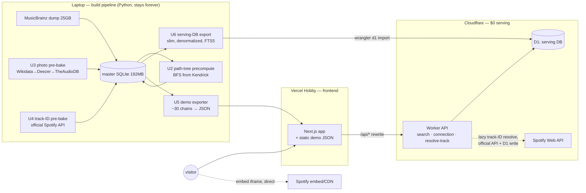

# feat: Zero-cost public launch — precomputed path tree, static demo, Cloudflare serving

**Product Contract preservation:** No upstream brainstorm; scope confirmed live with the user (2026-07-09) after a research-driven pivot away from an always-on paid backend. Supersedes the paid-hosting direction explored earlier in-session (Railway/Render/Fly + inbound rate limiting) — that work is *not* lost; its findings are folded into the KTDs and Risks here.

> **Context for a new session:** Rabbit Hole ("six degrees of Kendrick Lamar"): Python engine in `src/`, FastAPI in `api/main.py`, Next.js 16 frontend in `frontend/`. Active DB is `data/collaboration_network_mb.db` (192MB, gitignored; `RABBITHOLE_DB` env selects it): 119,729 artists / 369,456 collaborations / 563,826 songs / 30,661 aliases, built from a local MusicBrainz dump (the 25GB in `data/` is build input only — it never deploys). The connection page (`frontend/app/components/connection-view.tsx`) renders a vertical six-degrees chain with per-hop preview cards (`preview-player.tsx`). Branch: `feat/preview-waterfall-results`.

---

## Summary

Ship v1 to the public at **$0/month** by copying the survival pattern of the longest-lived comparable apps (sixdegreesofkanyewest.com — alive since 2016 on this exact design): **precompute everything on the laptop, serve dumb point lookups from free infrastructure, let Spotify's official embed render previews client-side**.

Three deliverables, strictly sequential:

1. **Build-pipeline pre-bakes (laptop, Python):** a shortest-path tree from Kendrick (distance + predecessor + connecting song per artist), the artist-photo sweep (~119.7k artists), and Spotify track-ID resolution for the path tree's connecting songs.
2. **Tier A — static portfolio demo:** ~30 curated showcase chains exported to static JSON, deployed on Vercel with no backend. First public artifact.
3. **Tier B — full app on Cloudflare free tier:** a slim serving database imported into D1, a thin Worker replacing the API's read paths (FTS5 search, path-walk connection, lazy track-ID resolve), the frontend cut over with honest error states.

The FastAPI + live-BFS stack retires to laptop-only build/dev tooling. No always-on server, no server-side preview fetching, no scraping in production.

---

## Problem Frame

The app works locally but has never been deployed. The original deployment question ("which paid host?") dissolved under two findings:

- **Compute, not storage, is the cost driver.** Only the 192MB SQLite ships; but the API loads all 369k edges into RAM for live BFS, demanding an always-on 512MB–1GB box ($5–15/mo) — rent paid forever for a free product.
- **The app has one fixed destination (Kendrick), so live BFS is unnecessary.** A single-source shortest-path tree precomputed once collapses every connection query to ≤7 indexed row lookups. This is verified prior art: sixdegreesofkanyewest.com stores exactly `(artist, kanye_number, predecessor, connecting_track_id)` per artist and has survived 10 years untouched on a $5 droplet; in 2026 the same design fits entirely inside Cloudflare's free tier.

Secondary problems solved en route: the production `next build` is currently broken by a type error; the photo/track-ID caches are ~empty (19/119,729 photos, 47/563,826 track IDs) so launch traffic would hammer upstream APIs; the current server-side Spotify embed-scrape is blocked from datacenter IPs (late-2025 anti-bot tightening) and is a ToS gray area — it must not ship publicly.

**User's stated goals:** $0 build now; possible future expansion/monetization (keep the door open, don't build for it); after launch he will make a portfolio demo video himself (screenshots/video are explicitly out of scope for this plan).

---

## Requirements

- **R1.** Production `next build` passes (fix the `fetchEdgePreview` fallback type error in `frontend/lib/api.ts`).
- **R2.** Every artist row carries precomputed `kendrick_distance`, `predecessor_id`, and connecting-song reference, validated against the live BFS engine.
- **R3.** Artist photos are pre-baked offline across all ~119.7k artists via the existing waterfall (Wikidata → TheAudioDB → Deezer), respecting each upstream's rate limits, resumable, run from the user's own terminal.
- **R4.** Spotify track IDs are pre-baked for path-tree connecting songs (popularity-first) via the **official** Web API; public previews render as official Spotify embed iframes keyed by those IDs — no server-side audio fetching or scraping in production.
- **R5.** Tier A: a static demo of ~30 curated showcase chains is publicly reachable with zero backend.
- **R6.** Tier B: all 119k artists are searchable and viewable on a $0/month serving stack (Cloudflare D1 + Worker free tier), with response caching headers so Cloudflare/Vercel CDNs absorb repeat traffic.
- **R7.** The frontend distinguishes backend failure from "artist not found" and surfaces search errors (today every failure renders "Not in our network yet" and search fails silently).
- **R8.** The public app displays photo attribution (Wikimedia Commons images are CC-BY/CC-BY-SA) per `frontend/DESIGN-NOTES.md`'s pre-public deferral.
- **R9.** The build pipeline (dump → graph DB → pre-bakes → serving export → D1 import) is documented well enough to re-run for a future data refresh.

---

## Key Technical Decisions

- **KTD1 — Precompute a single-source shortest-path tree from Kendrick; retire live BFS from serving.** Serving becomes ≤7 point lookups. Grounded in verified prior art (sixdegreesofkanyewest.com's `kanye_degree` table; Six Degrees of Wikipedia's preprocess-heavy design). The BFS engine (`src/path_finder_sqlite.py`) remains the build-time oracle for validation.
- **KTD2 — Cloudflare D1 + Workers free tier for serving; Vercel Hobby for the frontend.** D1 free: 500MB/database (192MB fits; the slim serving DB is far smaller), 5M rows read/day, FTS5 supported. Workers free: 100k req/day. Vercel Hobby hosts the Next.js app (non-commercial use — acceptable now; see Risks for the monetization path). Turso rejected (company mid-pivot, libSQL in maintenance mode). Fly scale-to-zero rejected (cold starts on the exact recruiter-click path that matters).
- **KTD3 — Official Spotify embed iframes are the public preview mechanism.** `https://open.spotify.com/embed/track/{id}`, unauthenticated, verified working July 2026; visitor's browser fetches from Spotify directly — zero server exposure, ToS-clean. The Nov-2024 `preview_url` removal is irrelevant to embeds. The scraped-MP3 custom player (`src/spotify_preview.py`) becomes dev-only. Songs with no resolvable track ID render a no-player card (song title, hop intact) — no iTunes/Deezer runtime fallback in v1 (Worker egress IPs are shared; per-IP-limited upstreams are unpredictable from Cloudflare).
- **KTD4 — Photo pre-bake uses bulk-optimized source order:** batched Wikidata SPARQL (~200–400 MBIDs per `VALUES` query, descriptive User-Agent — generic UAs are throttled hard since 2025) → Deezer at ~8 req/s (dominant source, exact-name guard already prevents wrong faces) → TheAudioDB (free test key, ~30/min) only for the remaining tail. Hours instead of days, $0. Runtime requests keep the existing quality order — irrelevant post-bake since everything is resolved.
- **KTD5 — Track-ID pre-bake covers path-tree connecting songs only, popularity-first; the Worker lazy-resolves the tail.** ≤119k songs matter (one per artist), not 563k. Official API with client-credentials from the Worker is keyed by app token, not IP — safe from Cloudflare. Results persist to D1 (100k writes/day free dwarfs demand). Tri-state semantics preserved (`NO_TRACK_SENTINEL` for confirmed-absent).
- **KTD6 — A slim serving database is derived from the master DB rather than importing all 192MB.** One denormalized row per artist (name, popularity, degree, photo_url, distance, predecessor_id, via-song title + track ID) + aliases + an FTS5 index over names/aliases. (`degree` is required by the frontend's `SearchResult` contract — the typeahead renders "N collabs" and disambiguates duplicate names by it.) Estimated tens of MB. The master 192MB DB stays home as the build source of truth. FTS5 replaces rapidfuzz for search (typo tolerance regresses slightly; prefix + alias matching covers the main cases; acceptable v1 trade-off).
- **KTD7 — Response shapes stay compatible with the existing frontend contract** (`frontend/lib/api.ts` types) so the cutover is a base-URL change plus the embed/error-state work, not a frontend rewrite. Complete responses get long `Cache-Control: s-maxage`; responses containing retryable NULLs (unresolved track ID) get short TTLs, so lazy resolution isn't frozen by the CDN.
- **KTD8 — The laptop is the permanent build pipeline.** All Python (`src/`, FastAPI, enrichment scripts) stays as local tooling, following the established batch-job conventions (`src/popularity_enrich.py` / `src/spotify_enrich.py`: `--rate`/`--limit` flags, CHUNK=200 bulk commits, NULL-marker resumability, 429 clean abort honoring `Retry-After`). Long runs execute in the user's own terminal, not an agent session.

---

## High-Level Technical Design

Request flow after launch: connection view = one Worker call walking ≤7 D1 rows (all pre-baked fields); previews = visitor's browser ↔ Spotify embed; photos = visitor's browser ↔ Wikimedia/TheAudioDB/Deezer CDNs (hotlinked URLs, as today). The only runtime upstream call our infrastructure ever makes is the lazy track-ID resolve against the official Spotify API, cached forever in D1.

---

## Scope Boundaries

**In scope:** the nine units below — type fix, three pre-bakes, static demo, serving DB + Worker, frontend cutover with error states + attribution, docs/runbook.

### Deferred to Follow-Up Work
- **Presentation polish** (larger photos/names, avatar crop fix in `connection-view.tsx`, dim photo background, motion) — user-sequenced after deployment.
- **Interactivity work** (deferred from plan 010) and the demo-Spotify-shell stretch idea.
- **Per-artist OG/share metadata** (`generateMetadata` on `connection/[id]`) — valuable for the share loop, not needed for the portfolio-video goal.
- **Official-release edge filter** — bootleg/mashup recordings create spurious edges (e.g., Beatles→Kendrick shortcuts). The path tree inherits the current graph as-is; filtering changes the graph build, a separate project.
- **iTunes/Deezer preview fallback in the Worker** for embed-less songs, if no-player cards prove too common.
- **Typo-tolerant search** beyond FTS5 prefix+alias matching.
- **Untracking the legacy 28MB `data/collaboration_network.db`** from git (it has uncommitted binary churn from schema migrations; don't ship it, consider `git rm --cached` in a housekeeping commit).
- **Monetization plumbing** (ads, custom domain, Vercel Pro or Cloudflare Pages migration) — see Risks.

**Out of scope:** demo video/screenshots (user does this himself post-launch); paid always-on hosting and its guardrail stack (per-IP limiters, origin auth) — dissolved by the architecture; any Spotify scraping in production.

---

## Implementation Units

### U1. Land the production-build type fix

**Goal:** `next build` passes; every later deploy is unblocked.
**Requirements:** R1. **Dependencies:** none.
**Files:** `frontend/lib/api.ts`.
**Approach:** The `!res.ok` fallback in `fetchEdgePreview` (~line 107) omits required `EdgePreview` fields (`artists`, `album`, `year`, `dominant_color`). Return a complete object (`artists: []`, nulls elsewhere) matching the interface.
**Test scenarios:** `npm run build` succeeds; existing UI behavior on a failed edge-preview fetch unchanged ("Preview unavailable" card still renders).
**Verification:** clean production build + lint.

### U2. Path-tree precompute (laptop)

**Goal:** every artist row gains `kendrick_distance`, `predecessor_id`, and via-song reference (song id + title), computed by single-source BFS from Kendrick over `collaborations`.
**Requirements:** R2. **Dependencies:** none (parallel-safe with U1).
**Files:** new `src/path_tree.py` (CLI script); schema additions in `src/database.py`; new `tests/test_path_tree.py`.
**Approach:** Load adjacency once (reuse `database.py`'s edge loader), BFS from the Kendrick node (`RABBITHOLE_KENDRICK_ID` / default in `api/main.py`), deterministic tie-break preferring higher-popularity predecessors (nicer chains), bulk-persist in CHUNK=200 commits. Unreachable artists keep NULL distance (frontend already has the honest "not in network" state for them). Pick one via-song per edge deterministically (prefer songs likely resolvable on Spotify — e.g., shortest title / highest artist popularity; implementer's judgment).
**Patterns to follow:** `src/popularity_enrich.py` (CLI shape, bulk commits).
**Test scenarios:** (happy) for a sample of ~50 artists across distances 1–6, `kendrick_distance` equals live `PathFinder` distance; walking predecessors from any sampled artist terminates at Kendrick in exactly `distance` steps; every `(artist, predecessor, via_song)` triple is a real collaboration edge. (edge) Kendrick himself: distance 0, no predecessor; unreachable artist: NULLs preserved. (error) missing Kendrick id → clean abort with message.
**Verification:** validation script output showing 100% agreement on the sample; distance histogram roughly matching known ~64%-within-6 coverage.

### U3. Photo pre-bake sweep (laptop, overnight)

**Goal:** `artists.photo_url` populated (URL or `"none"` sentinel) for ~119.7k artists.
**Requirements:** R3. **Dependencies:** none (parallel-safe with U2).
**Files:** new `src/photo_prebake.py`; `tests/test_photo_prebake.py`; small additions to `src/artist_photo.py` if batch seams are needed (it already supports `budget_s=None`).
**Approach:** KTD4 order. Stage 1: Wikidata SPARQL in chunks of ~200–400 MBIDs per `VALUES` query (~1–2 req/s, descriptive UA with contact email — already the convention in `artist_photo.py`). Stage 2: Deezer artist search ~8 req/s for remaining NULLs, exact-normalized-name guard as-is. Stage 3: TheAudioDB per-MBID at ≤30/min for the tail. Resumable (`WHERE photo_url IS NULL`), `--rate`/`--limit`/`--min-degree` flags, priority order by popularity/degree so prominent artists bake first, 429 → clean whole-run abort per `spotify_enrich.py`. Persist via `db.set_photo_urls_bulk` (tri-state: URL / `PHOTO_NONE_SENTINEL` / leave NULL on transient failure).
**Patterns to follow:** `src/spotify_enrich.py` (RateLimited abort), `src/popularity_enrich.py` (flags, chunked commits).
**Test scenarios:** (happy) mixed batch resolves URL/sentinel/NULL correctly per source responses (mock HTTP). (edge) resume run skips already-resolved rows; empty tail stage exits cleanly. (error) 429 from Deezer mid-run → aborts without corrupting resolved rows; Wikidata chunk timeout → those artists stay NULL for retry.
**Verification:** coverage query after full run (expect roughly ≥60% URLs overall, ~100% for prominent artists per DESIGN-NOTES measurements); spot-check 20 random photo URLs render and pass the allowlist. Run executes in the user's own terminal.

### U4. Track-ID pre-bake for connecting songs (laptop)

**Goal:** `songs.spotify_track_id` resolved for path-tree via-songs, popularity-first (top ~20k artists minimum; full sweep if time allows).
**Requirements:** R4. **Dependencies:** U2 (needs via-song set).
**Files:** extend `src/spotify_enrich.py` or new `src/track_prebake.py`; `tests/test_track_prebake.py`.
**Approach:** Official Web API (client credentials from `.env`), search by track title + artist names, exact/normalized-match guard before accepting an ID (mirror the existing resolve logic in `api/main.py`'s `/api/resolve-preview`), `NO_TRACK_SENTINEL` on confirmed miss, NULL on transient failure. Pace ~4–5 req/s; honor `Retry-After` with clean abort. Priority: descending predecessor-artist popularity.
**Patterns to follow:** `src/spotify_enrich.py` almost verbatim.
**Test scenarios:** (happy) known song resolves to expected ID (mocked); ambiguous title with wrong-artist top hit → guard rejects, sentinel persisted. (edge) resume skips resolved/sentinel rows. (error) 429 → abort, rows remain NULL.
**Verification:** ≥90% of top-20k via-songs resolved (ID or sentinel); spot-check 10 embeds play the right song in a browser.

### U5. Tier A — static portfolio demo (first public ship)

**Goal:** a publicly reachable demo: curated showcase grid → full chain experience (photos, embeds) for ~30 artists, zero backend.
**Requirements:** R5, R4 (embeds). **Dependencies:** U1, U2; U3/U4 for the showcase artists at minimum (they bake first by priority).
**Files:** new `scripts/export_demo.py`; static JSON under `frontend/public/demo/`; new `frontend/app/components/spotify-embed.tsx`; demo landing/wiring in `frontend/app/` (implementer's structure); `tests/test_export_demo.py`.
**Approach:** Exporter walks each showcase artist's chain and emits one JSON per artist (hop names, photo URLs, song titles, track IDs) + an index. Frontend: a demo mode (env-flagged or route-based) whose search surfaces only showcase artists and whose connection view hydrates from static JSON through the same rendering path as the live app. `SpotifyEmbed` renders the official iframe lazily (on scroll-into-view or tap) to keep the page light; hops without a track ID render the no-player card. Deploy to Vercel Hobby. Curate the showcase list with the user at execution time (default: Kendrick-adjacent crowd-pleasers across distances 1–4, e.g. Drake, SZA, Taylor Swift, Beatles-if-honest, etc.).
**Test scenarios:** (happy) exporter emits valid JSON for a distance-3 artist; demo page renders a full chain with embeds from fixture JSON. (edge) showcase artist with a photo-less hop renders initials avatar; hop without track ID renders no-player card. (error) missing demo JSON → graceful fallback message, no crash.
**Verification:** deployed Vercel URL: click a showcase artist → chain renders, an embed plays, Lighthouse sanity on mobile. This is the demo the portfolio video will capture.

### U6. Serving database export + D1 import

**Goal:** slim serving SQLite derived from the master DB, imported into Cloudflare D1.
**Requirements:** R6. **Dependencies:** U2; U3/U4 as-available (re-import is cheap and repeatable).
**Files:** new `scripts/export_serving_db.py`; `tests/test_export_serving_db.py`; `worker/` scaffolding for wrangler config (shared with U7).
**Approach:** One denormalized `artists` row per KTD6 (id, name, popularity, degree, photo_url, distance, predecessor_id, via_song_title, via_track_id) + `aliases` + FTS5 virtual table over name+aliases, indexes on id. Export as SQL dump; `wrangler d1 import`. Known gotcha: create the FTS5 table *after* import (D1 export/import breaks on virtual tables). Document the re-import runbook (it will run again after U3/U4 complete and for future refreshes).
**Test scenarios:** (happy) exported DB answers a connection walk for a sample artist identically to the master DB's path tree; FTS query for "kendrik"-adjacent prefix returns Kendrick. (edge) artist with NULL distance exports cleanly; sentinel photo/track values preserved. Test expectation: D1-side import verified manually via `wrangler d1 execute` spot queries — no automated CI against Cloudflare in v1.
**Verification:** row counts match master; serving DB size logged (expect ≪192MB); spot queries on the live D1 instance return correct rows.

### U7. Worker API

**Goal:** thin Worker exposing the read API from D1: `GET /api/search`, `GET /api/connection`, `POST /api/resolve-track`.
**Requirements:** R6, R4. **Dependencies:** U6.
**Files:** new `worker/` (wrangler config, `worker/src/index.ts`, `worker/test/` with vitest + Cloudflare's workers test pool).
**Approach:** Search: FTS5 prefix match over names/aliases, ranked by popularity, response shape matching `frontend/lib/api.ts`'s `SearchResult` — including `degree` and the duplicate-name disambiguation labels (port `database.py`'s `disambiguate_labels` logic, or precompute labels at export time). Connection: walk predecessor chain (≤7 indexed lookups, one batched query if convenient), return the existing `ConnectionResult` shape plus per-hop `via_track_id`; add an explicit error status distinct from `not_found` (feeds R7). Resolve-track: for a NULL via-song, call official Spotify API (client-credentials token cached in Worker memory; secret via `wrangler secret`), same match-guard as U4, write result to D1, return it; sentinel on miss. Cache-Control per KTD7: long `s-maxage` (~1 day) for complete responses, short (~60s) when any hop's track ID is NULL. Keep queries indexed — an unindexed LIKE over 120k rows costs 120k of the 5M daily row-reads; FTS keeps it to a handful.
**Test scenarios:** (happy) search "drake" returns Drake first; connection for a distance-3 artist returns 4 nodes/3 hops with photos and track IDs; resolve-track persists and returns an ID (Spotify mocked). (edge) unreachable artist → `not_found`; Kendrick himself → distance-0 response; already-sentinel song → returns "none" without calling Spotify. (error) D1 unavailable → 5xx with error body (not a fake not_found); Spotify 429 → response marks track unresolved, short TTL, no persist. (integration) cache headers differ between complete and incomplete connection responses.
**Verification:** vitest suite green; `wrangler dev` manual smoke against real D1; deployed workers.dev URL serves all three endpoints within free-tier CPU (10ms budget is ample for point lookups).

### U8. Frontend cutover + honest error states + attribution

**Goal:** the production frontend serves all 119k artists via the Worker, with real error handling and photo attribution.
**Requirements:** R6, R7, R8. **Dependencies:** U5 (SpotifyEmbed exists), U7.
**Files:** `frontend/next.config.ts` (rewrite → Worker URL via `API_ORIGIN`), `frontend/lib/api.ts`, `frontend/app/components/connection-view.tsx`, `frontend/app/components/search-typeahead.tsx`, `frontend/app/components/preview-player.tsx` (retire scraped-player path from public flow), footer/about surface for attribution.
**Approach:** Point the existing `/api/:path*` rewrite at the Worker (keeps same-origin, no CORS). Replace edge-preview/resolve-preview call sites with embed rendering from `via_track_id` + lazy `resolve-track`. Error honesty: `fetchConnection` distinguishes non-200 from 404 → new `{status:"error"}` renders "We're busy — try again" with retry (today it lies with "Not in our network yet"); search catch sets an error flag rendering a "search hiccuped — try again" row (today: silent dead box). Attribution: one footer line ("Photos: Wikimedia Commons / TheAudioDB / Deezer") linked to an about note. Demo mode from U5 remains as a permanent fallback landing if the backend ever disappears.
**Test scenarios:** (happy) search→connection→embed plays end-to-end against the Worker. (edge) artist without photo → initials; hop without track ID → no-player card; unreachable artist → existing honest not-found copy. (error) Worker 500 → busy-state with retry, NOT "not in network"; search failure → visible error row. (integration) repeat visit to a popular artist served from CDN cache (observe cache-hit header).
**Verification:** production Vercel deploy + `next build` clean; the four error/edge states demonstrated; Lighthouse mobile sanity.

### U9. Retire serving-FastAPI, document the pipeline

**Goal:** repo truthfully reflects the new architecture; a future data refresh is a documented, repeatable procedure.
**Requirements:** R9. **Dependencies:** U8.
**Files:** `README.md` (architecture + deploy sections), new `docs/RUNBOOK.md` (build pipeline: dump → master DB → U2/U3/U4 pre-bakes → U5/U6 exports → D1 import → Worker/Vercel deploy; expected durations and rate budgets), `api/main.py` module docstring (mark as local dev tool), `requirements.txt` (add `pillow` — currently missing, crashes clean installs that import `album_color`).
**Approach:** FastAPI stays runnable for local dev and as the BFS validation oracle — nothing deleted, honestly relabeled. Note the Spotify scrape module is dev-only and why (datacenter IP blocks + ToS).
**Test scenarios:** Test expectation: none — docs and metadata only (the `pillow` addition is verified by a clean `pip install -r requirements.txt && python -c "import api.main"`).
**Verification:** a cold reader can follow RUNBOOK.md from dump to deployed refresh without this conversation's context.

---

## Verification Contract

- `python3 -m pytest tests/` green (150 existing + new suites U2–U6).
- `cd frontend && npm run build && npm run lint` clean (R1 gate).
- `cd worker && npx vitest run` green.
- Live gates: Tier A URL renders a showcase chain with a playing embed; Tier B URL searches an arbitrary long-tail artist and renders its chain; the four U8 error/edge states demonstrated; D1 spot queries match master DB.

## Definition of Done

All nine units landed; both public URLs live; pre-bakes at ≥ the U3/U4 coverage bars; runbook written; production stack makes zero non-official upstream calls; total monthly cost $0.

---

## Risks & Mitigations

- **Vercel Hobby is non-commercial.** Fine for a free portfolio app; if monetization happens (user's stated maybe), move the frontend to Cloudflare Pages (free, commercial-OK, no bandwidth cap) or Vercel Pro ($20/mo). The static-export-friendly architecture keeps this a low-effort migration.
- **Spotify embed dependency.** Sporadic 2025 community reports of embed playback blocks in some browsers; the product itself remains live/free/official. Mitigation: no-player card fallback is already the design; iTunes-preview fallback is a deferred follow-up.
- **New Spotify app quotas (post-Nov-2024 dev-mode regime)** could slow the U4 pre-bake. Mitigation: popularity-first ordering makes partial completion useful; lazy resolve covers the tail indefinitely.
- **D1 rows-read budget** (5M/day free) is only threatened by unindexed scans. Mitigation baked into U6/U7: FTS5 + indexed walks, never `LIKE '%x%'`.
- **Wrong-face risk in bulk Deezer photo stage** — mitigated by the existing exact-normalized-name guard; sentinel rather than guess on ambiguity.
- **Bootleg spurious edges** (Beatles→Kendrick shortcuts) will be visible in precomputed chains, same as live BFS today. Accepted for v1; official-release filter deferred.
- **Master-DB / D1 drift** — lazy track-ID resolves write to D1 only. Accepted: D1 is a cache layer for that column; the runbook's re-export overwrites it harmlessly (re-resolution is cheap and self-healing).

---

## Sources & Research

- **Repo scan (2026-07-09, in-session):** API surface & request-time writes (`api/main.py`), schema/coverage counts, batch-job conventions, missing `pillow`, localhost-only CORS, no deploy artifacts, memory footprint of live BFS.
- **Flow/edge-case analysis (in-session):** frontend error-state gaps (C1 wrong "not found" on failure, M2 silent search), audio/img onError gaps, cache-TTL-vs-lazy-resolution interaction, DB-swap semantics.
- **Hosting/API-limits research (in-session, web):** 2026 pricing for Fly/Railway/Render; Vercel CDN rewrite caching; Wikidata UA enforcement + SPARQL batching; TheAudioDB 30/min test key; Deezer 50/5s; iTunes ~20/min; Spotify datacenter-IP scrape blocks; Deezer preview-URL expiry.
- **Zero-cost hosting research (in-session, web):** D1/Workers/Pages free limits + FTS5 support; Turso pivot risk; Fly scale-to-zero economics; sql.js-httpvfs static option; Vercel Hobby terms; survival-pattern survey (Oracle of Bacon, Six Degrees of Wikipedia).
- **sixdegreesofkanyewest.com verification (in-session, web):** repo `github.com/sa2812/Six-Degrees-of-Kanye-West` — per-artist `(gen, ancestor, track)` SQLite schema, server-rendered Spotify embed iframes, no server-side preview fetching, ~$6–7/mo droplet, dataset untouched since 2016 and still serving; Spotify embeds verified unauthenticated July 2026.
- Prior plans: 008 (preview waterfall), 010 (artist photos); `frontend/DESIGN-NOTES.md` pre-public deferrals; memory notes (MusicBrainz pivot, bootleg edges, enrichment goldmine).
