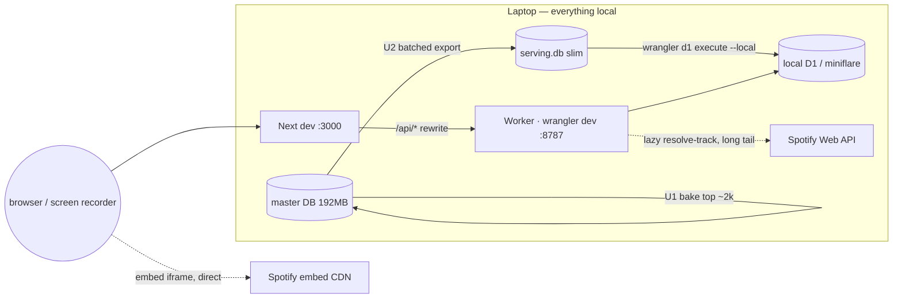

# feat: Local demo readiness — full local app, presentation polish, honest cleanup

**Product Contract preservation:** No upstream brainstorm; scope confirmed live with the user (2026-07-09). This is a deliberate pivot **away** from public deployment: the zero-cost Cloudflare/Vercel work (plan `2026-07-09-001`) stays dormant in the repo for a future "when there's time/money" push. Today's goal is a screen-record-ready local demo.

> **Context for a new session:** Rabbit Hole ("six degrees of Kendrick Lamar"): Python engine in `src/`, FastAPI in `api/main.py` (now local-dev/validation tooling only), Next.js 16 frontend in `frontend/`, and a Cloudflare Worker in `worker/` that serves a slim D1 database. As of plan `2026-07-09-001` the frontend talks to the **Worker** (`/api/*` → `http://127.0.0.1:8787` via the Next rewrite), not FastAPI. The connection page renders a vertical six-degrees chain (`frontend/app/components/connection-view.tsx` + `chain-display.tsx`) with an official Spotify embed between hops (`spotify-embed.tsx`). Master DB: `data/collaboration_network_mb.db` (192MB, gitignored). Branch: `feat/preview-waterfall-results`.

---

## Summary

Get Rabbit Hole to a **polished, reproducible local demo** the user can screen-record and screenshot — no deployment, no multi-day upload. Three workstreams:

1. **Run it locally, richly.** Bake photos + Spotify track IDs for the **top ~2,000 popular artists** (a few minutes on the laptop, not the deferred multi-day full sweep), load the full 119k-artist serving DB into **local** D1 (no write cap locally), and make the whole app start with one command.
2. **Presentation polish (the key design changes).** Larger, properly-centered artist photos and names; a dim artist-photo background behind each hop; subtle entrance motion; and **real interactivity** — clicking any artist in a chain falls down *their* rabbit hole.
3. **Honest cleanup.** Correct the now-moot "public URLs live" definition-of-done in the deployment plan, add a short "run the demo locally" doc, and record the pre-existing lint errors so the repo reads truthfully after the pivot.

---

## Problem Frame

The app is built but not in a demoable local state. Concretely:

- **The data is nearly empty.** Local D1 holds a 21-row test subset; only ~16 showcase artists have photos/track IDs baked. Searching an arbitrary artist yields sparse chains — initials instead of photos, no previews.
- **Photos are too small to see** (32–36px avatars) and use an `object-top` crop *hack* in `chain-display.tsx` — the user's exact "you can't see the picture well" complaint.
- **Deferred design work never landed.** The dim photo-background and entrance motion (plan 010 U3/U4) were skipped, partly to avoid fighting the album-color preview card — but that card was retired in the embed cutover, so the objection is void. The chain nodes are also non-interactive, leaving "real interactivity" (an earlier user ask) unbuilt.
- **The repo reads wrong after the pivot.** Plan `2026-07-09-001`'s Definition of Done still demands "both public URLs live," which is now explicitly *not* the goal.

**User's goal:** high-quality screenshots and a demo video that showcase the project — arbitrary artists searchable, real 3–4+ degree chains with photos and playing previews, running entirely on the laptop. Deployment is deferred, not cancelled.

---

## Requirements

- **R1.** The full 119,729-artist serving DB loads into **local** D1 and every reachable artist is searchable with a real chain — no public write cap involved.
- **R2.** The top ~2,000 artists by popularity have baked Spotify track IDs (so famous artists show a playing preview immediately); the long tail lazy-resolves previews on first view via the Worker. Photo coverage is separate and already broader (~64% of the long tail carries a `photo_url` from prior enrichment, ~100% of prominent artists), so most searched artists show a real photo, not initials.
- **R3.** The app starts locally with a single documented command (both the Worker and the frontend), reproducibly.
- **R4.** Artist photos in the chain are visibly larger and centered in their circles; artist names are larger; the avatar-crop defect is fixed.
- **R5.** Each artist→hop block shows a dim, tasteful artist-photo background that stays legible under the chain content.
- **R6.** Chain entrance has subtle motion that respects `prefers-reduced-motion`.
- **R7.** Clicking any non-base artist in a chain navigates to that artist's own six-degrees view (rabbit-hole traversal).
- **R8.** The deployment plan's Definition of Done no longer claims public URLs as a completion gate; a local-demo run doc exists; pre-existing lint errors are recorded.

---

## Key Technical Decisions

- **KTD1 — Bounded top-N bake, not the full sweep.** Photo + track-ID pre-bake runs `--limit`-bounded over the top ~2,000 artists by popularity/degree, using the existing `src/photo_prebake.py` / `src/track_prebake.py` scripts. Rationale: famous artists and their famous collaborators are what a demo surfaces; ~2k covers them in minutes at safe local rates. Runs from the user's own terminal (memory: long builds run in the user's terminal).
- **KTD2 — Batched multi-row INSERT export for a fast local seed.** The current serving-DB export emits one `INSERT` per row (~150k statements → the slow import observed earlier). Change the exporter to emit multi-row `INSERT` batches (~500 rows/statement) so `wrangler d1 execute --local` finishes in seconds, not minutes. Local D1 has **no** write cap, so the whole DB loads in one pass.
- **KTD3 — Keep the Worker + local-D1 architecture; do not revert to FastAPI.** The frontend is already wired to the Worker; keeping it means the demo runs on the same code path a future deployment would use, and needs only seeding + baking (additive) rather than undoing plan 001's U8 embed cutover. FastAPI stays as the build-time BFS validation oracle.
- **KTD4 — Larger avatars fix the crop honestly.** Replace the `object-top` bias hack with a genuinely larger avatar (target ~56–64px in the chain) using centered `object-cover`. At a larger size the face-clipping the hack worked around largely disappears; the fallback initials circle scales with it.
- **KTD5 — Dim photo background is now unblocked.** Plan 010 skipped it to avoid fighting the album-color preview card; that card was retired in the embed cutover, so a low-opacity artist photo behind each hop block no longer clashes. Legibility is guaranteed with a dark scrim over the image (same pattern the retired card used).
- **KTD6 — Real interactivity = clickable chain nodes.** Link the *intermediate* `ChainNode`s to `/connection/{artistId}`, turning the chain into a traversable graph — the literal "rabbit hole." Exclude **both** endpoints: the base node (Kendrick) and `path[0]` (the currently-searched artist, whose page you are already on — linking it would reload the same view and read as broken). This is the highest-value interactivity for a demo video and needs no new backend.
- **KTD7 — Spotify chrome stays for now; strip is a live judgment call.** The design system is explicitly a "Spotify concept" portfolio piece and the embeds are real/clickable, so the "chrome goes nowhere" critique is weak. Keep `app-chrome.tsx` and revisit strip-vs-keep once the polished app is running (Open Question OQ1) rather than removing it sight-unseen.

---

## High-Level Technical Design

Local run topology — everything on the laptop, nothing deployed:

Chain node, before → after (presentation): a 32–36px top-cropped avatar + small name pill becomes a larger centered avatar + larger name, set over a dim full-bleed artist photo, entering with subtle motion, and clickable to that artist's own chain.

---

## Scope Boundaries

**In scope:** the seven units below — top-2k bake, fast local seed + one-command launch, avatar/name sizing + crop fix, dim photo background, entrance motion, clickable chain traversal, and honest cleanup.

### Deferred to Follow-Up Work
- **Public deployment** (Cloudflare/Vercel) and the full ~120k pre-bake — the entire plan `2026-07-09-001` execution tail, dormant until the user chooses to deploy.
- **Stripping the inert Spotify chrome** — pending OQ1; not removed this pass.
- **A purely-decorative Spotify-like shell that expands beyond the current chrome** — the "cool stretch" idea, explicitly later.
- **Per-artist OG/share metadata, official-release edge filter, typo-tolerant search** — carried from the prior plan's deferrals; unchanged.
- **Deep git housekeeping** (untracking the churning legacy `data/collaboration_network.db`, fixing the pre-existing setState-in-effect lint errors) — the user chose "tidy the honest ends," not deep clean; these are recorded, not fixed.

**Out of scope:** the demo video and screenshots themselves (the user produces these); any production hosting; any Spotify scraping.

---

## Implementation Units

### U1. Bounded top-~2k photo + track-ID bake (laptop)

**Goal:** the top ~2,000 artists by popularity/degree have `photo_url` and their path-tree via-song `spotify_track_id` resolved in the master DB.
**Requirements:** R2. **Dependencies:** `SPOTIFY_CLIENT_ID` / `SPOTIFY_CLIENT_SECRET` must be set for the track bake (`src/track_prebake.py` exits 1 immediately without them; they already live in the repo `.env`). The path tree from plan 001 U2 already exists in the master DB.
**Files:** `src/photo_prebake.py`, `src/track_prebake.py` (both exist — invoke with `--limit`; both already order by popularity/degree by default), `docs/RUNBOOK.md` (record the bounded-bake invocation, including the required Spotify env vars).
**Approach:** Run each script `--limit`-bounded over the highest-popularity artists. Confirm the existing resumable NULL-marker + 429-clean-abort behavior covers a bounded run (it does — bounding just stops early). No new rate-limit logic. Runs in the user's own terminal. Note the two scripts order by *different* keys — photos by the artist's own popularity, track IDs by predecessor popularity — so `--limit 2000` covers two slightly different artist sets; this is accepted (the Worker's lazy resolve-track backfills any preview gap on first view), not reconciled.
**Patterns to follow:** existing `src/spotify_enrich.py` / `src/popularity_enrich.py` conventions the scripts already mirror.
**Test scenarios:** (happy) a bounded run of `--limit 50` resolves photos/track IDs for the 50 highest-popularity artists and leaves the rest NULL (existing tests in `tests/test_photo_prebake.py` / `tests/test_track_prebake.py` already cover resolution + resume; add one asserting `--limit` stops after N and orders by popularity). (edge) re-running skips already-resolved rows. (error) 429 mid-run aborts cleanly without corrupting resolved rows.
**Verification:** coverage query shows ~2k artists resolved; spot-check that a handful of famous artists (Drake, SZA, Tyler) have real photo URLs + track IDs.

### U2. Fast local seed + one-command launch

**Goal:** the full serving DB loads into local D1 quickly, and the whole app starts with one documented command.
**Requirements:** R1, R3. **Dependencies:** U1 (bake first so the seeded DB carries photos/tracks).
**Files:** `scripts/export_serving_db.py` (switch to batched multi-row INSERTs per KTD2), `tests/test_export_serving_db.py`, `.claude/launch.json` (already defines both servers — confirm), a top-level convenience script or documented command sequence (e.g. a `Makefile` target or a short shell script under `scripts/`), `docs/RUNBOOK.md`.
**Approach:** Re-export `worker/export/serving.sql` from the freshly-baked master DB. Produce the multi-row batches by **coalescing `conn.iterdump()`'s already-escaped `INSERT INTO … VALUES(...)` lines** into ~500-row statements — do *not* hand-serialize values (artist names and JSON collaborator strings contain apostrophes/quotes; naive f-string concatenation produces malformed SQL). Keep FTS5 table creation in the separate `fts5_setup.sql` (post-import, per the D1 virtual-table gotcha). **The one-command launch must drop/recreate the local D1 before seeding** (delete the miniflare D1 sqlite, or `DROP TABLE` first) — the exporter emits `INSERT OR IGNORE`, and a local D1 already exists from an earlier 21-row seed, so a plain re-seed would silently skip every freshly-baked row and keep showing stale data. One command: reset local D1 → seed → start both the Worker (:8787) and the frontend (:3000).
**Patterns to follow:** existing export script structure; `.claude/launch.json` server defs.
**Test scenarios:** (happy) the exporter emits batched multi-row INSERTs and the resulting SQL, applied to a fresh SQLite DB, reproduces the same row counts as the master path tree; a local search for an arbitrary long-tail artist returns a real chain. (edge) an artist whose **name contains an apostrophe** (e.g. "Guns N' Roses") round-trips through export→seed without malformed SQL — the fixture must include one, since Drake/Future fixtures alone would pass while real data breaks. (edge) an artist with NULL distance / sentinel photo exports and seeds cleanly. (error) after a fresh bake, the reset-then-seed launch shows the new photos/track IDs (proves the drop/recreate defeats `INSERT OR IGNORE` staleness). Covers the earlier slow-import failure mode.
**Verification:** local seed completes in seconds; `wrangler dev` + `npm run dev` serve a searchable app; searching a non-showcase artist renders a chain with photos.

### U3. Larger, centered artist photos + names

**Goal:** photos are big enough to see and centered in their circles; names are larger.
**Requirements:** R4. **Dependencies:** U2 (need real photos to verify).
**Files:** `frontend/app/components/chain-display.tsx`.
**Approach:** Increase avatar size (`ArtistAvatar` — target ~56–64px; base node slightly larger than intermediates), replace `object-top` with centered `object-cover` (KTD4), scale the initials-fallback circle and its text to match, and bump the `ChainNode` name text size. Preserve the `onError` → initials fallback and the base-vs-intermediate styling.
**Patterns to follow:** existing `ChainNode` / `ArtistAvatar` structure and Tailwind token classes.
**Test scenarios:** Test expectation: none — pure presentation; verified in the browser preview at desktop + 375px (avatar renders larger and centered; a photoless artist shows a correctly-sized initials circle; names are legibly larger; no layout overflow at 375px).
**Verification:** browser preview shows large centered photos and larger names on a real chain; mobile width does not overflow.

### U4. Dim artist-photo background per hop block

**Goal:** each artist→hop block sits over a dim, legible artist-photo background.
**Requirements:** R5. **Dependencies:** U2, U3.
**Files:** `frontend/app/components/connection-view.tsx`, `frontend/app/components/chain-display.tsx` (or a small new wrapper element).
**Approach:** Attach the dim background to the **artist-node region only**, not the full hop block — the Spotify embed is an opaque iframe (Spotify's own dark player) that nothing can show through, so a "behind the whole block" background would only peek around the pill and arrows and read as accidental. Render the artist's `photo_url` at low opacity under a dark scrim (`linear-gradient` over the image, mirroring the retired album-color card's legibility pattern — KTD5). No background when the artist has no photo (initials only) — decide during build whether photoless nodes get a neutral fill to keep the column's rhythm (see OQ2). Verify legibility against both a bright and a dark source photo.
**Patterns to follow:** the scrim gradient pattern documented in `frontend/DESIGN-NOTES.md` (plan 009 album-color card).
**Test scenarios:** Test expectation: none — presentation; verified in browser (background reads as subtle, text/embed stay legible; photoless artists show no background, no broken image; check both light source photos and dark ones for contrast).
**Verification:** browser preview shows the dim background enhancing, not obscuring, the chain at desktop + 375px.

### U5. Subtle chain entrance motion

**Goal:** the chain enters with tasteful motion that respects reduced-motion preferences.
**Requirements:** R6. **Dependencies:** none (U2 to have a real chain to demo against; shares no files with other presentation units).
**Files:** `frontend/app/components/connection-view.tsx`, `frontend/app/globals.css` (or Tailwind config for a keyframe/utility).
**Approach:** Add a subtle staggered fade/rise **to the artist `ChainNode`s only** — the Spotify embeds mount lazily on scroll (IntersectionObserver) and already have their own skeleton→player transition, so including them in the stagger would create two competing motion systems that read as jank in a scroll-through. Gate all motion behind `@media (prefers-reduced-motion: reduce)` → no motion. Keep it short and calm (the design language is deliberately understated; note this revives motion that `frontend/DESIGN-NOTES.md` previously skipped as off-brand — keep it minimal enough not to reopen that, see OQ3).
**Patterns to follow:** existing `globals.css` conventions; `rh-skeleton` shows the project already defines custom animations.
**Test scenarios:** Test expectation: none — presentation; verified in browser (nodes animate in on load; enabling reduced-motion disables it; no layout shift or jank).
**Verification:** browser preview shows the entrance animation; toggling `prefers-reduced-motion` (preview_resize/emulation) removes it.

### U6. Clickable chain traversal (real interactivity)

**Goal:** clicking any non-base artist in a chain opens that artist's own six-degrees view.
**Requirements:** R7. **Dependencies:** U3.
**Files:** `frontend/app/components/chain-display.tsx`, `frontend/app/components/connection-view.tsx`.
**Approach:** Wrap each *intermediate* `ChainNode` (index `> 0` and not the base/Kendrick) in a Next `Link` to `/connection/{artist.id}`. Skip both endpoints — Kendrick (base) and `path[0]` (the searched artist / current page); optionally render `path[0]` as a distinct non-interactive "you are here" state. Use a **persistent** affordance (not hover-only — the plan tests at 375px where hover doesn't exist and a demo video has no cursor): a subtle consistent pressable style + a visible keyboard focus ring; Enter activates. The destination route already exists and re-runs the connection view for the new artist.
**Patterns to follow:** the existing `Link` usage in `connection-view.tsx` ("← New search"); the search→`/connection/[id]` navigation already in the app.
**Test scenarios:** (happy) clicking an intermediate artist navigates to `/connection/{thatId}` and renders their chain. (edge) the base node (Kendrick) is not a link. (a11y) nodes are keyboard-focusable and activate on Enter. Test expectation: interaction verified in the browser preview (no frontend unit-test harness exists); assert the rendered node is an anchor with the correct href.
**Verification:** browser preview — clicking a mid-chain artist loads their six-degrees view; keyboard nav works; Kendrick is not clickable.

### U7. Honest cleanup

**Goal:** the repo reads truthfully after the deployment pivot.
**Requirements:** R8. **Dependencies:** none.
**Files:** `docs/plans/2026-07-09-001-feat-zero-cost-public-launch-plan.md` (correct the Definition of Done), `docs/RUNBOOK.md` or `README.md` (a short "run the demo locally" section), and a recorded note of the pre-existing lint errors (in `README.md` or a `docs/` note).
**Approach:** Amend the prior plan's DoD so "both public URLs live" is marked deferred/superseded by this local-demo plan (do not delete the deployment plan — it's the future path). Add a concise local-run doc pointing at the U2 command. Record that `frontend/app/components/search-typeahead.tsx` carries a pre-existing `react-hooks/set-state-in-effect` lint error (unrelated to this work, deferred). `preview-player.tsx` was **deleted** in the embed cutover (git status shows it removed; nothing imports it) — note it as removed, don't cite it as a live lint source.
**Test scenarios:** Test expectation: none — docs/metadata only.
**Verification:** a cold reader can follow the local-run doc from clone to running demo; the deployment plan no longer reads as "must ship publicly."

---

## Verification Contract

- `python3 -m pytest tests/` green (existing suites + the U1 `--limit` and U2 batched-export additions).
- `cd frontend && npm run build` clean (lint's pre-existing errors are recorded, not introduced — do not add new ones).
- `cd worker && npx vitest run` green.
- **Live local gates (the demo itself):** with the one-command launch running, searching an arbitrary non-showcase artist renders a real chain; famous artists show large centered photos; the dim background and entrance motion read well at desktop + 375px; clicking a mid-chain artist traverses to their chain; a Spotify embed plays.

## Definition of Done

All seven units landed; the app runs locally from one documented command with the top-~2k data baked; the chain shows large centered photos over a dim background, animates in, and is click-traversable; the deployment plan's DoD is corrected and a local-run doc exists. **No deployment occurs.** The user can screen-record and screenshot the running local app.

---

## Open Questions

- **OQ1 — Strip the inert Spotify chrome?** The original brief leaned toward stripping it for a public MVP; the design system justifies it as the "Spotify concept" framing, and the embeds are now real. Recommend deciding once the polished app is running (KTD7). Default: keep it this pass.
- **OQ2 — Photoless nodes in the dim-background column (U4).** ~64% of long-tail artists have a photo, so a chain can alternate photo-backed and initials-only nodes down the column. Decide during build whether photoless nodes get a neutral fill for rhythm or simply show no background. Default: no background (cleanest).
- **OQ3 — Does entrance motion (U5) override the prior design stance?** `frontend/DESIGN-NOTES.md` deliberately skipped motion as "off-brand vs. the deliberately static Spotify aesthetic." This plan revives it per your "key design changes" direction. Keep it minimal so it doesn't reopen that tension; confirm the feel during the browser-verify pass.

---

## Risks & Mitigations

- **Local D1 seed still slow if batching isn't applied.** KTD2's multi-row INSERT change is the specific mitigation; verify import time drops before declaring U2 done.
- **Dim photo background hurting legibility** for busy/bright source images — mitigated by the dark scrim (KTD5); verify against both a bright and a dark source photo.
- **Bake hitting upstream throttles** — bounded to ~2k at safe local rates, resumable, 429-clean-abort; worst case is a temporary throttle that clears, then resume. Local/residential IP, demo-speed — the datacenter-IP ban surface does not apply.
- **`prefers-reduced-motion` not honored** would ship inaccessible motion — U5 gates on it explicitly; verify by toggling emulation.
- **Larger photos exposing more rot in hotlinked CDN URLs** — the `onError` → initials fallback already covers a dead image at any size; unchanged.

---

## Sources & Research

- **In-session repo reads (2026-07-09):** `connection-view.tsx`, `chain-display.tsx` (avatar sizing + `object-top` crop hack), `spotify-embed.tsx`, `next.config.ts` / `lib/api.ts` (Worker cutover contract), `layout.tsx` + `app-chrome.tsx` (inert chrome still wrapping the app), `worker/` config + local D1 state, `photo_prebake.py` / `track_prebake.py` flags, `serving.sql` (one-INSERT-per-row → slow import).
- **`frontend/DESIGN-NOTES.md`:** plan 010's deliberate skip of the dim background (U3) and motion (U4) and *why* (album-color card clash — now void since that card was retired); the legal-safety framing of the Spotify concept + inert chrome; measured photo coverage (~64% long tail, ~100% prominent).
- **Prior plan `2026-07-09-001`:** the Worker/D1 architecture, the bake scripts, and the deployment tail now deferred; its DoD is corrected by U7.
- **Memory:** delight-over-completeness north star; run long builds in the user's own terminal.
